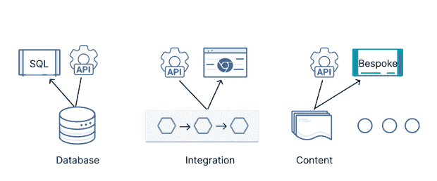
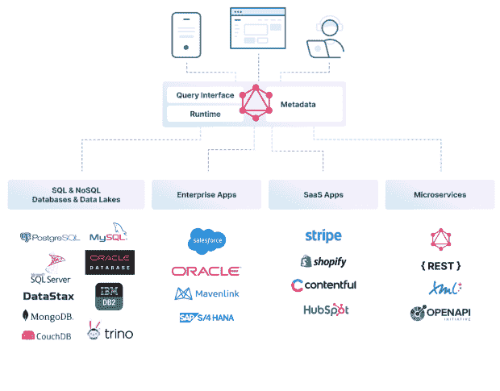
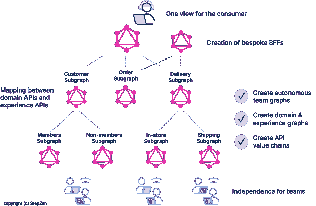

# API 是有趣的地方

> 原文：<https://thenewstack.io/apis-are-where-fun-happens/>

我们生活在 API 经济中，它正在推动数字世界的发展。每天都有产品是原料药的新公司诞生。每个月都有新形式的 API——graph QL、gRPC——以及围绕 API，尤其是 API 安全性的新供应商出现。在我最近参加的一次 API 世界会议上，我参加了一个关于 API 趋势的小组，我说:“很长一段时间以来，API 是通往乐趣的大门。现在是 API 成为乐趣的时候了。”

这显然是世界的发展方向。API 是治理、编排、联合、分发、数据服务和“前端的后端”移动的地方。

让欢乐开始吧。

## API 作为数据源的入口

API 是访问和操作数据的方式，因此它们显然是数据层的接口。

图 1:数据的 API 接口

API 不会取代其他一些接口；它们取代它们是为了面向不同的受众或者隐藏业务逻辑。

这里有一些独立的观察:

1.  当然，数据库有 SQL 接口。但是他们现在也越来越多地拥有 API。原因很简单:API 带来了更多的开发者、更多的应用、更多的数据用途。上个月， [DataStax，](https://www.datastax.com/?utm_content=inline-mention)的首席产品官 [Ed Anuff 写了一篇关于 API 的优秀文章:](https://www.linkedin.com/in/edanuff/)[“为什么数据库需要 API](https://thenewstack.io/why-databases-need-apis/)”我会把标题编辑成“为什么数据库*有* APIs。”因为它就在我们身边。
2.  传统的分析工具在捕捉 API 浪潮方面速度较慢，但这种情况正在改变。无头商业智能(BI)正在成为一种事物。直接从分析系统启动 BI 应用程序，绕过定制的“应用程序/仪表板”代码。Cube.dev 就是一个很好的例子，REST 和 GraphQL APIs 是其核心产品。

但是 API 不仅仅提供独立构建的数据层的接口。它们有助于构建数据层。他们帮助的最重要的方面是数据联合。

## API 作为乐趣

几乎所有的企业都在努力构建他们的数据仓库/湖。然而，数据湖很难维护，并且主要服务于分析需求。所有分析的输出都需要被消耗，并且有数据要么今天不在仓库中，要么永远不会在仓库中(手边的数量，有人吗？).此外，还有其他几个导致数据分散化的长期趋势:

*   **API 经济:**假设你正在访问一个像 Stripe 这样的第三方 API。在这种情况下，您(通常)无权访问原始数据。相反，您可以通过系统提供的 API 访问数据。这也适用于您的组织可能正在构建的微服务。
*   **云**倾向于锁定数据(它们使得出口费用非常高)，所以数据留在原处。
*   **数据驻留**需求进一步帮助分散数据。

Net 中，数据联合方法有时是访问分散数据的唯一方法。虽然您可以构建一个 SQL 接口，但它通常只覆盖 SQL 数据库，例如 Trino 使用的方法。正确的方法是 API 层，更具体地说，是 GraphQL API 层。

图 2:作为联邦数据层的 GraphQL

在这一层中，您放置了一些元数据(哪个后端可以做什么)、一个分散和收集的执行优化引擎，以及用于路由和组装的轻量级业务逻辑。

API 也有助于完善传统的数据架构。以 ETL(提取、转换、加载)为例。有些源系统(有些是通过批量 API 访问的)被转换，然后加载到仓库中。随着数据的移动，治理如何移动？

## API 作为数据层上组织控制的一种方式

企业最大的问题几乎从来不是技术；是组织。API 有助于将数据源从组织的控制中解放出来，并使企业范围的功能变得更加容易。但是，有人曾经说过，“给我看一个组织公开的 API，我就告诉你它的组织结构。”

有趣的是采用特定于组织的 API 结构，并将其转换为特定于消费的 API 结构。再次，GraphQL 来拯救这里。联邦是它的超级力量，它允许将 API 分割成不同的部分和重新组合。GraphQL APIs 从网关到后端，再到应用程序施展魔法的网关。想象一下从后端提供的粘土中塑造美妙事物的能力。

联邦 GraphQL API 架构正是这样做的。

图 3:联邦是 GraphQL 的一大优势

## 摘要

从 API 仅仅作为网关到后端数据源，到 API 成为新数据架构诞生和新功能产生的地方，这是一个世代的转变。API 正在从网关变成乐趣，再变成乐趣。抓紧了！

<svg xmlns:xlink="http://www.w3.org/1999/xlink" viewBox="0 0 68 31" version="1.1"><title>Group</title> <desc>Created with Sketch.</desc></svg>