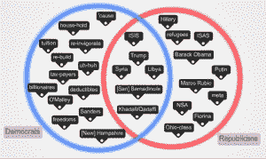

# API 和人工智能如何帮助选举信息民主化

> 原文：<https://thenewstack.io/apis-artificial-intelligence-help-democratize-election-information/>

有人认为，至少是开玩笑地说，因为美国总统如此显著地影响着世界政治和经济，所以全世界都应该为他或她投票。今年 11 月将举行另一场选举，虽然世界其他地方的人不能投票，但美国和世界各地的人们应该有机会了解这场漫长的美国总统选举周期中的辩论、新闻和结果。

最酷的是，尖端技术如何帮助选举数据、情绪、言论等的共享民主化。今天，新的堆栈为您提供了将选举信息连接到人民、为人民服务的技术的概述。

## 艾告诉我们政客们到底在说什么

当我们想到选举中使用的计算机时，我们通常会想到废弃的电子投票机。我们通常不会想到计算机检查论点的分析细微差别，但这正是反对新技术堆栈的运动的前沿。

IBM Watson 的 Ashley Hathaway 告诉我们:“任何时候有辩论，人们都会使用语音或声音检测将辩论翻译成文本，然后带着它进城，并提出有趣的实体提取和有趣的个性见解。”“我认为选举和政治话题总是很有趣，能看到结果。有时候，这真的很有见地，有时候，看看计算机对不同候选人的看法只是一种乐趣。”

这不仅仅是为了让新闻评论员能够剖析这场辩论，也是为了让公民获得更多的信息。[澄清](http://clarify.io)已经与 IBM Watson 一起完成了[的初步工作，获取美国总统辩论中的言论，找出最重要的词语，然后使用 IBM Watson 应用程序查找某个主题的新闻文章。](https://www.ibm.com/blogs/watson/2016/02/decoding-the-debates-a-cognitive-approach/)

如果希拉里·克林顿在她的电子邮件服务器上收到一个问题，而你不确定这个问题的重要性。“这将有助于你发现这一点，”Clarify 的产品总监基思·凯西解释说，

本月早些时候，Clarify 加入了微软风险投资公司(Microsoft Ventures)的机器学习加速器项目，该项目旨在推进自动语音识别，不仅理解正在说的内容，还将其置于适当的上下文和领域中。

您还可以使用这些信息来创建一些有趣的视觉表示，展示某些候选词和单词模式之间的关系，如左图所示的维恩图，它首先发布在 Alchemy API 的博客上。

您可以将这些语音识别数据插入 AlchemyData 新闻 API，该 API 具有 400 多个不同的方面，可用于搜索新闻，可以通过查询和关键字限制来简化。

目前，这种辩论语音识别是通过一个开放的 API，任何人都可以插入。技术政治顾问可能想尝试这种技术来帮助他们的候选人变得更可信，更准确，甚至更可爱。

“已经有几个演示证明人们在演讲方面变得更好了，”海瑟薇说。“你只需把演讲稿交给电脑，它就会突出显示需要改进的具体内容，让你知道自己什么时候过于自信了，或者哪里不清楚。这就是人工智能和机器学习让我们提出不同问题的地方，我们可以学到比以前更多的东西。”

## 政府宣传短片

让我们面对它，大多数政府网站甚至没有非常好的搜索引擎，当然，尽管他们有伟大的. gov 域名，也缺乏搜索引擎优化。这意味着当我们想要查找信息时，我们会进行大量的谷歌搜索，并且经常会得到相互矛盾的结果。
[谷歌公民信息应用编程接口](https://developers.google.com/civic-information/docs/data_guidelines)试图澄清这一点，特别是代表和投票站信息，它为州、县、国会选区和大城市提供了几乎 100%的覆盖。这些信息旨在帮助人们投票，并协助 GOTV[获得选票]的努力，但由于它是一个开放的 API[应用程序编程接口]，任何应用程序和服务都可以建立在它的基础上。他们确实在这个 API 上添加了很多注释，说明数据是如何难以处理的，因为数据来自如此多的来源，而且没有合适的语义规则。

每个选举周期都会引起很多关注的另一个重要过程是投票——你有多少次听到“特朗普真的做得很好，还是媒体只是想要更多的关注？”嗯，在他在新罕布什尔州大获全胜之后，这些民意调查似乎更接近事实。但是你应该相信哪些民意调查呢？在一个知识共享开源项目中，*赫芬顿邮报* [民意测验专家 API](http://elections.huffingtonpost.com/pollster/api) 希望将数千份民意测验汇总成图表。

在 2000 年布什对戈尔的大选之夜和随后的日子里，有一种明显的推动，要把不确定性从出口民调、乍得解释和政治权威人士的意见中剔除，并把它放到通常更可靠的计算机手中。美联社 [AP 选举 API](https://developer.ap.org/ap-elections-api) 汇集选举数据，如投票数和种族电话，允许那些在此基础上构建应用程序的人提取数据，自动生成特定种族的特定报告。

这不仅仅是关于上面的男人或女人。别忘了三分之一的参议院和整个众议院都在进行改选。还有什么比使用 GovTrack API 这样的工具以编程方式访问美国国会的所有信息更好的时机呢？

我们只是触及了今年最大的竞选的选项，但肯定其他国家在选举和选民技术方面比美国先进得多。全球开放数据指数跟踪 78 个国家和波多黎各(注意:不是美国)的选举开放数据项目

“任何事情都是公平的。Hathaway 说:“这一切都是为了思考用例是什么，并找到适用于用例的 API。“看到人工智能和机器学习开始运行的速度很有趣。过去，获取大型数据集需要很长时间。但随着所有深度学习功能和进步的出现，实现价值的时间变得越来越快。”

IBM 是新堆栈的赞助商。

通过 Pixabay 的特征图像。

<svg xmlns:xlink="http://www.w3.org/1999/xlink" viewBox="0 0 68 31" version="1.1"><title>Group</title> <desc>Created with Sketch.</desc></svg>