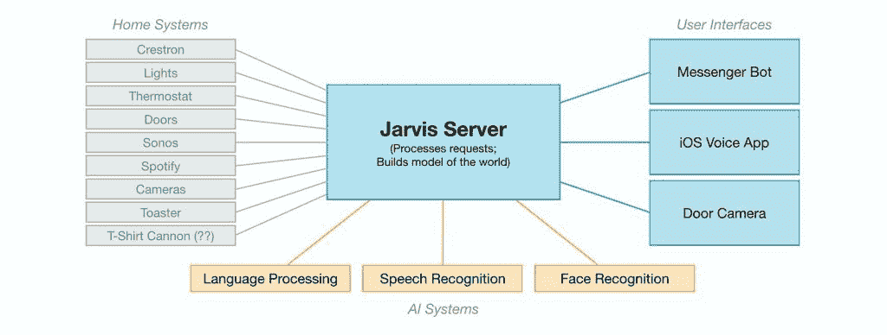

# 扎克如何用 API 构建他的贾维斯人工智能机器人

> 原文：<https://thenewstack.io/apis-fuel-ai/>

你可能已经听说了，脸书联合创始人马克·扎克伯格的 2016 年个人计划[是建造他自己的人工智能(AI)机器人，他亲切地将其命名为贾维斯。扎克伯格的人工智能远非《T4》中钢铁侠的全功能认知助手贾维斯，甚至是《杰森一家》中被围攻的女仆罗西](https://www.facebook.com/notes/mark-zuckerberg/building-jarvis/10154361492931634/)

尽管如此，对于 100 个小时的工作，它还是设法完成了一些基本任务。使用 Python、PHP 和 Objective C 的组合，并覆盖自然语言处理、语音识别、人脸识别和强化学习 API，允许他在电话或计算机上与贾维斯交谈，并控制连接的电器，允许他打开和关闭灯和音乐，从他的 t 恤大炮中推出灰色 t 恤，甚至在早上为他准备好温暖的烤面包。

但是一个人如何构建一个人工智能呢？ [Iddo Gino](https://www.linkedin.com/in/iddogino) ， [Rapid API](https://rapidapi.com/) 的 CEO，把这些点连接起来。RapidAPI 是世界上最大的 API 连接器，使开发人员能够在一个平台上收集和连接 API。吉诺在一封电子邮件中说:“我们对这个领域有了很好的了解，尤其是人工智能领域，人们在这里使用许多 API。”。

扎克伯格博客文章中的贾维斯模式。

当你打开人工智能(AI)或机器学习(ML)的黑匣子时，它会揭示一簇簇 API。他注意到 Jarvis 的大部分核心功能来自于连接 API，而不是从头开始编写功能代码。他在一篇博客文章中为 Jarvis 设计了结构，但实际上是为所有 API 设计的，包括 Siri 和亚马逊的 Echo。即使是 IBM 的 Watson，从根本上来说，也是一群互联的 API。

Gino 根据所采取的/需要的行动，将 Jarvis 或任何人工智能所需的 API 分成三组。

## **告诉贾维斯一个命令**

各种各样的用户界面 API 允许扎克伯格与贾维斯连接，包括 [Facebook Messenger](https://developers.facebook.com/docs/messenger-platform) ，iOS 语音命令和一个门口摄像头。首先，扎克伯格发布命令；Messenger Bot API 告诉 Jarvis 系统完成一项任务。(例如，“给我一件 t 恤”或“当我的下一个约会到达门口时提醒我”)。

### **命令解释**

AI 系统 API 帮助 Jarvis 理解通过用户界面 API 传递的命令。当扎克伯格或任何认知助理用户发出命令时，他们使用自然语言，而不是计算机语言。

接下来是一个世界各地的开发者都熟悉的过程，将自然语言分解成各个组成部分，让计算机来完成任务。例如，简单的任务“给我一件灰色 t 恤”被用于语音识别和自然语言处理的 API 分解为组成部分(用灰色 t 恤装载大炮，发射大炮)，自然语言处理从单词中提取任务和意图。

识别站在门口的人并允许或拒绝进入是一个更复杂的过程，但核心过程保持不变，识别语音(或文本)命令并将其分解为可以翻译成任务供计算机完成的组成部分。

这些命令是通过 API 使用的。

### **采取行动**

家庭系统/数据 API 是真正完成工作的东西。到目前为止，该命令已经被识别，然后被分解成组件任务。现在，家庭系统 API 允许开发人员连接到物联网设备，如电灯开关、恒温器和门锁。这个集群还包括从 Jarvis 系统之外的服务中检索数据的 API，例如，从 [Spotify](https://developer.spotify.com/web-api/) 中获取一首歌曲或播放列表，或者使用[互联网电影数据库 API](https://www.npmjs.com/package/imdb-api) 来找出哪位演员在钢铁侠电影中为 Jarvis 配音。

根据《快速公司》的一篇文章，扎克伯格在使用哪些设备上受到了限制。

尽管贾维斯仅限于扎克伯格的私人住宅，但他的家庭网络是在脸书的企业基础设施下。所有连接到脸书基础设施的设备都需要有脸书安全证书，该证书有非常严格的标准。例如，物联网冰箱还没有脸书安全证书。此外，他发现他需要对他的 t 恤加农炮和狗食分配器进行一些硬件更改，以便让它们与贾维斯一起工作。他还黑了一台 20 世纪 50 年代的烤面包机，让他在面包插入并关闭电源的情况下按下控制杆，这样它就可以在未来某个时间自动开始烘烤。安全规定要求现代烤面包机拆除这一功能。

### **打造自己的**

所以贾维斯主要是在工作——快速公司记者的演示经常需要重复命令，这让扎克伯格很尴尬。

尽管扎克伯格说他在这个项目上花了大约 100 个小时。他从脸书[信使机器人框架](https://messenger.com/platform) (duh)开始，并使用[巴克](https://buckbuild.com/)构建系统，开发该系统是为了快速构建大型项目。与 FaceBook 开源平台合作真的为他节省了时间。他引用了[核素](https://github.com/facebook/nuclide)、 [FastText](https://github.com/facebookresearch/fastText) 以及来自[脸书研究](http://l.facebook.com/l.php?u=http%3A%2F%2Fgithub.com%2Ffacebookresearch&h=lAQFU27Gu&s=1)的各种其他项目，以此来减少他的项目时间。

他建议，如果你对自己的人工智能感兴趣，就研究 GitHub 回购。当然，其他公司也在做他们自己的机器学习/认知助理/人工智能平台，你可以把你的车挂在开发人员花了数千小时创建这一功能的平台上。

机器学习/认知助理/人工智能的兴起呈爆炸式增长，每天上市的 API 流也是如此。吉诺在他的博客中写道:“人工智能只会和他们使用的 API 一样好。API 越好，它们让人工智能采取的数据和行动越多——人工智能就会越好。”

<svg xmlns:xlink="http://www.w3.org/1999/xlink" viewBox="0 0 68 31" version="1.1"><title>Group</title> <desc>Created with Sketch.</desc></svg>