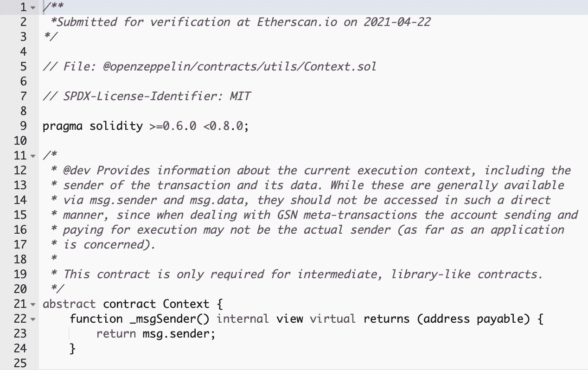
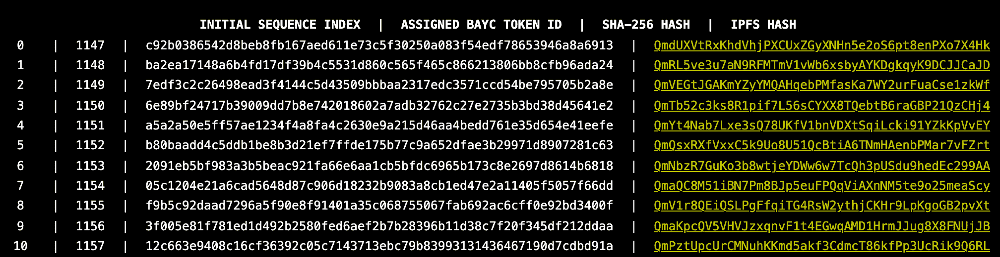
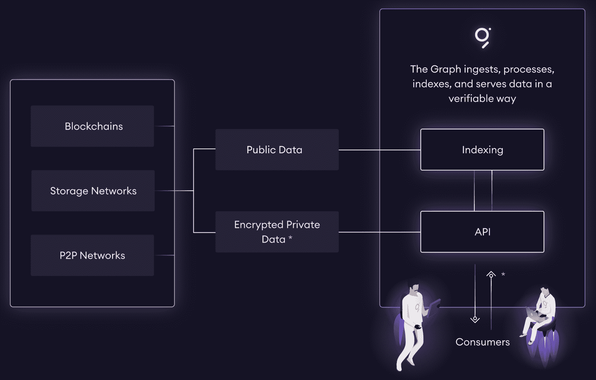

# Web3 中的 API 与图形——它与 Web 2.0 有何不同

> 原文：<https://thenewstack.io/apis-in-web3-with-the-graph-how-it-differs-from-web-2-0/>

 [理查德·麦克马努斯

理查德是 New Stack 的高级编辑，每周撰写一篇关于网络和应用程序发展趋势的专栏文章。此前，他在 2003 年创立了读写网，并将其发展成为世界上最有影响力的博客之一。在 Twitter @ricmac 上关注他。](https://twitter.com/ricmac) 

开发分散式应用程序(dApp)的绊脚石之一是查询和使用来自区块链和其他“链外”解决方案的数据的复杂性。对于 dApps，尤其是那些运行在以太坊区块链上的 dApps，并不是所有的数据都存储在区块链上。通常涉及到分散的存储网络，如星际文件系统(IPFS)。除此之外，区块链固有的复杂性——其规模、“汽油费”和其他障碍——也使得开发者难以提供 API(应用编程接口)。

一个旨在改变这种情况的项目是图[，被描述为“一个用于查询以太坊和 IPFS 这样的网络的索引协议”该协议允许开发人员“构建和发布开放的 API，称为子图，使数据易于访问。”](https://thegraph.com/en/)

## 区块链数据困难

根据 Graph 网站上的文档 T10,“很难直接从区块链读取除基本数据之外的任何信息”他们举的一个例子是无聊猿游艇俱乐部(BAYC)的智能合同，这是区块链以太坊上一套流行的数字猿 NFT。根据该图，进行“对契约的基本读取操作”(谁拥有特定的 ape，等等)相对容易，但是“更高级的真实世界的查询和操作，如聚合、搜索、关系和非平凡过滤是不可能的。”

无聊猿游艇俱乐部的智能合同代码。

本质上，无聊猿游艇俱乐部放在区块链上的是它的猿的交易数据。[智能契约](https://etherscan.io/address/0xbc4ca0eda7647a8ab7c2061c2e118a18a936f13d#code)只有 2000 多行代码，大部分都是关于猿类的购买和转移。经营一家名为西北 NFTs 的软件咨询公司的 [Patrick Price](https://www.linkedin.com/in/patrickpr12/) 对代码的[分析指出，代码并不完全是原创的。“环顾其他 NFT 合约，许多都有同样的复制粘贴功能，”他写道。](https://medium.com/northwest-nfts/bored-ape-yacht-club-contract-review-80dce503308e)

猿本身——它的属性，它的视觉外观，以及其他关于数码兽的数据——都存储在 IPFS 上。BAYC 有一个网页[列出了“每一个将会存在的无聊猿的起源记录”，其中包括 IPFS 的链接。](https://boredapeyachtclub.com/#/provenance)

原始索引，分配的 BAYC 令牌 ID，SHA256 哈希输出和每个 Bored Ape 图像的 IPFS 链接。

## 图表是如何工作的？

这个图表的目的是索引所有无聊的 ape 数据——智能合约和存储在 IPFS 和其他地方的所有资产——然后让开发者可以使用这个索引。这些数据的 API 称为“子图”，然后可以使用标准的 GraphQL API 进行查询。

每个子图索引的内容由“子图清单”定义该文件“定义了子图感兴趣的智能契约、那些契约中要注意的事件，以及如何将事件数据映射到图将存储在其数据库中的数据。”货单存放在 IPFS。

来源:图表

与其他区块链项目类似，在 Graph 协议中也有一个相当复杂的共识机制在起作用。正如该图的项目负责人 Yaniv Tal 所描述的那样，“图上的工作是由一个开放的参与者网络执行的，包括:索引器，它们运行提供数据的计算机；馆长，他们组织数据；和授权者，他们通过标记令牌来增加网络的安全性。”根据 Tal 的数据，截至 2021 年底，“网络上有 160 个索引器、7，400 多个代理器和 2，200 多个策展人。”

至于令牌 GRT，在撰写本文时，它在 CoinMarketCap 的市值中排名第 53 位。

目前该图主要支持以太坊和兼容的区块链，但“索拉纳，宇宙和波尔卡多特集成正在进行中。”Tal 还指出了“从存储网络和对等数据库等地方访问非链数据”的重要性，这也正在研究中。

到目前为止，Graph 主要致力于构建以太坊和 IPFS 数据存储。但是在更广阔的区块链世界里有更多的数据。显然，为了提供我们在 Web 2.0 世界中所习惯的那种全功能 API，还有大量的工作要做。

## 图表后面是谁？

Graph 协议由一家名为 [Edge & Node](https://edgeandnode.com/) 的公司开发，Yaniv Tal 是该公司的首席执行官。[纳德·达比特](https://twitter.com/dabit3)，一位我为[最近一篇关于 Web3 架构](https://thenewstack.io/web3-stack-what-web-2-0-developers-need-to-know/)的帖子采访过的高级工程师，也在 Edge & Node 工作。该公司的计划似乎是基于该图制造产品，并对新生的生态系统进行投资。

在 Edge & Node 中有一些重要的 API DNA。其中三位创始人(包括 Tal)曾在 2018 年被 Salesforce 收购的 API 开发者公司 MuleSoft 共事。MuleSoft 成立于 2007 年，接近 Web 2.0 的巅峰时期。熟悉那个时代的读者可能还记得，MuleSoft 在 2013 年收购了广受欢迎的专注于 API 的博客 [ProgrammableWeb](https://www.programmableweb.com/) 。

尽管 Edge & Node 的创始人都不是 MuleSoft 的高管，但有趣的是，有一条线索将 Web 2.0 API 世界与 Edge & Node 希望在 Web3 中构建的东西联系起来。

## Web3 方式的 API

Graph 协议背后的团队面临着许多技术挑战，尤其是试图扩展以适应多种不同的区块链平台。此外，“链外”数据生态系统很复杂，而且不清楚不同存储解决方案之间的兼容性如何。

但是我喜欢使用协议的方法来尝试将 API 带入新兴的 Web3 世界。在他的年终帖子中，Tal 将加密协议描述为“一种新的组织结构，允许大量的人在世界上的任何地方进行协调。”至少在理论上，这意味着一个公司(比如说 MuleSoft)不必成为 API 开发者和 API 消费者之间的中间人。有了这个图和它的加密货币令牌，人们就有了运行开放协议的经济动机，这样就不需要中间件了。

然而，正如其他区块链技术一样，这个图表在 Web3 中的影响力能否像 MuleSoft 在 Web 2.0 中的影响力一样，还有待观察。

<svg xmlns:xlink="http://www.w3.org/1999/xlink" viewBox="0 0 68 31" version="1.1"><title>Group</title> <desc>Created with Sketch.</desc></svg>