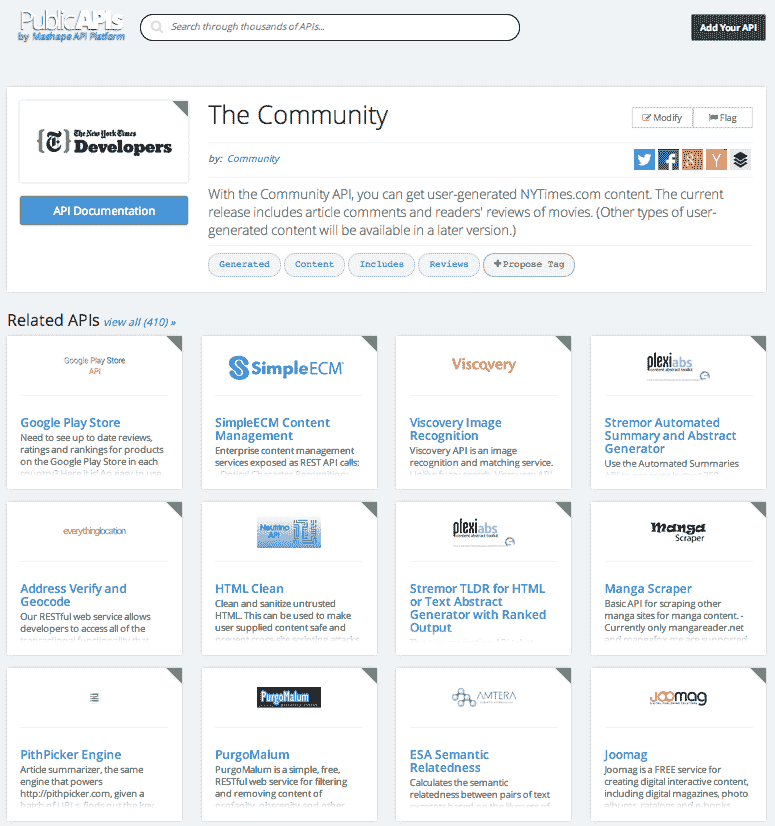

# APIs.io:一个 API 搜索引擎

> 原文：<https://thenewstack.io/apis-io-an-api-search-engine/>

APIs.io 是一个实验性的搜索引擎，它使用 APIs.json [发现格式](http://apisjson.org/)。该项目由[3 级](http://3scale.net/)维护，并得到了[养蜂人](http://apievangelist.com/)和[APItools.com](http://apitools.com/)的支持。这是今年早些时候启动的一个项目的后续项目。

关于这个项目的一些情况:

*   APIs.json 格式是 API 元数据的草案格式。它被[描述为](http://apisjson.org/)一个“机器可读的 JSON 文件，它存在于你的域的根中，描述了你的 API 和它的支持 API 程序。”
*   搜索引擎抓取已知的 APIS.json 文件，Alexa 上的顶级域名，并跟随包括链接。它发现的 API 可以通过网络搜索和它的搜索 API 获得。
*   搜索引擎还为 APIs.json 提供了一个[验证器和一个](http://apis.io/lint)[生成器](http://apis.io/builder)。该代码可在 [GitHub](https://github.com/apisio/apis.io) 上获得。
*   APIs.io 可以引入所有元素，比如属性、事件和异常。这意味着开发者可以深度链接到任何东西，3Scale 首席执行官 Steve Wilmott 在黑客新闻线程上谈到新的搜索引擎时说。

其中一个目标是鼓励其他人制作他们自己的搜索引擎，这样元数据可以被更广泛地共享，机器和人类都可以阅读。

直到 [APIs.io](http://apis.io) 之前，我们只有像 ProgrammableWeb 这样做得很好的目录——但是这样很难跟上 API 的增长。直到现在，网络上还没有关于 API 的“元数据”——所以我们希望 apis.json 和 apis.io 能帮助实现这一点。

威尔莫特在《黑客新闻》上说，谷歌也不容易找到一些 API，因为它只是将其视为内容，或者它们没有链接。

从长远来看，希望 apis.json 文件中的许多字段都是机器可读的(例如，主要 T&C 条款的元数据)，指向库的指针等等。所以你可以过滤。

APIS.io 最初是由 Octoblu 的联合创始人克里斯·马蒂厄(Chris Matthieu)推出的，该公司让 API、平台和设备能够相互对话。这项服务仍在运行，源代码可以在 GitHub 上找到。

Mashape 帮助客户分发、货币化、管理和消费云 API，它也有一个名为[public API](http://web.archive.org/web/20150401053418/http://www.publicapis.com/)的完整目录。在搜索结果中出现的每个 API 都包括对其他相关 API 的推荐。

【T2

PublicAPIs 服务很干净，看起来非常有用。但是使用元数据有一定的优势。也就是说，机器对机器的通信以及由此带来的好处，例如自动更新关于 API 的信息以及抓取数据的能力。目录需要更新。

有一些大趋势正在进行中。容器正在影响倾向于锁定客户数据的 IaaS 模型。API 有助于改善这个问题。但是谁愿意麻烦地将所有数据和元数据从专有数据库中取出来呢？

容器允许一种新的备份。一种移动代码的方式，以便它可以跨不同的服务和内部部署环境使用。代码可以更新。微服务提供即插即用服务的方式。API 也可以在容器上下文中使用。API 传播者 Kin Lane 今年早些时候写了一篇[帖子](http://apievangelist.com/2014/03/13/the-power-of-designing-and-deploying-api-driven-resources-in-containers/)，讲述了 AutoDevBot 如何使用一套容器来监控 API 端点。

在未来几年，API 应该与运行容器的机器一起工作，以适应数据负载、不断变化的环境和不同种类的用例。如果机器能够理解元数据，那么像 APIs.io 这样的发现引擎就变得非常有价值和必要，特别是当数以百万计的东西连接在一起，自动化的需求对于我们这个世界的编程变得至关重要。

通过 Flickr 知识共享[的特色图片。](https://www.flickr.com/photos/denverjeffrey/497202663/in/photolist-KWi2H-87P4oi-87RLXh-abLuDV-87P5qP-7mAUtN-87Nun4-bkbY3h-89eTiB-72hkn9-7ytdb2-91471X-9pT4Ni-5LAEXD-aFhJjH-9169EV-6awutw-9E8gsW-7rY7do-9qD5SU-9kKX2z-71SrCn-9enWWG-7437ZC-731ZgM-dL8cys-9DktVw-7cDQve-sPx52-85zhf1-2KCePD-8GTBZm-9xTW2e-73YzER-4YKWfV-aWKPSD-9pztKZ-aFmvnb-5HEb1n-9D9xLQ-bPjM3Z-6sxhL1-aj2yrD-5scYHD-7icyVt-3VoKBx-dmQYTx-9xWVpq-9idQ3x-9hHjcJ)

3Scale 是新堆栈的赞助商。

<svg xmlns:xlink="http://www.w3.org/1999/xlink" viewBox="0 0 68 31" version="1.1"><title>Group</title> <desc>Created with Sketch.</desc></svg>