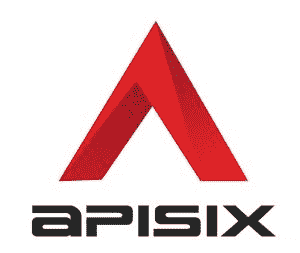
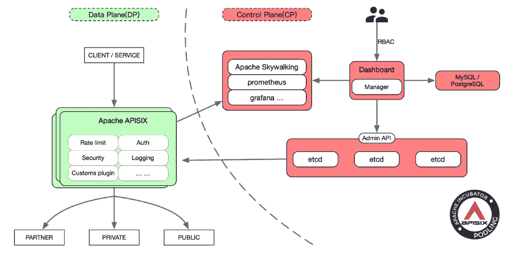
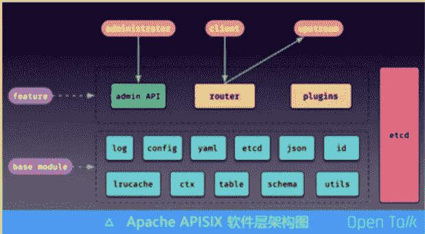

# APISIX:一个面向微服务的开源 API 网关

> 原文：<https://thenewstack.io/apisix-an-open-source-api-gateway-for-microservices/>

 阿帕奇软件基金会最新的顶级项目，API gateway [APISIX](https://github.com/apache/incubator-apisix) ，迅速上升到那个[的地位](https://blogs.apache.org/foundation/entry/the-apache-software-foundation-announces66)。

2019 年 4 月诞生于中国刘彘科技，当年 6 月开源，去年 10 月进入 Apache 孵化器。

据该项目副总裁[温明](https://github.com/moonming)称，最初只有大约 20 名贡献者，经过 7 个月的孵化，现在已经有近 100 名贡献者，包括 26 名提交者。

在一个充斥着 [API 网关选项](https://garnerinsights.com/Global-API-Management-Market-Report-2019)的市场，为什么要创造一个新的呢？

温表示，云原生架构带来了全新的挑战，来自网站、移动和物联网应用的流量也是如此。

“我们调查了几个流行的开源 API 网关项目，发现它们都无法解决云原生和微服务带来的这些新挑战，”他说。

“有的只适合处理企业内网流量，无法处理成千上万的客户端请求；有些依赖于关系数据库，这种数据库不能轻松灵活地伸缩。这主要是因为技术发展太快了。在设计这些 API 网关的架构时，云原生和微服务还没有流行起来。

“我们也考虑过实现一个基于 Envoy 的 API 网关，但是 Envoy 比较难上手和开发，不适合在南北流量上使用。”

他说: [APISIX](http://apisix.apache.org/) 的设计是为了处理大量的请求，并且二次开发的门槛很低。发音是“API six”；原公司提供商业版， [API7](https://www.apiseven.com/) 。

温这样概括设计准则:

*   原生云，轻量级，易于容器化
*   集成统计和监控组件，如[普罗米修斯](https://prometheus.io/)、[阿帕奇天行者](https://thenewstack.io/skywalking-apm-for-the-heterogeneous-new-stack/)和[齐普金](https://thenewstack.io/meet-zipkin-tracer-debugging-microservices/)。
*   支持 gRPC、Dubbo、WebSocket、MQTT 等代理协议，以及从 HTTP 到 gRPC 的协议转码，以适应更广泛的场景
*   承担 OpenID 依赖方的角色，连接 Auth0、Okta 和其他身份认证提供者的服务
*   通过在运行时动态执行用户函数来支持无服务器，使网关的边缘节点更加灵活
*   支持插件的热加载
*   不锁定用户，支持混合云部署架构
*   最后，网关节点应该是无状态的，并且可以扩展和灵活。

“有了这些功能，用户的服务只关心业务本身，而非业务实现相关的功能，如服务发现、认证、统计、指标等。可以在关口解决，”温说。

“从这个角度来看，API 网关可以取代 Nginx 来处理南北流量，也可以充当 Istio 控制平面和 Envoy 数据平面的角色来处理东西流量。

## 标准设计

APISIX 由一个数据平面组成，用于动态控制请求流量；一个控制平面用于存储和同步网关数据配置，一个 AI 平面用于编排插件，以及实时分析和处理请求流量。

它构建在 [Nginx 反向代理服务器](http://nginx.org/)和键值存储 [etcd](https://etcd.io/) 之上，以提供轻量级网关。它主要是用类似于 Python 的编程语言 [Lua](http://www.lua.org/) 编写的。它使用基数树进行路由，使用前缀树进行 IP 匹配。

根据 Wen 的说法，使用 etcd 而不是关系数据库来存储配置使其更接近云原生，但也确保了整个网关系统的可用性，即使任何服务器停机。

所有的组件都被写成插件，所以它的模块化设计意味着特性的开发者只需要关心他们自己的项目。

它的内置插件包括电流和速度限制、身份认证、请求重写、URI 重定向、开放跟踪和无服务器。

它支持 OpenResty 和 Tengine 运行环境，可以在裸机到 Kubernetes 上运行。它同时支持 X86 和 ARM64。

在一篇中型文章中，温指出了与竞争对手的具体区别:

*   按需“继承”
*   优先考虑
*   允许在 Nginx 的所有阶段安装
*   插件热装载和卸载

“我们开发了基于 Apache APISIX 的 Kubernetes ingress 控制器，以取代 Kubernetes-native ingress 来处理所有南北集装箱集群和部分东西交通。APISIX 的高性能路由、灵活的插件机制、API 管理和设计理念正是云原生架构的需求，”语音识别初创公司 [AISpeech](http://www.aispeech.com/) 的高级 R&D 总监张顺说。

该项目宣传其微服务架构的性能、低延迟和可扩展性。它坚持认为，与竞争对手相比，它提供了 5 到 10 倍的性能提升。

欧盟的智能工厂项目 [eFactory](https://www.efactory-project.eu/) ，中国科技巨头[腾讯](https://www.tencent.com/en-us/about.html)，以及多货币网站 [Airwallex](https://www.airwallex.com/us) 都在生产中使用 APISIX。

这些公司为项目做出了贡献，并提供了反馈，这形成了一个良性循环，促进了社区的多样性和健康发展。这也是开源的魅力所在，”他说。

在 7 个月的时间里，这个项目已经发布了 6 次。

奥地利 Salzberg Research 的软件工程师 Nirojan Selvanathan 在一段视频中说，在 eFactory 项目的工作中，他发现 APISIX 有三个优点:

*   处理与多个平台一起工作所涉及的延迟。
*   模块化和无状态架构提供了一种更简单的方式来编写插件，以处理多平台和多身份验证系统。
*   MQTT 支持非常适合它所处理的制造数据。

[https://www.youtube.com/embed/NvVKuq5GUCs?feature=oembed](https://www.youtube.com/embed/NvVKuq5GUCs?feature=oembed)

视频

## 更多的库伯内特斯，艾

“最近，移动应用、企业互操作性和物联网之间的互连需求增长，将后端服务支持对象从单个 web 应用扩展到了各种使用场景。这增加了访问压力和后端服务的复杂性。这个问题的合适解决方案是 API 网关。…我们评估了许多 API 网关，最终选择 Apache APISIX 作为我们新一代 API 网关的核心组件，因为它具有高性能、高可扩展性和活跃的社区，”腾讯云工程师 Hui Li 表示。

展望未来，该项目计划增强控制平面，使 APISIX 更容易在 Kubernetes 环境中运行。

它也在扩展它的人工智能平面能力。据文介绍，负载均衡、动态上行、身份认证等功能不足以应对当前复杂多变的终端请求。在这种情况下，帮助用户在流量处理层面完成一些 AIOps 功能，提高工作效率。

它还计划解决服务网格问题，他称之为“一个非常重要的方向”

<svg xmlns:xlink="http://www.w3.org/1999/xlink" viewBox="0 0 68 31" version="1.1"><title>Group</title> <desc>Created with Sketch.</desc></svg>