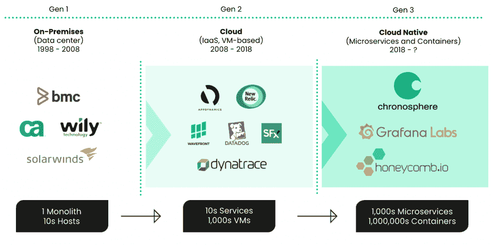

# APM 供应商正在制造关于可观察性的混乱——不要上当

> 原文：<https://thenewstack.io/apm-vendors-are-creating-confusion-about-observability-dont-fall-for-it/>

 [马丁·毛

马丁·毛是 Chronosphere 的联合创始人兼首席执行官。他之前在优步，领导开发和现场可靠性工程团队，创建并运营 M3，这是世界上最大的生产监控系统之一，存储数百亿个时间序列，每秒钟实时分析数十亿个数据点。在此之前，他是 AWS EC2 团队的技术负责人，曾为微软和谷歌工作。](https://www.linkedin.com/in/martinmao/) 

可观测性是科技界最热门的话题之一，但这并不新鲜。这个术语可以追溯到 1960 年，当时 Rudolf E. Kalman 在控制理论的上下文中描述了可观测性的概念。

类似于社交媒体上的任何趋势都会吸引成千上万的意见，每个管理软件供应商、媒体和行业分析师都在提供他们独特的可观察性。

结果呢？几乎有多少定义就有多少解决方案。这造成了混乱，传统的监控软件供应商，甚至一些善意的分析师也助长了这种不透明。

监控和可观察性相关但不相同。我在过去已经写过关于这个话题的文章，所以我不会在这里纠缠这个问题。为了超越理论定义，理解我们是如何走到今天这一步的是很有帮助的。

## 从监测到可观测，历经三代

### 第 1 代:数据中心

从 20 世纪 90 年代开始，IT 和系统管理(ITSM)被“四大巨头”所控制:惠普、IBM Tivoli、BMC 和 Computer Associates。监控由安装在服务器上的 [SNMP](https://www.pcwdld.com/snmp-trap#wbounce-modal) 陷阱和代理组成，或多或少为物理服务器、存储和网络提供红/黄/绿状态。早期的应用程序管理供应商，如 Wily(被 CA 收购)和 BMC，拥有对运行在一个数据中心内多达几十台服务器上的单块应用程序进行性能监控的市场。他们主宰着市场，直到虚拟化和云计算最终让他们容易受到破坏。

### 第二代:云

这种颠覆是以一系列应用程序性能监控(APM)工具的形式出现的，这些工具是为新的云服务世界设计的。从 2000 年代中期开始，企业在其数据中心的数十台主机上运行数千个虚拟机。到 2011 年，他们还开始部署公共云服务。New Relic、Dynatrace 和 Datadog 等供应商通过 APM 平台彻底颠覆了第 1 代供应商，这些平台能够提供对数千台虚拟机及其上运行的应用程序的性能和可用性的可见性。

对于大多数早期的云工作负载，简单的性能和可用性数据就足够了，他们平台的孤岛性质并不是采用的障碍。然而，由于组织已经扩展了他们的云足迹并采用了 DevOps 方法，APM 工具无法提供云原生扩展和快速应用交付所需的可扩展性、可靠性和共享数据洞察。就像他们的第一代前辈一样，他们的市场地位面临着直接的生存威胁。

### 第三代:云原生和可观测性的出现

这种生存威胁来自专门为云原生应用和基础架构设计的新一代监控解决方案。随着容器和微服务架构的采用，云架构的巨大转变始于 2018 年左右。云与云原生的区别在于，云原生应用是使用容器和微服务架构在云基础设施上原生开发和部署的。云可以简单地将单一应用程序提升并转移到云基础架构。

容器和微服务架构为开发者提供了前所未有的速度、灵活性和可扩展性。领先公司的开发人员每天部署数百个软件更新，以更快地响应客户需求和市场条件，并使他们的业务更加敏捷和灵敏。

然而，这种速度和规模也开启了一个新的复杂性时代。现在，应用和运营团队必须应对数百万个容器和数千个微服务，而不是数千个虚拟机和数十个服务，其中一些可能只能存在几分钟。此外，向云原生的转变，以及 DevOps 的采用，意味着开发人员对其应用程序的运营负有责任，而不是将它们扔给 IT 运营团队。

第二代工具凭借其架构，努力跟上这个云原生世界的独特规模和功能需求。第二代监控/APM 从单个应用程序和基础架构组件收集**预定的**数据，以提供性能和可用性分析。这个数据收集由 APM 供应商决定，他们产生的数据被锁定在该供应商。数据的价值取决于 APM 工具的功能。

## 可观察性取代了应用和基础设施监控

监控主要由 APM 供应商决定的潜在、预期问题的能力已经不够了。云原生架构在规模上要大得多，更加分散，并且过于相互依赖，不会受到 APM 供应商的数据收集的限制。开发人员需要灵活地选择和控制他们收集和分析的数据。

此外，云原生的规模产生了更高的基数数据，传统 APM 很难收集和分析这些数据。可观察性已经成为一种新的操作模式。可观察性解决方案采用系统提供的任何输出—日志、跟踪、指标、事件—并为用户提供洞察力，使他们能够检测和修复整个体系(基础架构、应用程序和业务)中的问题。

与监控相反，可观察性提供了快速检测和修复问题所需的适当上下文中的所有数据，并使客户能够控制要收集的数据。开发人员可以为每项服务收集更多定制和特定的遥测数据。可观察性还允许开发人员产生高基数数据，以更好地处理云原生的规模和复杂性。

在 Gen 3 中，可观测性数据收集已经从供应商控制转变为客户控制。底线是 APM 可以提醒工程师存在问题，但是可观察性提供了用于隔离根本原因和修复问题的详细数据。

> 与监控相反，可观察性提供了快速检测和修复问题所需的适当上下文中的所有数据，并使客户能够控制要收集的数据。

可观察性直接影响工程指标，如平均修复时间(MTTR)和平均检测时间(MTTD)、部署时间等。，但它还可以提供实时见解，帮助改善业务 KPI，如支付失败、订单提交/处理或影响客户体验的应用程序延迟问题。

APM 是表桩；可观察性提供了竞争优势。APM 是为云设计的；可观察性是为云原生设计的。随着云计算的普及，可观测性将超过 APM 成为主流解决方案。

## 为什么 APM 供应商跟不上(反而造成混乱)

第二代 APM 工具不支持原生云有四个主要原因:

*   **数据量** —每个容器发出的遥测数据量与虚拟机相同。从数千个虚拟机扩展到数百万/数十亿个容器会导致可观察性数据的数量级增长。
*   **短暂性** —除了规模之外，容器本质上是短暂的，可能只能存在几分钟，而虚拟机的生命周期可以是几个月甚至几年。第二代 APM 工具不是为此而设计的。DevOps 团队需要重新评估他们对数据在这样一个动态环境中的价值的假设。对于短期和长期使用情形，保持数据的灵活性和可控性非常重要。
*   **相互依赖** —在单一应用和虚拟机的世界里，应用和基础设施之间的关系是可以预测的。在云原生世界中，微服务和容器之间的关系更加灵活和复杂。数据基数更大，将应用程序、基础设施和业务指标联系起来也更具挑战性。
*   **专有数据格式** — APM 供应商通过使用专有代理以专有格式接收和存储数据来创建锁定。企业越来越希望与开源标准兼容，他们希望拥有自己的数据。他们还希望跨部门域共享和访问数据，以便更好地协作，更快地检测和解决问题。将数据锁定在专有孤岛中会阻碍这些工作，并增加成本。

第二代供应商无法完全重构他们的原生云解决方案。相反，他们已经重新构建了他们的营销和定位。到了一定年龄的人会记得，传统数据中心供应商通过“洗云”他们的产品来应对公共云服务的增长。Cloudwashing 只是用“云”这个词重新包装现有的解决方案。它通常伴随着一些最小的技术增强，比如将一个整体的应用程序移动到一个虚拟机上。

类似地，第二代监控供应商正在通过添加对可观察性的[“三大支柱”:日志、跟踪和指标的支持，添加新的定价和打包选项，以及将自己重新命名为“云”和“可观察性”来“清洗可观察性”。](https://chronosphere.io/learn/are-the-three-pillars-of-observability-still-relevant/)

## 为了避免混淆，关注可观察性结果

这种把一切都称为“可观测性”的做法，自然在市场上造成了很多混乱。分析师社区试图提供帮助，但是每个公司似乎对可观察性有不同的定义，并把它放在不同的操作框架/环境中。此外，他们与 APM 供应商的现有关系——他们正试图帮助他们度过这一世代转变——意味着他们经常从可观察性是 APM 的发展而不是对它的破坏的角度开始分析。

但是可观察性是破坏性的，因为它在架构上如此不同，并且唯一地解决了云的原生需求。同样，它不是关于所有的输入，如日志、跟踪和指标，而是关于足够的数据和上下文的[生产，以便可以快速检测和补救问题](https://thenewstack.io/beyond-the-3-pillars-of-observability/)。

最重要的是，为了真正避免市场混乱和定义上的争论，我们作为一个行业需要关注结果。如果实施得当，可观察性将推动竞争优势、世界一流的客户体验和更快的创新。底线是快速、更高效的补救，并带来可衡量的业务影响。这一点都不令人困惑。

<svg xmlns:xlink="http://www.w3.org/1999/xlink" viewBox="0 0 68 31" version="1.1"><title>Group</title> <desc>Created with Sketch.</desc></svg>