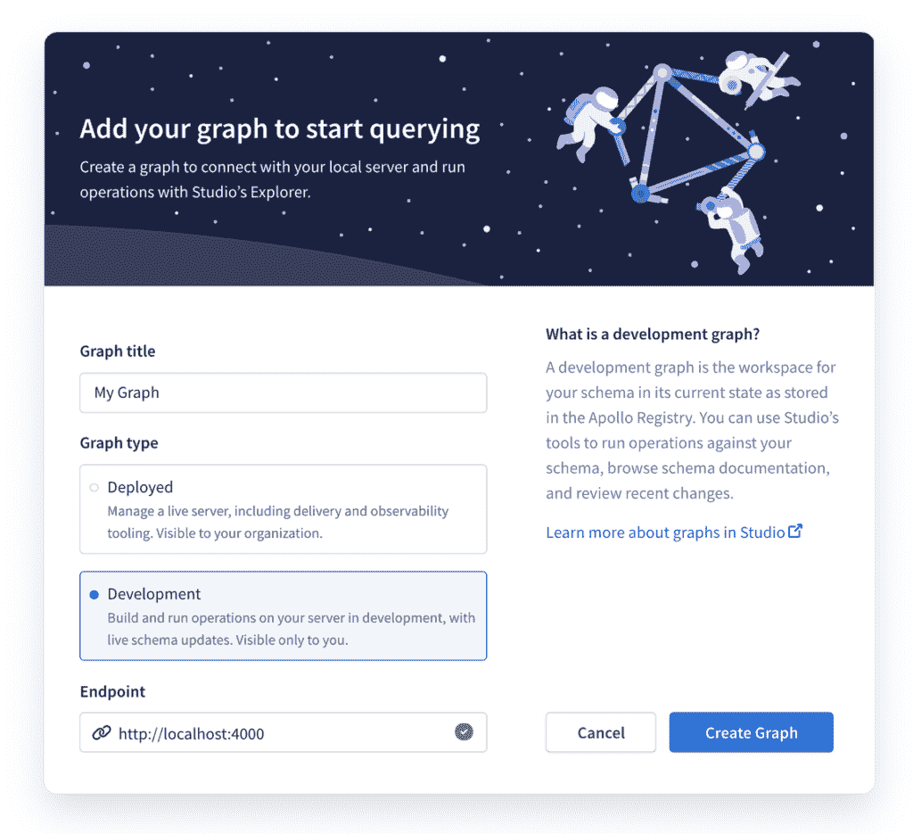

# Apollo 将 Explorer GraphQL IDE 扩展到开发环境

> 原文：<https://thenewstack.io/apollo-extends-explorer-graphql-ide-to-development-environments/>

GraphQL 工具公司 [Apollo](https://www.apollographql.com/) 推出了一个版本的 [Apollo Studio](http://studio.apollographql.com/) ，这是一个基于云的服务，用于开发和交付数据图(及其图形管理器的更名)，允许开发人员在本地运行的 GraphQL 服务器上构建图形和测试查询，而不是在生产中。

使用 Apollo Explorer，即 Apollo Studio 的 IDE，用户可以导航他们的图形并构建 GraphQL 查询，但是，到目前为止，该功能仅适用于注册的生产图形。换句话说，使用 Apollo Explorer 意味着您正在处理实时的、生产中的图形，并且您所做的任何更改都是在实时代码上完成的。显然，这并不理想，本月早些时候，该公司发布了一个支持开发图的版本来弥补这一缺陷。

[首席技术官兼 Apollo 联合创始人马特·德贝加利斯](https://www.linkedin.com/in/debergalis)经常将 GraphQL 描述为一种民主化的技术，这种技术使前端开发人员能够在他们以前被边缘化的领域采取行动。他在一次采访中解释说，发展图表只是这个广泛主题的延伸。

“从历史上看，API 一直是服务器优先的技术。它们是由后端团队定义的，它们反映了那些后端团队的偏好和需求。然后，工程师们就要实际构建用户界面，构建产品，让它工作并适应它，”德贝加利斯说。“Dev graphs 是在实际应用程序和图形开发过程中使用 Studio 的一种方式。它允许负责图形 API 中的数据的工程师使用 Studio 对这些更改进行建模，并能够在这些更改投入生产之前进行验证，并且能够在团队在整个组织中推广这些更改时，将这些更改传达给依赖于他们的数据的团队。这实际上是将我们对公共数据图的愿景扩展到组织，一直延伸到软件开发过程的开始，并到达每个开发人员的手中。”

通过开发人员图表，Explorer 在本地开发服务器上为开发人员提供了提取变量、一键式查询构建和智能搜索等功能。

Apollo Explorer 建立在 Monaco 的基础上，为其提供了熟悉的 Visual Studio 代码感觉和界面，并提供了类似的功能，如对 GraphQL 的智能感知支持，查询林挺，自动完成，悬停时查看定义，以及通过 command-click 跳转到定义，等等。

“Dev graphs 为团队带来了所有这些工具，这些工具实际上定义了图表中的内容—这些相同的交互式工具让我了解我将要更改的模式，让我使用我已存储的查询并针对我正在创建的图表的更新版本运行它，让我与同事共享这些工具，并在图表的定义和设计方面进行协作， 让我对我所定义的东西进行持续的整合，这样我就可以确定我所做的改变与图表的使用方式是一致的，”德贝加利斯说。 “这就是 dev graphs 使之成为可能的原因:将那些过去用于生产图的工具扩展到团队中实际创建新版本的部分。”

DeBergalis 解释说，这一版本的部分原因是越来越多的企业和大型组织正在转向 GraphQL 而不是 REST APIs，在大型组织中导航大型图表需要这样的工具。

“我想说，过去一年发生的令人兴奋的事情是，这种情况在企业中传播得如此之快，”德贝加利斯说。“我们如何用分布式开发团队帮助拥有多种产品的公司，尤其是大公司？我们如何通过为公司数据图推出一个通用的图表来帮助这些公司显著加快软件开发，这个图表不只是针对一个团队或一个应用程序的一个屏幕，而是涵盖整个组织。”

<svg xmlns:xlink="http://www.w3.org/1999/xlink" viewBox="0 0 68 31" version="1.1"><title>Group</title> <desc>Created with Sketch.</desc></svg>