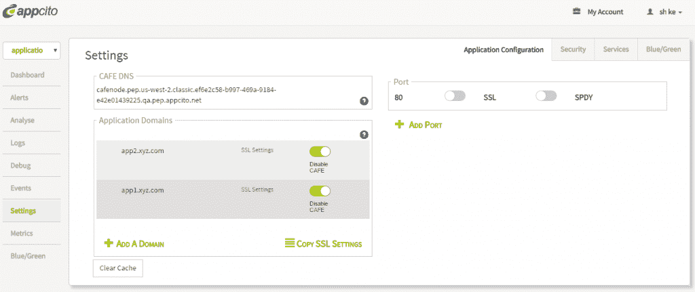
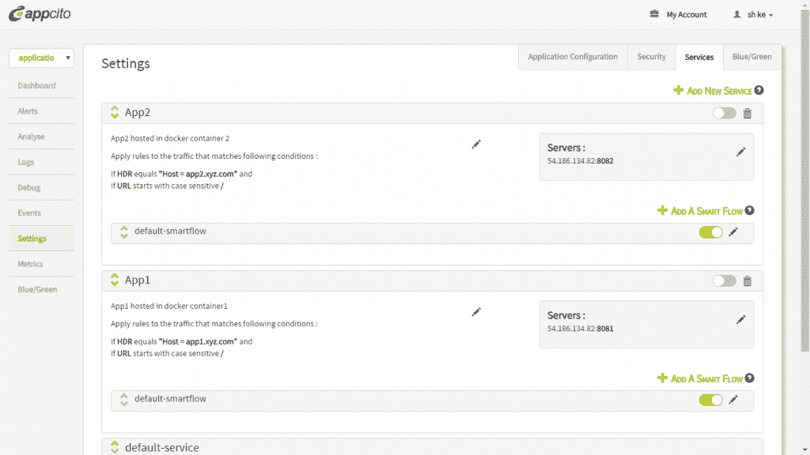

# Appcito 的新负载平衡器，专为码头时代设计

> 原文：<https://thenewstack.io/appcitos-new-load-balancer-designed-for-the-docker-age/>

当你问微服务架构的专家相比单片设计有什么好处时，你得到的答案之一是负载平衡。你会被告知，意识到自己在生态系统中的作用的微服务应该有能力找到自己的适当平衡，Docker 的作用是促进微服务。

也许吧，但是直到每个应用程序都把自己分解成数百万个全视、自感知的“纳米机器人”，Docker 容器将只包含程序。当这些程序成为设计中最不分散的部分时——例如，当数据库功能从分析功能中分离出来时——就必须有东西充当容器的负载平衡器。

## 推翻反向代理决策

到目前为止，领先的选择之一是 HAProxy，我们的 Alex Williams 承认这需要一篇比这篇文章更长的文章来解释。[其他人更喜欢 Nginx](http://nginx.org/en/docs/http/load_balancing.html) ，有人说它更简单，而且有良好的记录。

Appcito CAFE UI

去年 2 月，一家名为 Appcito 的公司推出了一项名为[云应用前端(CAFE)](http://www.appcito.com/products/) 的应用交付服务，这是一种针对 AWS 的分布式应用部署和管理服务，后端有自己的反向代理。这是一种努力，旨在为可能包含或不包含微服务的分布式应用的部署提供一个更明智的、图形化的前端，并配有分析工具。

上周，采取了明显的下一步，Appcito 扩展了 CAFE 以支持 Docker。

“一旦你开始与 Docker 合作，”Appcito 产品和战略副总裁 Siva Mandalam 上周六在公司博客中写道，“你会很快发现，不仅有与容器相关的管理任务，还需要应用基础设施服务来确保你在容器内运行的基于微服务的应用程序始终可用、安全并性能良好。”

鉴于 Docker 用户目前对 Nginx 和 HAProxy 的偏好，开发人员——打算让他们的应用程序使用可以说是更复杂的反向代理——是否应该开始考虑重新设计它们？毕竟，微服务设计的理想开销是应用程序应该自己进行负载平衡。

我向湿婆曼陀罗提出了这个问题。

“HAProxy 或 Nginx 部署需要工作。在应用程序的基础上改变代理的配置需要更多的工作，”他通过电子邮件告诉新的堆栈。

## 咖啡馆的活跃代理人

Appcito 为 CAFE 创建了两类活动代理，每一类都在 SDN 拓扑的一端分配了一项任务。在控制平面中有 Barista，Appcito 将其描述为集中式应用服务控制器(ASC ),内置分析功能位于其中。在数据层面，CAFE 部署了所谓的策略执行代理(PEP，不要与性能增强代理混淆，我相信这是被美国职业棒球大联盟禁止的)。这些政策由咖啡师制定，然后由 pep 执行。

Mandalam 解释说:“PEP 代理可以快速部署、重新配置或删除，而无需更改微服务或应用程序堆栈的其他组件。“通过基于 Web 的用户界面快速加入和集中管理精细的应用程序策略，显著降低了管理开销。”

Mandalam 将 pep 描述为在“弹性、高可用性、弹性集群”中交付，该集群可以根据其支持的工作负载自动扩展。

“pep 靠近您的应用基础设施放置，以确保低延迟，”他继续说道。此外，为了确保所有这些动态系统之间的会话连续性，Appcito CAFE 持续管理逻辑 PEP 内(以及所有区域中所有 PEP 实例之间)每个会话的状态。这种共享的持久状态存储确保了应用程序的零停机时间和加速可用性。在配置 CAFE 时，您无需担心容量规划或高可用性。CAFE 的数据路径组件总是高度可用的。此外，它们可以根据您应用程序的流量需求进行伸缩。”

我问 Appcito 的 Mandalam，在 CAFE 中，特定于应用程序的策略是如何制定和维护的，微服务架构如何改变这些策略的实施方式？

Appcito CAFE UI

“通过 Barista 应用服务控制器 UI，”他回答说，“它提供了在应用程序级别或微服务级别制定和维护策略的策略框架。主要变化是能够对如何在应用程序级别应用服务策略提供更多控制，例如，包括服务的无中断滚动升级；动态控制，当环境和基础架构发生变化时(比如公共云)，您需要动态地学习和调整策略，以使您的应用满足性能标准。”

Mandalam 实际上在这里建议微服务应该控制它们运行的环境，以便优化它们的性能。这显然不是因为它们应该为包括咖啡馆在内的特定环境而设计，而是因为恰恰相反的原因:因为这些环境的性质甚至特征都是会变化的。

## 更高层的交通

典型的 sdn 在应用所在的网络第 7 层不支持太多流量导向。我问 Siva Mandalam 咖啡馆如何填补这一空白，他给出了五点建议:

1.  **控制传入流量**:在 PEP 入口处的容器和对象级别进行速率限制，并在出口点根据应用服务器容量限制流量。
2.  **非平稳水印**:**多粒度学习文件访问时间周期性:每天，每周，每月。**
3.  **基于交通状况分析的政策和交通导向建议**:低频高流量/高频低流量。
4.  **使用数据有效负载大小的负载平衡**:(a)Barista ASC 和 PEPs 都允许无限数量的存储 URL 和对象；(b)策略可用于在租户、容器或对象级别对流量进行分级限制，以最大限度地减少延迟。
5.  **跨唯一集群的平衡**:自动发现服务引擎的自动扩展或新容器，并使用默认策略跨集群进行负载平衡(这些功能可以定制)。

“Appcito CAFE 提供精细的分析和与其他平台的集成，以及改进的内省，”他补充说。“CAFE 支持集成以访问来自其他分析平台的数据，从而实现增强的下钻、数据交叉关联和异常检测。它可以提供对顶级文件/对象、顶级容器、对象中的总流量、字节、容器、延迟的可见性，并对检测到的任何异常进行根本原因分析。

> 这种集成支持全面的深入查看功能，可快速调试和分析错误的根本原因。

" Appcito CAFE 也可以集成到警报和事件生成工具的框架中."

Mandalam 认为，对开发人员和管理员来说，最重要的好处是让他们能够专注于自己的应用。IT 部门的新手不需要学习 Nginx 或 HAProxy 的配置语法，就可以胜任应用程序的部署和管理。

## Nginx 回应

我们请 Nginx 的产品负责人欧文·加勒特(Owen Garrett)对 Appcito 的说法进行了评论。

Garrett 淡化了配置文件的使用有些令人费解的概念，指出根据这张频繁更新的图表，将近四分之一的网站使用它的格式。

Garrett 告诉 New Stack:“如何使用标准编排工具(如 Puppet/Chef)来驱动 Nginx 配置是一个常识。“不需要专有的 API 或‘中央管理系统’。当用户大规模运行微服务平台时，他们不希望使用 GUI 来配置前端代理。他们希望选择适合他们自己的基础架构的流程编排和部署工具，并且他们需要使用的每个产品都能够轻松地与他们进行互操作。”

Nginx 高管承认，Appcito 的声明表明“对应用程序代理设备的真正渴望，以管理基于 Docker 的基础设施内外的流量。随着供应商和开源项目为这些挑战提供解决方案，最佳实践正在快速变化。”

但他接着说:“用户应该明智地避免过早做出决定，将他们锁定在专有的封闭方法上，应该寻求开源和供应商支持的开放核心解决方案的组合，以帮助他们加快部署，同时根据需要自由创新。”

这是有待历史解决的争论的一部分:如果开发人员可以自由地专注于设计和架构，就像 Appcito 的 Mandalam 建议的那样，那么这种专注的结果会像开发人员建议的那样包括负载平衡的微服务吗？或者，微服务会开始期待部署级别的策略来解决流量问题吗？在后一种情况下，Nginx 和 HAProxy 可能会开始显得过时。

通过 Flickr 知识共享的特色图片[。](https://www.flickr.com/photos/basf/4837105835/in/photolist-8nrr3t-K61Tw-7ChHab-x8Jrt-8SWYix-7668Ta-7tV25w-k478e-jMnm1E-pQfVqk-87pSM9-bxrRfa-9bfqBi-cwcmZG-6gq9fv-dg8ZpD-3pVuW3-8MwgqD-atnbYR-8yAt9U-5CH13z-6h6GFA-bkXyDc-2VTkuF-9aDij1-9jAcgA-4QLyU-hvmktR-7LoQ6u-aF9u4C-fvNHa2-5cacsY-5gGpjn-aCKXD-9YsPnJ-gBc1dB-4YihWi-4Y6ckx-5xS5UV-7yQReX-87mFqx-aN3h9K-NZBVg-e26w1R-89iMnL-7R6VoS-4Uy8ZU-o8ogLw-75PeYn-8ixMwU)

<svg xmlns:xlink="http://www.w3.org/1999/xlink" viewBox="0 0 68 31" version="1.1"><title>Group</title> <desc>Created with Sketch.</desc></svg>