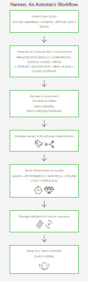

# Harness 提供了一个自动化应用部署的平台

> 原文：<https://thenewstack.io/appdynamics-founder-harnesses-continuous-deployment/>

对于许多正在进行数字化转型的公司来说，建立持续集成和持续部署(CI/CD)管道以加速应用程序开发是必不可少的。但是许多人发现管道的 CI 部分比 CD 部分更容易维护。

新推出的 [Harness.io](https://harness.io/) 旨在通过提供更快的自动化部署工具来纠正这一问题。

公司创始人 [Jyoti Bansal](https://www.linkedin.com/in/jyotibansal/) 解释道:“很多人认为如果 CI 解决了，那么 CD 也就解决了，但这是两件完全不同的事情。”他也是应用程序监控公司 [AppDynamics](https://www.appdynamics.com/) 的创始人。“CD 非常依赖 CI。人们可以接受 CI 部分:将代码签入您的主代码库，构建，并做一些基本的测试。CD 是它自己的问题。如何快速、动态地将变更推向生产？”

Bansal 说:“我们正在制造马具，以满足这个市场的需求。

班萨尔说，在他之前在 AppDynamics 的日子里，许多客户会解释说，他们将代码可靠地推向生产的过程与谷歌、脸书或网飞的过程完全不同，这些过程被认为是如何大规模进行 CI/CD 的例子。

Bansal 说，虽然这些公司“行动迅速，打破常规”，但银行做不到这一点。他采访的一家银行表示，该行有 4000 名开发人员，还有一群 [DevOps](/category/devops/) 工程师，他们被雇佣来维护用于部署不同代码的脚本，回滚这些代码，并大规模、快速地验证这些代码。

“这就是马具的起源，”班萨尔说。“人们努力想知道生产中发生了什么。他们需要一个平台来帮助他们做到这一点。看看[大厨](https://www.chef.io/)和[木偶](https://puppet.com/)这样的产品。你跟不上这些剧本。”

[Harness | Harness 是第一个持续交付即服务平台](https://harness.io?wvideo=uc6cysr5vl)

班萨尔说，这个线束平台从“智能自动化”开始。想想人们是如何自动化部署的。你不必写所有这些脚本。如果你有剧本，你可以带进来。你告诉我们你想要实现什么。这是一个简单的 YAML 文件吗，说明对于这个微服务，我的代码在 git 中的这里？我们使用 Jenkins 从 git 中提取并在那里进行构建，然后我们希望启动一些环境并运行这些测试，然后启动另一个环境进行性能测试，然后我们希望部署到生产中，”Bansal 说道，他解释了如何将部署过程描述为 Harness 中的一系列步骤。

此外，Bansal，Harness 可以执行验证步骤，以确保部署能够满足 SLA、性能或安全要求。班萨尔称之为“持续验证”

“这是关于学习应用程序行为的一切，”他说，“当你推出一个代码变更时，它如何影响你的性能？它如何影响你的异常或你的用户界面？你把所有这些数据都变成了变化的标志。”

Bansal 说，不断验证性能指标的能力也与 Harness 的安全能力相吻合。“您如何进行治理，管理您的安全、密码和凭据？您可以对每个部署进行全面审计。你必须完全服从。DevOps 的整个想法是，开发者可以去构建新的服务，编写新的代码。你希望有这样一个框架，在其中提供治理合规性，”Bansal 说。

或者，换句话说，“我们允许你在不破坏任何东西的情况下快速移动，”他说。

Harness 本周宣布了其服务和内部同名产品。“我们的目标是让这一切变得非常简单，”班萨尔说。“CD 是一个复杂的东西，但有人可以在几个小时内到达那里。人们可以非常快速地设置、启动并运行一组复杂的应用程序。”

班萨尔对这家新公司的未来寄予厚望。“我们认为这只是开始。这里的市场和问题空间与 AppDynamics 一样大，甚至更大。这是个大问题。我们的任务是解决软件交付。每个人都必须构建越来越多的软件，因此这些软件的价值将会增加。你如何处理软件交付？那些做得更快、更顺利的公司将比那些做得不好的公司更有竞争优势，”班萨尔说。

Harness 的基于服务的模型与许多企业内部传统的变更管理和部署流程大相径庭。 [ITIL](https://www.cherwell.com/products/it-service-management/itil-processes/essential-guide-to-itil-change-management) 有自己的流程和政策建议，这些建议可能会占用一个 IT 人员的整个职业生涯。

在其他地方，像 [BMC](https://www.bmc.com/guides/itil-change-management.html) 和 [CA Technologies](https://www.ca.com/us/products/ca-harvest-software-change-manager.html) 这样的公司，以及前惠普软件部门，现在的 [Micro Focus](https://software.microfocus.com/en-us/software/management-of-change-services) ，提供更传统的变更管理系统。

然而，这些都是大型、昂贵的企业软件，并不针对 CI/CD 领域。事实上，在许多情况下，企业部署和变更管理过程可能比具体的要厚。例如，威瑞森多年来一直推行一个 700 步部署程序清单来推广新软件。

在这里，班萨尔对市场机会的判断可能是正确的。虽然 CI/CD 是创业公司成熟的热门新话题，但变更管理和治理是一个经常被遗忘的市场，有根深蒂固的传统参与者，他们几乎都承认自己的传统地位。如果 Bansal 和他的团队可以让企业相信快速生产可以是可靠的、稳定的和可验证的，那么他可能会有另一个 AppDynamics。

CA Technologies 、[主厨](https://www.chef.io/)、木偶是新栈的赞助商。

<svg xmlns:xlink="http://www.w3.org/1999/xlink" viewBox="0 0 68 31" version="1.1"><title>Group</title> <desc>Created with Sketch.</desc></svg>