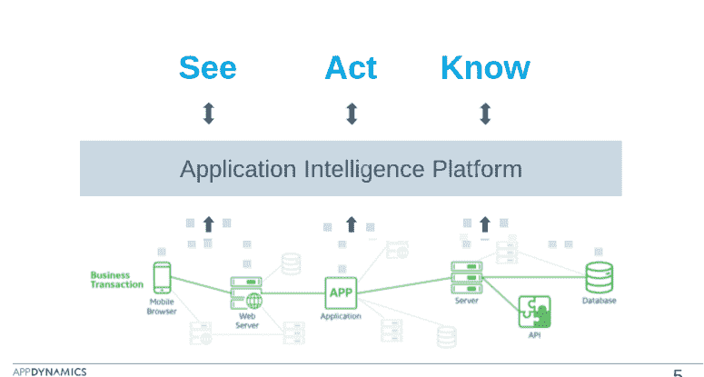

# app dynamics 2016 年冬季 APM 版本提供了对 C、C++应用的更多可见性

> 原文：<https://thenewstack.io/appdynamics-heats-apm-winter-2016-release/>

当“应用性能管理(APM)”一词在过去十年的早期首次出现在技术领域时，最需要进行测试的应用是 enterprise Java 和[。网](https://www.microsoft.com/net)。

时代变了，开发人员处理应用程序性能监控科学的方式也变了。 [AppDynamics](https://www.appdynamics.com/) 的目标是成为未来的 APM 解决方案。AppDynamics 自称为第三代应用程序性能管理平台，正在努力从简单的 APM 转向全面的应用程序智能。

该公司每年递增更新其监测平台四次，大约每个季度一次。最新发布的版本被标记为 Winter 16，大致对应于北半球的冬天，并添加了有助于推进 APM 状态的新功能。

该公司增强了其统一监控功能，包括对服务器和数据库的更多可见性，以及对监控 C 和 C++应用程序的支持。管理员现在可以获得移动和浏览器用户的详细用户会话报告。应用分析已经扩展为一种查询语言，用于找出细微问题的答案。

## 复杂问题的敏捷解决方案

毫无疑问，开发人员寻求的不仅仅是传统的 APM 监控，因为当今的企业开发复杂的应用程序需要详细的基础设施来支持。AppDynamics 在 2014 年实现了 100%的增长，自推出以来已经拥有超过 1800 名客户，其中包括媒体巨头巴克莱和 DirectTV。

AppDynamics 应用性能图表仪表板

“数字化正在改变公司的经营方式。即使是运营流程，每个公司都在关注软件和应用如何驱动基础设施。AppDynamics 产品营销副总裁 Kalyan Ramanathan 说:“软件运行良好非常重要。无论客户如何访问应用程序，企业都在投入越来越多的精力来确保数字体验的卓越性。

自从 [APM](https://www.appdynamics.com/product/application-performance-management/) 首次成为面向开发者的产品以来，应用程序已经变得越来越复杂。在移动、网络和物联网产品上为客户提供真正出色的体验更是如此，因为每个应用程序通常都捆绑了大量单独的服务来帮助实现这种用户体验。无论这是采取多个 API 调用、服务映射的形式，还是在一个函数完成时启动/停止数百个单独的容器，这种困难的结构都使得监控应用程序性能成为一项艰巨的任务。

app dynamics–应用复杂性图

当使用数据库时，应用程序管理的复杂性增加了。在 SQL 和 noSQL 以及传统的数据存储中，架构通常是根深蒂固的。随着微服务的兴起，应用变得更加敏捷。当客户通过一系列交互与应用程序进行交互时，IT 经理可能很难向他们的用户提供一致的体验。Ramanathan 指出，这些商业交易是从客户的应用程序通过网络单独发送的，然后发送到第三方 API 或后端应用程序。

“AppDynamics 做得特别好的是发现业务交易，将最终用户和后端的应用程序流程联系起来。一旦有了这些，你就可以监控和管理商业交易的表现，”Ramanathan 说。

## 统一应用监控

通常所说的端到端监控实际上远不止这些。核心是，通过监控和管理业务事务，可以更好地理解它们。管理是关键。应用程序中发生的事情至关重要，这是 AppDynamics 在其最新的“2016 年冬季”发布中努力解决的问题。这些更新允许用户更好地了解如何在应用程序中使用他们需要的 APM 工具。AppDynamics 将这一概念分为三个核心原则:

*   查看:允许开发人员查看端到端事务。
*   Act:为开发人员提供添加全方位事务的能力
*   了解:允许开发人员了解事务的操作影响。

Ramanathan 注意到 AppDynamics 在逻辑上将用户在应用程序会话中采取的所有步骤连接成一个单独的实例。这些独特的会议可以告诉公司会议的表现，以及客户在会议中的路径。这种统一的监控方法超越了综合监控，涵盖了支持客户的应用程序的所有元素。AppDynamics 还扩展了其统一监控功能，以支持 C 和 C++应用程序，允许开发人员扩展对虚拟机服务器基础架构的支持。

AppDynamics 基金会:看、做、知道

AppDynamics 总共为用户提供了 33 种 APM 功能。这些功能包括数据集、第三方数据集的集成、使用第三方 API 访问数据库、编写自己的查询来分析数据的能力以及其他可视化功能。其他优势包括从应用的角度了解 CPU/内存/服务器的详细信息，分析开发人员基础设施的底层部分如何运行，以及丰富的分析功能。这些信息使企业能够更好地分析他们的数据，并开始从中得出趋势。

由于 AppDynamics 的统一平台是从头开始构建的，这项庞大的任务允许开发人员只需一行代码就可以简单地安装和设置平台。AppDynamics 在 2016 年及以后的主要目标是成为生产监控和生产分析的首选解决方案。

这允许客户将他们的开销保持在最低水平，同时仍然具有相同的 APM 功能，并允许客户映射他们的业务事务。Ramanathan 还指出，商业交易本质上是一种通用语言，应该加以管理。

AppDynamics 有多种部署模型，既有内部部署，也有云中部署。

通过 Pixabay 的特征图像

<svg xmlns:xlink="http://www.w3.org/1999/xlink" viewBox="0 0 68 31" version="1.1"><title>Group</title> <desc>Created with Sketch.</desc></svg>