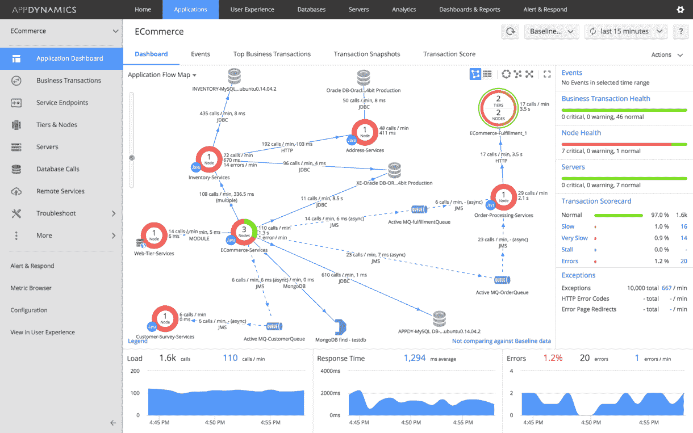

# AppDynamics 将开发人员引入应用性能管理

> 原文：<https://thenewstack.io/appdynamics-pulls-developers-application-performance-management/>

[应用性能管理](https://thenewstack.io/new-relic-revolutionizing-application-monitoring/) (APM)的实践可能不再仅仅针对运营。为了推出[AppDynamics](https://www.appdynamics.com/)“2017 年春季”APM 平台，该公司已经包括了 app dynamics 开发人员工具包，旨在将 APM 工具放到开发人员手中，允许他们将这些信息集成到工作流中。

AppDynamics 平台可用于解锁多种形式的信息，从整体性能数据到危机期间的深度捕捉。开发人员工具包还向开发生命周期添加了测试工具，这些工具能够改善开发人员对整个应用程序功能的看法。其中最主要的可能是新的开发人员模式，它允许捕获表征整体应用程序性能的数据。

虽然这听起来可能不太直观，但 AppDynamics 是专门为在正常操作期间捕获有限的数据量而构建的，以最大限度地减少操作开销(以及操作人员过多的信息)。但是在开发和测试过程中，想要评估更多的数据是正常的，开发人员模式为了更详细的分析放弃了性能保护。

与这一新特性齐头并进的是捕捉实时应用流量并回放以供测试的新功能。新的开发人员工具包包括一个网络流量捕获系统，可以封装此类数据，并在软件开发生命周期的测试阶段提供使用。这种新的实时模式可以跟踪整个业务交易的数据，确保从端到端捕获完整的流量。

在 AppDynamics 的世界里，各种各样的用户在该公司所谓的商业交易上进行合作。这些包括应用程序的单个流中涉及的任何内容，例如“将商品添加到购物车”实时模式侧重于捕获这些事务背后的流量，允许开发人员针对完整的正常工作负载进行测试。

AppDynamics 开发计划高级总监马特·乔丁(Matt Chotin)表示，AppDynamics 平台的这次更新还首次增加了对 [Go](https://golang.org/) 编程语言和 [Xamarin](https://www.xamarin.com/) 跨平台移动应用开发平台的支持。“我们是首批完全支持 Go 的厂商之一，”Chotin 说。“我们希望确保在该平台上构建的任何人都可以访问我们可以提供的数据。”

这个版本中还包括一个新的 Android Studio 插件，用于改善使用 AppDynamics 开发 Android 应用程序的体验。[在移动应用中使用 AppDynamics 时，智能崩溃提醒](https://www.appdynamics.com/solutions/continuous-delivery/)现在默认打开，然后这些可以与转化率联系起来，确保错误与业务重要性直接相关。

Chotin 说，这是 AppDynamics 的关键区别:与实际业务的联系。他说，通过对商业交易的关注，应用程序的所有利益相关者可以围绕一个共同的词汇表进行构建；一个词汇表，其中的指标是围绕这些常用词构建的。

当运营、开发和业务分析师都在同一个房间里，试图弄清楚每个人到底在谈论什么时，词汇可能是一件大事。操作可能是在服务器中讨论，而开发是在特性中讨论，并且业务用户都在使用营销术语。Chotin 说，对特定用户流的关注迫使用户将应用程序视为客户使用的各种渠道，而不是一千个不同的单独仪器部件。

“我们希望继续关注的是如何将开发人员和运营团队与业务和客户联系起来，”Chotin 说。“客户最终真的会推动业务发展。当我们谈论解决性能问题时，我们可以做一些事情，比如更好地解决数据库查询，或者更好地解决网络查询。这是一个潜在的技术动机，但我认为真正的力量来自于你与客户的更大联系。”

Chotin 本人曾经是一名开发人员。他说，他之所以转向产品管理，是因为他觉得自己与客户体验脱节了。他说，为开发人员提供一个更好的窗口，让他们了解每天指导开发工作的决策所依据的指标和分析，只会让开发人员感到更有权力，与客户更有联系。他说，这是推动卓越应用体验的关键。

通过 Pixabay 的特征图像。

<svg xmlns:xlink="http://www.w3.org/1999/xlink" viewBox="0 0 68 31" version="1.1"><title>Group</title> <desc>Created with Sketch.</desc></svg>