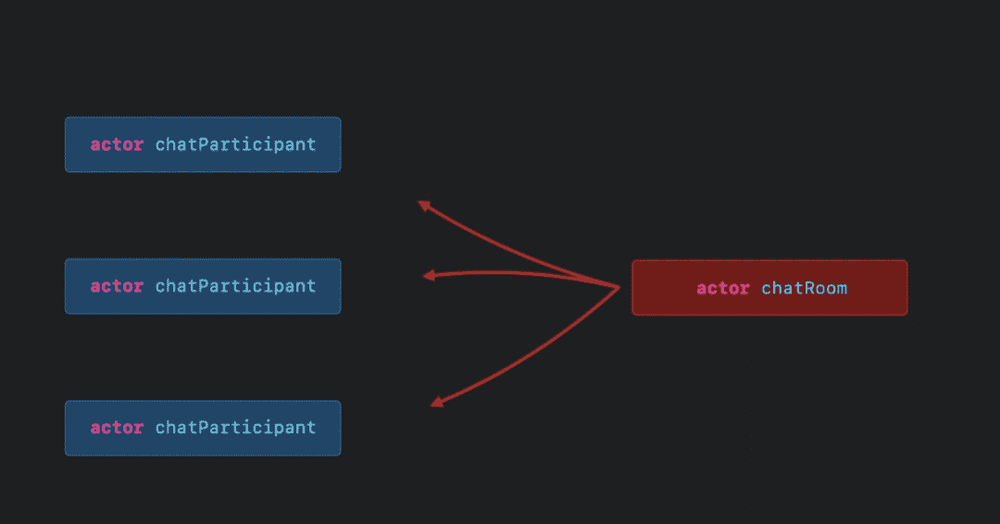

# 苹果在 WWDC22 上强调 Swift 增强功能

> 原文：<https://thenewstack.io/apple-highlights-swift-enhancements-at-wwdc22/>

苹果全球开发者大会于本周举行，会上发布了新的 iOS 功能和机器，如 M2 芯片。会议的大部分内容是关于特性和对用户的好处，但也有一部分是专门为开发社区推出的。

[Swift](https://developer.apple.com/swift/) 是苹果开发的一种编程语言，用于在他们的产品上构建应用。自从在 2014 年 WWDC 会议上宣布(以及随后的发布)以来，开源语言经历了几次重大更新——最近一次是在今年的[3 月](https://www.swift.org/blog/swift-5.6-released/)。当涉及到扩展 Swift 时，苹果似乎没有任何放松油门的意图。这并不奇怪。应用程序市场正在火起来，其他公司(见[微软最近的合作应用程序公告](https://www.microsoft.com/en-us/microsoft-365/blog/2022/05/24/build-collaborative-apps-with-microsoft-teams/))也想成为应用程序开发的权威。

在 WWDC 会议上，发布了新的开发工具，为 Swift 提供了更广泛的功能列表。在主题演讲期间，苹果工程师经理 [Ben Cohen](https://twitter.com/AirspeedSwift?ref_src=twsrc%5Egoogle%7Ctwcamp%5Eserp%7Ctwgr%5Eauthor) 指出，“在过去的一年里，swift 在并发性增强、使 Swift 代码更易于读写的升级、为客户工作流程提供工具以及底层改进方面做得更好。”

## **Swift 的新功能**

Swift 更新的要点之一是并发性。Cohen 说:“现在可以将代码与过去三年发布的所有操作系统快速并发地部署在一起。很明显，苹果花了很大力气让并行运行的代码更容易读写。“这其中很大一部分是斯威夫特的演员模式，”科恩说。Actors 允许您使用线程安全的并发执行代码来隔离数据。Swift 防止您在并行线程之间意外共享该状态，从而消除了一个主要的错误来源。”

科恩补充说，新的更新在“分布式演员”方面更进了一步“分布式参与者可以跨多个进程或设备进行通信，”他说。“‘分布式’关键字标记了这些可以远程访问的工作和方法，无论是您 Mac 上的独立进程、不同设备之间的点对点，还是从一台设备与您在服务器上用 Swift 编写的后端对话。”

据 Cohen 称，一个相关的公告是正在发布的新源代码包，“为 Swift 现有的一套序列算法带来了并发性”。“例如，”他解释说，“Swift sequence protocols 支持 zip 算法来组合序列，async algorithms 则提供了一个版本来将两个异步序列压缩在一起。”

参与者通过 async/await 进行交流。

Swift 更新中还包含了升级的字符串处理功能。正则表达式用来帮助描述你期望在字符串中看到的模式，并精确定位特定信息，它正在得到增强。苹果 XCode 的工程经理[肯·奥尔](https://www.linkedin.com/in/keorr)说，新的‘正则表达式文字’是“直接构建在语言中的，允许 Swift 编译器检查正确性”。

## **用 SwiftUI 定制布局**

苹果的跨平台用户界面框架 SwiftUI 得到了比过去更复杂的布局选项。有一个新的网格容器特性，允许开发人员构建多维的动态布局。您还可以创建自己的容器，这些容器将具有完全可定制的行为。

图表构建工具也以 Swift 图表的形式出现在 SwiftUI 中。它的功能包括在图表上反映应用程序的风格，提供为纵向和横向视图编码的能力，预览数据的结果，以及其他使您更容易理解数据的可视化工具。

可以说 Swift 图表工具已经问世很久了。毕竟，如今数据是每个人最关心的问题。

<svg xmlns:xlink="http://www.w3.org/1999/xlink" viewBox="0 0 68 31" version="1.1"><title>Group</title> <desc>Created with Sketch.</desc></svg>