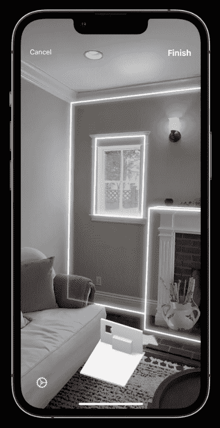
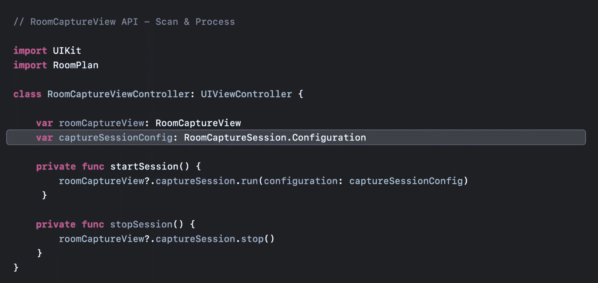
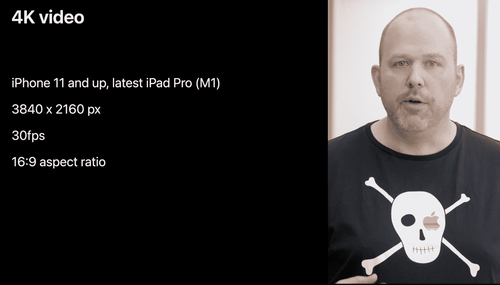

# 苹果在 WWDC22 上为混合现实耳机奠定基础

> 原文：<https://thenewstack.io/apple-lays-foundation-for-mixed-reality-headset-at-wwdc22/>

在苹果年度开发者大会 WWDC 召开之际，有传言称一款“混合现实”AR/VR 头戴设备将[主导](https://twitter.com/markgurman/status/1533452635415539712)这场盛会——尽管硬件本身预计不会被披露。其他人[预测](https://twitter.com/scobleizer/status/1530601980577472512?s=21&t=9o8TO8PyleH8G4wH10mOuQ)苹果将推出新的 3D 开发环境。

这两件事都没有发生。如果说今年有什么东西主宰了 WWDC，那就是搭载 M2 处理器的新款 MacBooks。无论如何，WWDC 2022 包括了几个值得开发者关注的 AR 软件更新——*和*，它们大致暗示了人们热议的耳机。这些更新包括 [ARKit 6](https://developer.apple.com/augmented-reality/arkit/) (苹果 AR 开发套件的最新版本) [Metal 3](https://developer.apple.com/metal/) (游戏的图形 API，针对苹果芯片进行了优化)和用于扫描房间的新 [RoomPlan](https://developer.apple.com/augmented-reality/roomplan/) API。

正如来自彭博的马克·古尔曼[所说](https://twitter.com/markgurman/status/1533904289894211589)，这三个增强现实更新“将会在明年在耳机中播放，但不是今天。”这款耳机的最新预测是 2023 年在 Q2 发布，可能会在 1 月份发布(如果发布的话，将正好是 iPhone 发布的 16 年后)。那么，开发者如何为明年这款可能一鸣惊人的苹果新设备做准备呢？

## 房间平面图

[去年 WWDC](https://thenewstack.io/wwdc21-ios-platform-upgraded-but-what-about-the-web/) 的一大亮点就是引入了[物体捕捉](https://developer.apple.com/news/?id=48xhsgu2&utm_source=thenewstack&utm_medium=website&utm_campaign=platform)，让你可以拍摄现实世界的物体，并将其转化为 3D 模型。今年的 WWDC 将 3D 捕捉从单个物体扩展到整个房间。

Swift 编程语言中的 [RoomPlan](https://developer.apple.com/augmented-reality/roomplan/) API 允许您进行“参数化 3D 房间扫描”，这对室内设计师、房地产经纪人、零售商和其他人都很有用。它可以从 iPhone 和 iPad(2020 年以后的型号)上的相机和激光雷达扫描仪创建 3D 扫描。

在[的一个 WWDC 视频](https://developer.apple.com/videos/play/wwdc2022/10127)中，苹果的 [Praveen Sharma](https://www.linkedin.com/in/praveensharma/) 解释道，RoomPlan“使用 ARKit 驱动的复杂机器学习算法来检测墙壁、窗户、开口和门；以及界定房间的物体，如壁炉、沙发、桌子和橱柜

RoomCaptureView 是开发人员可以在他们的应用程序中使用的扫描和处理 API。除了将房间扫描集成到应用程序中，开发人员还可以选择以 USD 或 USDZ 文件格式导出它们。

Swift 中的 RoomCaptureView API 代码。

你可以看到这一切的走向。去年是 3D 扫描单个物体，今年是整个房间。很快，3D 扫描你周围的一切将成为现实——那时一副“混合现实”眼镜将成为一种更容易与 3D 内容交互的方式。

已经有迹象表明，在 AR 内容方面，智能手机将很快被取代。在另一个名为“[卓越 AR 体验的品质](https://developer.apple.com/videos/play/wwdc2022/10131/)的 WWDC 视频中，苹果 AR 设计师 [Allie Dryer](https://www.linkedin.com/in/allison-dryer-02093a34/) 评论了使用手机消费 AR 的人体工程学，指出“长时间伸出手臂会令人疲惫，单手使用时触摸位置不当的按钮也会感到不舒服。”

## ARKit 6

ARKit 最新版本的主要讨论点是它对 4K 视频的新支持。正如苹果公司大致暗示的那样，“4K 视频非常适合将虚拟和现实内容整合在一起进行视频创作的应用。”换句话说，混合现实需要它。

在 WWDC 的一次技术会议上，苹果公司的克里斯蒂安·利普斯基说“在过去的几年里，我们看到了对高分辨率内容的大量需求——尤其是那些利用增强现实技术制作电影的应用程序对更多像素的渴望。”

4K 视频在 ARKit 6。

利普斯基继续解释说，“在 4k 模式下，使用 3840×2160 像素的图像区域，你可以每秒 30 帧的速度捕捉视频。”在 ARKit 6 之前，最大值是 1920 x 1440 像素的图像区域，因此这是图像质量的重大改进。

然而，Apple 建议您仅在“有明确需要时”使用 4K 视频，因为它对内存和其他系统资源有潜在影响。“受益于高分辨率视频的应用程序是[4K]的良好候选对象，如视频、电影制作和虚拟制作应用程序，”利普斯基说。

“虚拟生产应用”是混合现实应用的另一种说法。同样，我们在 WWDC22 上没有获得任何未来硬件的细节(咳嗽，*眼镜*)，苹果消费者可能很快就会使用这些硬件来体验这些类型的应用程序——但开发者正在准备*现在*通过 ARKit 6 中的 4K 视频处理等基础技术来创建 AR 和 VR 应用程序。

在稍后的会议中，Lipski 谈到了对对象捕获 API 的改进。“现在，有了新的高分辨率背景图像 API，你可以拍摄更高分辨率的物体照片，并创建更逼真的 3D 模型，”他说。

## 没有 WebXR，但对 XR 未来的广泛暗示

虽然苹果今年确实增强了 3D 捕捉和处理技术，但不幸的是，仍然没有迹象表明它支持混合现实的网页版本:WebXR。

正如 AR/VR 企业家托马斯·尼格罗[在 Twitter](https://twitter.com/ThomasNigro/status/1533921619437146112) 上评论的那样，WebXR“仍然无法在 iOS 16 Safari 上工作，尽管实验标志可用并已启用。”唉，对苹果来说，缓慢支持网络标准并不是什么新鲜事。缺乏对 WebXR 的支持将对尼格罗这样的开发者产生影响，因为浏览器几乎肯定会成为主流 AR 采用的入口——特别是在苹果推出混合现实耳机之前的几个月或几年。

尽管如此，苹果在一份新闻稿中声称，它的目标是“推动应用体验向前发展”在今年的 WWDC 上，有许多迹象表明，ar 软件——以及可能在 2023 年发布的混合现实耳机——确实将成为推动下一个应用时代的驱动力。

<svg xmlns:xlink="http://www.w3.org/1999/xlink" viewBox="0 0 68 31" version="1.1"><title>Group</title> <desc>Created with Sketch.</desc></svg>