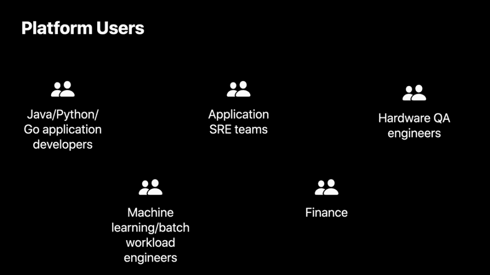

# 苹果计划在 Kubernetes 上运行其大部分“计算管理”

> 原文：<https://thenewstack.io/apple-plans-to-run-most-of-its-compute-management-on-kubernetes/>

根据苹果软件工程师 [Alena Prokharchyk](https://twitter.com/Lemonjet) 今天在[kube con+CloudNativeCon North America](https://events.linuxfoundation.org/kubecon-cloudnativecon-north-america/)上发表的演讲，消费硬件巨头[苹果](https://www.apple.com/)正在加大对 Kubernetes 的全面生产使用，以向其开发人员和工程师提供“计算管理”。

她说，随着时间的推移，苹果将在 Kubernetes 集群上运行其大部分工作负载。

对于 CNCF 来说，它正在鼓励企业最终用户在今年的大会上对其技术提供更多投入，苹果的使用——以及这家通常保密的公司公开披露其 K8s 运营的意愿——是其开源编排平台在企业中更广泛使用的一个强有力的证明。

在使用 Kubernetes 之前，苹果一直使用定制到一个名为 [Jarvis](https://www.theverge.com/2015/4/26/8499669/software-behind-siri-named-jarvis) 的框架中的 [Apache Mesos](http://mesos.apache.org/) 资源管理平台，该平台为开发人员提供无状态和有状态服务，尽管容器编排器已经成为一个瓶颈。该公司还希望找到一个能够更好地利用硬件资源的平台。

当然，自然的选择是 Kubernetes，Prokharchyk 说，他也是 CNCF 技术监督委员会的成员。Prokharchyk 说，K8s 的插件性质意味着选择存储、运行时网络操作“不再是生死攸关的决定”。"选择总是可以被重新评估，而不需要重构整个系统."对开发者来说，另一个重要的特性是通过控制器和自定义资源定义来扩展 Kubernetes API 的能力，苹果欣赏 Kubernetes 社区的开放性和透明性。

实现的主要目标之一是满足组织内不同用户群的需求(尽管一些团队在开始展示时已经将 K8s 用于单个项目)。苹果意识到，该公司的平台开发人员将有一个 K8s 学习曲线，以及对该公司的工程实践以及它们如何适应这种新的云原生范式的重新评估。“我们意识到了这个决定的影响，”Prokharchyk 说。

该公司正在进行的部分工作是配置 Kubernetes，使其尽可能易于开发人员使用。这涉及到理解不同用户群的需求。例如，一组 Java/Python/Go 开发人员喜欢使用容器来测试他们的应用程序。应用站点可靠性工程师(sre)希望为他们的团队构建高级部署工作流。硬件工程师希望加快验证设备的方法。机器学习和批处理工作负载工程师希望在数千个 pod 上运行大型作业。

“所有这些用户都希望采用云原生工具来更好地调试、记录、监控和跟踪他们的应用程序，”Prokharchyk 说。“作为平台开发人员，我们的责任是提供一个具有安全资源隔离和可靠调度的可扩展编排层。”

Prokharchyk 说，为开发者提供高级接口是平台组的工作。现在，苹果以两种服务的形式提供这些 K8s 资源:名称空间即服务和集群即服务。有了名称空间即服务——这些服务可能会在苹果公司被消费的主要方式——用户不必担心基础设施管理。“他们可以专注于应用程序的部署和开发。”

对于多租户使用，资源管理被分离出来作为自己的抽象，重点是平衡混合环境中的工作负载。“该系统将在集群、优先级、使用和限制之间进行动态平衡，以找到用户应用程序的最佳位置，”她说。在名称空间服务中，用户可以自由选择他们偏好的云原生工具，这些工具由平台团队定义的 CRD 提供支持。

目前，苹果工程师正在寻求为 Kubernetes 开发做出更多贡献，希望获得上游接受的所需功能。例如，他们正在寻求对 microVMs 的更大支持，这可以为多租户工作负载提供多层隔离。他们还在探索使用“虚拟集群”，即自助服务集群，用户可以在其中定义自己使用的控制和数据平面。多集群工作负载管理也是一个研究领域。

“我们希望降低开发商和运营商的平台复杂性。同时，我们希望保持高安全标准和资源利用率，”她说。

<svg xmlns:xlink="http://www.w3.org/1999/xlink" viewBox="0 0 68 31" version="1.1"><title>Group</title> <desc>Created with Sketch.</desc></svg>