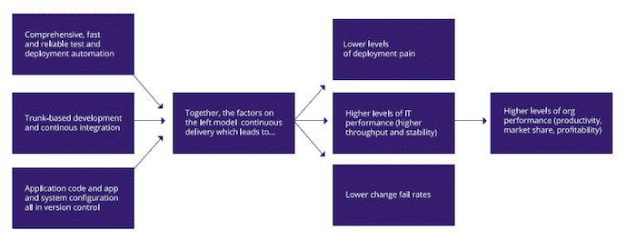

# DevOps 研究:您的部署有多痛苦？所有这些压力又是如何产生的？

> 原文：<https://thenewstack.io/application-architecture-key-predictor-overall-business-success-shows-new-devops-study/>

想预测一个企业是否有很高的成功几率？查看其 IT 团队是否正在实施连续交付和微服务架构，您就有了答案。Puppet Labs 建议，你只需要问一个问题就能知道你的 IT 部门运作得有多好:“部署有多痛苦？”答案不仅会揭示企业的 IT 绩效，还会揭示他们潜在的整体业务成功。

为了证明持续交付实践和组织绩效之间的因果关系，Puppet Labs 根据其年度调查 DevOps 世界的调查结果发布了此路径图:

木偶实验室的 CD 练习路径图。

调查发现，“你越是通过自动化、减少批量和缩短周期来提高系统质量，越是有效地管理团队的工作量和可视化工作队列、缺陷和瓶颈，你就越能提高产量和稳定性。”

高绩效的 IT 团队部署代码的频率是其他调查对象的 30 倍，最终的生产代码实际上比他们的同行快 200 倍。更多的开发人员加快了部署代码的频率。当一个企业中的开发人员数量超过 100 人时，一个拐点就出现了，表现最好的企业可以成功地增加到每个开发人员每天三次部署。

令人惊讶的是，有无数的环境变量并没有成为 DevOps 性能的障碍。像团队是否使用现成的软件，是在遗留项目还是绿地项目上工作，或者是在记录系统上构建和集成都没有那么重要。应用程序架构似乎是管理性能的主要手段。

DevOps 成功的另一个重要指标是整体管理环境。

工作场所健康研究早就发现，高需求、低控制的工作会降低生产率，增加心理健康成本，如员工的压力休假和倦怠。“高需求”工作是指那些没有给员工足够时间完成所有任务的工作。“低控制”工作是指员工没有被授权自己解决问题，对工作环境没有控制权，也没有学习新技能的机会。

正如更广泛的行业中的情况一样，DevOps 也是如此:IT 性能在企业中更高，在这些企业中，开发人员有时间学习新技能，被鼓励了解他们的工作如何与整体业务目标保持一致，被给予性能指标的可视化显示，并被鼓励解决问题。

该调查的缺点之一是缺乏妇女对调查的回应。在 4976 名受访者中，只有 5%是女性。作者对低参与率感到惊讶，指出 13%的系统管理人员是女性。然而，那些接受调查的人是在男性占主导地位的环境中工作的:33%的人在没有女性的团队中工作，56%的人在女性同事不到 10%的团队中工作。

作者指出，研究表明，女性领导能带来更高的金融业务绩效，女性越多的团队，团队智慧越高。“尽管有这些明显的优势，但组织未能在技术领域招聘和留住女性……我们可以做得更好。这取决于我们所有人优先考虑多样性和促进包容性的环境，”作者敦促道。

特色图片:[专家步兵](https://www.flickr.com/photos/expertinfantry/)的: [961120-N-2316H-001](https://www.flickr.com/photos/expertinfantry/5466899761/in/photolist-9k6hQr-6jk9td-9ysrwn-adB7N5-85VJRh-ccUpzA-dY5udY-dr1mrJ-bTrPxt-7Vsi6L-bSvnn2-rRnPvF-ac3p2e-bM6rhr-ac2Ufd-ac2Un9-ac2TZL-az4jg3-dr1mw1-drfzss-ad127q-auYoEs-auYs3d-34qWdG-4XJsbd-dkJ2uu-cTkAC3-7YFVPG-4U2DXU-dNogHP-6jS4Xm-dVy7PS-bKPeXv-aadkD5-ktuA58-8idtba-cTkAh9-cTkA1Q-cTkBH1-cTkBsW-cTkBc3-cTkAWJ-6mhWWw-hL67YT-6paEzt-a9VWKa-dchJUh-bVx9Nz-a9XtU5-dSH7QF) 由 2.0 在 [CC 下授权。](https://creativecommons.org/licenses/by/2.0/)

<svg xmlns:xlink="http://www.w3.org/1999/xlink" viewBox="0 0 68 31" version="1.1"><title>Group</title> <desc>Created with Sketch.</desc></svg>