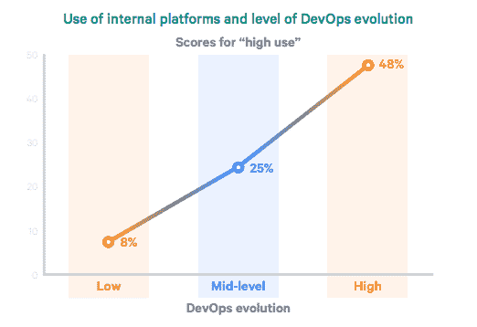

# 使用 GitOps，应用程序部署更快

> 原文：<https://thenewstack.io/application-deployment-is-faster-with-gitops/>

 [乔迪·蒙公司

乔迪是 Weaveworks 的产品营销总监。他是一名开源产品专家、社区建设者和公共演说家。他是 OpenUK 和 PMM 联盟大使，常驻伦敦。](https://uk.linkedin.com/in/jordimoncompanys) 

企业必须更快地创新，以保持当今的竞争优势。但是要做到这一点，他们需要在软件交付的现代方法上构建他们的应用交付管道。大多数企业都有多个开发运维团队在多个应用交付管道上工作。让每个人都同意一个技术栈是具有挑战性的，尤其是当多个团队在多个代码库上工作的时候。更糟糕的是，在整个软件交付过程中，应用程序的部署通常仍然是手工处理的。这要求每个团队和每个团队成员对整个堆栈有深入的了解，这使得组织很难扩展他们的应用程序开发来满足业务需求。

在本帖中，我们看看 2021 年 DevOps 报告的主要发现，以及来自 [Weave GitOps](https://www.weave.works/product/gitops-core/) 的最佳实践，作为在您的组织中实施这些知识的一种方式。

## **创新只有通过更快的发展速度才有可能**

根据 DORA (DevOps 研究和评估)发布的 [2021 年 DevOps 报告状态](https://puppet.com/resources/report/2021-state-of-devops-report)，高绩效的 DevOps 团队具有更频繁的部署、更短的变更准备时间、更快的 MTTR(平均恢复时间)和非常低的变更失败率。

来源:木偶

对更快的[应用部署](https://thenewstack.io/deployment-strategies/)周期的需求导致了 GitOps 的流行。GitOps 包括在应用程序开发的整个操作阶段使用 Git。GitOps 允许您以更敏捷的方式构建应用程序，因为它使用 Git 作为唯一的事实来源。所有配置和状态更改都在 Git 中完成，并通过一个简单的 pull 请求立即应用到生产中。这意味着您可以在几秒钟内将更改部署到您的应用程序中。这是对以前在孤岛中管理操作并手动完成这一工作的方法的改进。

Weave GitOps 是一个开源工具的集合，最著名的是云本地计算基金会(CNCF)孵化项目 [Flux](https://fluxcd.io/) ，它擅长以 GitOps 的方式自动部署。Flux 充当一个代理，不断检查 Git 中的更新，并立即将这些更新应用到生产中。

## **部署频率提高了稳定性和可靠性**

更频繁地部署应用程序和服务是提高其质量和稳定性的关键。软件交付的问题是，我们将每个版本都视为一个大事件，这意味着我们很少部署。然而，改进应用程序的最佳方式是进行频繁的增量更改。

持续集成和持续交付(CI/CD)总是鼓励更频繁地进行较小的变更。GitOps 通过极大地简化部署来实现这一点。它通过使部署变得像编辑 Git 存储库和发起 pull 请求一样简单来实现这一点。

虽然很简单，但有繁忙的软件代理在后台不断工作，使这成为可能。这是 Weave GitOps 的工作，在 Flux 的帮助下:以最小的摩擦简化从 Git 到生产的变化过程。

## **流水线自动化减少人为错误**

软件交付管道可以被认为是开发和发布软件产品的过程。如果流程没有实现自动化，管理起来会非常耗时且令人沮丧。事实上，缺乏自动化会导致人为错误，从而浪费大量时间和金钱。

那么软件交付管道是如何工作的呢？简而言之，这个过程始于开发人员创建一个新的特性或缺陷修复。然后对软件进行测试，并部署到试运行环境中进行测试和反馈。如果更改通过了测试，它们将被提升到生产环境中。这整个过程可以自动化，以提高发布的质量，并使团队更容易发布代码。

Weave GitOps 允许您创建一个管道，可预测地发布对软件的更改。您可以将管道配置为与您喜欢的 Git 或 CI 服务——如 GitHub、Jenkins 或 Git lab——一起工作，并将更改部署到生产中。

## **回滚允许从故障中快速恢复**

将代码部署到生产环境中时，总是会出现问题。想象一下，一个第三方提供商出了问题，你的整个系统就瘫痪了。我们大多数人都遇到过这种情况。但是，如果您可以回滚到之前的提交、更改或部署，会怎么样呢？如果您可以回到以前的版本，回到出现 bug 之前的某个时间点，而不是关闭您的系统，会怎么样呢？这在 GitOps 中是可能的，它涉及到恢复到 Git 存储库的以前保存的版本。

[Weave GitOps Enterprise](https://www.weave.works/product/gitops-enterprise/) 是围绕使用 Git 的版本控制功能来存储分布式系统的状态这一思想而构建的。在应用更改之前，Weave GitOps 会自动将每个存储库的状态保存为快照。这意味着回滚到以前的状态只需要一个命令。

## **通过降低复杂性减少运营开销**

传统的软件交付过程通常需要大量的批准，导致大量的时间和精力。这通常涉及到开发和运营团队之间的许多来回。这通常会导致软件交付到产品的延迟，以及相关各方之间沟通不畅和冲突的风险。结果是:大量的时间和精力花费在不必要的重复性任务上。GitOps 是避免这些问题的好方法，因为它将开发和运营团队的优先事项联系起来。开发人员无需接触生产集群即可部署代码。平台团队提供现成的应用堆栈，使部署可预测且可重复。

《2021 年开发运维状况报告》认为，内部平台模式是高绩效开发运维团队的特征。

来源:木偶

通过应用 GitOps 背后的思想，您可以看到简化操作的能力有了显著的提高。借助 GitOps，您可以开发、测试和部署软件变更，而无需通过审批、来回奔波或任何其他手动瓶颈。

## **渐进式交付允许实时用户测试**

渐进式交付是一种高级部署模式，包括金丝雀释放和蓝绿部署等方法。它允许实时用户测试，而不是在发布应用程序之前对其进行大量检查的传统方法。渐进交付的想法很简单:分阶段推出新的变化，而不是一次全部推出。这样，如果出了问题，也不会影响到你的整个用户群。

渐进式交付允许在真实环境中进行测试，而不是在模拟环境中。它允许在应用程序中的错误到达所有最终用户之前及早检测到错误。这是渐进式交付的主要好处，因为它允许应用程序在发布之前进行测试，在过程的早期捕获 bug。这可以确保您提供尽可能高质量的服务。

Weave GitOps 可以利用开源工具 [Flagger](https://flagger.app/) ，以及像 Istio 或 Linkerd 这样的服务网格工具来实现渐进式交付。整个部署过程的配置存储在 Git 中。这使得实施部署策略以及在部署过程中编辑这些策略变得非常容易。

不满足于仅仅采用 DevOps，而是希望在 DevOps 中达到成熟的组织，需要关注 GitOps 实践。这些实现了更高的开发速度、自动化和可预测的发布，以及先进的渐进交付方法。Weave GitOps 将 Flux、Flagger 和 Istio 等前沿开源工具整合到一个易于操作的解决方案中。组织可能会从怀疑开发运维的价值转变为使用 GitOps 按需部署。

要了解更多关于市场上 GitOps 解决方案的信息，请加入我们以及来自 [AWS、微软、VMware 和 D2iQ 的朋友，参加我们于 10 月 20 日举办的下一次](https://www.gitopsdays.com/)虚拟 GitOps 活动。在这个为期半天的活动中，我们将探索 CNCF 孵化产品 Flux 如何为 EKS、Arc、Tanzu 和 bare metal 上的企业 GitOps 解决方案提供支持。

<svg xmlns:xlink="http://www.w3.org/1999/xlink" viewBox="0 0 68 31" version="1.1"><title>Group</title> <desc>Created with Sketch.</desc></svg>