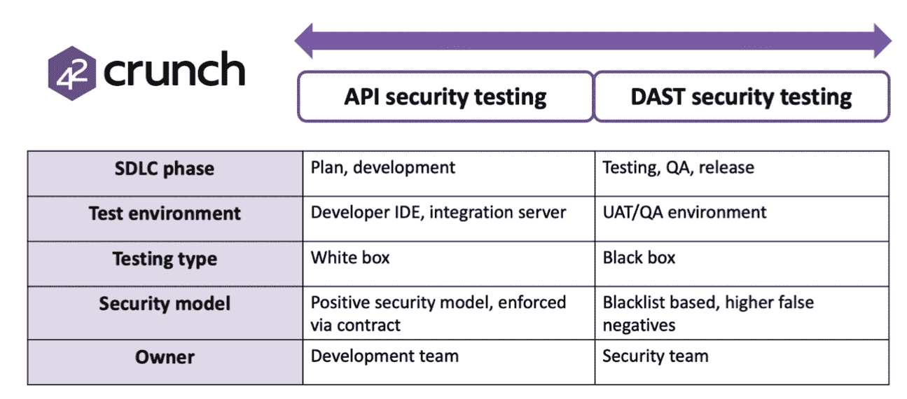

# 应用安全工具不能胜任 API 安全的工作

> 原文：<https://thenewstack.io/application-security-tools-are-not-up-to-the-job-of-api-security/>

 [科林·多莫尼

科林·多莫尼(Colin Domoney)是一名 API 安全研究专家和开发者倡导者，拥有 42 个 Crunch。他监督 42Crunch 社区的发展，并策划 apisecurity.io 行业时事通讯。Colin 是一名经验丰富的 AppSec 专家，曾与 Cyberproof、Veracode、CA 合作，并负责监管德意志银行的全球 AppSec 项目。](http://apisecurity.io/) 

在过去的二十年里，软件以网络或移动应用的形式扩散到了我们生活的方方面面(根据 GitHub 的数据，仅在 2020 年代码库就增加了 35%)。对手越来越多地攻击这些应用程序，防御者采用各种测试工具和技术来保护它们。

如今，大多数企业都有一个应用安全(AppSec)计划来管理这些工具的部署和相关的漏洞。软件开发世界中唯一不变的是变化，尤其是近年来，随着云原生技术(如容器、编排平台)的广泛采用以及通过微服务的采用打破了单一模式。

不幸的是，对于 AppSec 团队来说，这种快速发展的形势意味着他们使用的许多工具都不能胜任保护其应用程序的任务。

这一点在应用程序编程接口(API)的安全性方面表现得最为明显，API 是所有现代应用程序的基础。从安全的角度来看，API 提出了一个独特的挑战，因为从攻击的角度来看，它们是独一无二的 OWASP 认识到了这一点，他专门为 API 安全漏洞 列出了 [十大漏洞。](https://apisecurity.io/encyclopedia/content/owasp/owasp-api-security-top-10.htm)

## 为什么现有的 AppSec 工具在 API 上表现不佳

### SAST 不是为以 API 为中心的应用程序设计的

任何 AppSec 程序的主力都是静态应用程序安全测试(SAST ),这是对应用程序中的漏洞进行的“白盒”评估，通过检查源代码并创建应用程序中的数据流模型来确定应用程序在哪里容易受到外部攻击，例如注入攻击。

复杂的数据流路径或不受支持的框架会降低 SAST 分析的准确性，因为模型可能不完整或不准确。

在 API 的情况下，这要复杂得多，因为大多数 SAST 工具都被设计为与构建为例如 Java Servlet PHttpRequest 的 web 应用程序一起工作。身体年龄或者。Net ASP 页面。

在这种情况下，SAST 工具检测代码库中的`HttpRequest.Body`实例，因为这通常是网页的构造方式。不幸的是，API 要复杂得多，因为它们是使用无数第三方框架(如 SpringBoot、Flask 等)以不同方式构建的，并且应用程序入口点的检测也更加复杂，导致模型不准确和误判率更高。

### DAST 缺乏 API 的上下文

动态应用程序安全测试(DAST)是对正在运行的应用程序进行的“黑盒”评估，方法是以与用户或攻击者相同的方式测试应用程序端点。DAST 工具擅长“爬行”web 应用程序来确定页面结构和输入字段，然后攻击这些字段来识别漏洞。

不幸的是，对于一个 API，DAST 扫描器不能枚举 API 端点，使得这种攻击不可能。一些 DAST 工具(比如 [OWASP ZAP](https://www.zaproxy.org/) )可以摄取一个 OpenAPI/Swagger 文件来播种蜘蛛程序。

即使在这种情况下，如果不深入了解 API 端点，DAST 工具也无法提供 API 安全性的智能评估。例如，DAST 扫描器将不能识别破坏的对象级授权([【BOLA】](https://apisecurity.io/encyclopedia/content/owasp/api1-broken-object-level-authorization))问题，除非它知道用于识别对象的参数值(以便模糊该字段)，然后能够解释响应以确定攻击是否成功，或者是否返回任何错误。

### API 安全性左移

[安全工具](https://thenewstack.io/category/security/)在过去十年中取得了巨大的进步，然而，高度扩展和有效的 AppSec 计划的最大障碍是安全活动在软件开发生命周期(SDLC)中进行得太晚。

测试太晚会增加补救的成本，并降低开发人员补救的可能性。对于典型的整体式应用程序，除了在周期的后期进行测试之外别无选择，因为需要应用程序的一个运行中的功能实例来执行测试，特别是对于 DAST。

随着基于微服务的以 API 为中心的架构的出现，有可能在开发时测试每个单独的 API，而不需要应用程序的完整实例，从而实现“左移”方法，允许早期测试单独的组件。

因为 API 最早是在 SDLC 中指定的，并且具有定义好的契约(通过 OpenAPI / Swagger 规范),所以它们非常适合先发制人的“左移”安全测试方法 API 规范和底层实现可以在开发人员 IDE 中作为独立活动进行测试。

这种方法的核心是特定于 API 的测试工具，因为需要对 API 契约有上下文意识。现有的 SAST/DAST 工具在很大程度上不适合这种应用——在讨论检测 BOLA 的 DAST 测试时，我们发现 DAST 工具无法理解 API 行为。

通过使用合同指定 API 行为，可以实施和验证正确的行为，从而实现积极的安全模型(所需的行为被列入白名单),而不是像 DAST 这样的黑名单方法。

下图总结了 API 安全本地测试和 DAST 测试的主要区别，来自 [42Crunch](https://42crunch.com/why-42crunch/) :

资料来源:42Crunch。

我所讨论的安全测试工具通常由组织的安全或 AppSec 团队操作，并经常强加给开发人员，他们可能会发现这些工具不适合现代开发实践，如持续集成(CI)和持续部署(CD)——有时会导致开发人员的沮丧和安全工具的较低采用率。

相比之下，能够在他们的环境中为开发工作增加价值的 API 安全工具(例如允许 API 规范的持续验证)更有可能被采用和积极使用。

## 结论

SAST 和 DAST 等更传统的安全测试工具在你的 API 开发环境中有一席之地吗？答案几乎肯定是肯定的，特别是如果您已经有了以这些工具为中心的投资和过程。通过利用 API 规范的声明性质，精明的组织可以使用特定于 API 的工具来采取严格的“左移”方法，并使用积极的安全模型来实施和测试 API 安全性。任何由此产生的 API 都通过设计保证安全，为可以使用 SAST/DAST 工具测试的高层应用程序堆栈(网页或移动应用程序)提供坚实的基础。

<svg xmlns:xlink="http://www.w3.org/1999/xlink" viewBox="0 0 68 31" version="1.1"><title>Group</title> <desc>Created with Sketch.</desc></svg>