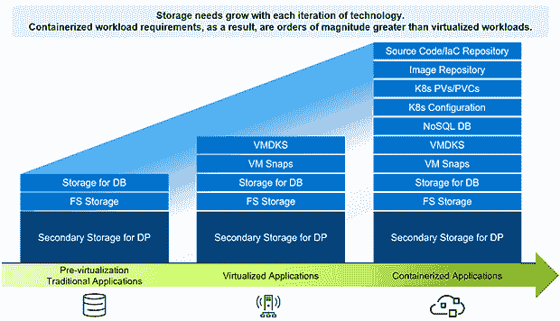

# 应用程序存储很复杂。自动化能简化它吗？

> 原文：<https://thenewstack.io/application-storage-is-complex-can-automation-simplify-it/>

一个应用程序通常需要三层来运行:网络，用于连接；存储，保存信息；和计算。在这三者中，计算是过去二十年来变革的主要驱动力，例如在从裸机上运行应用到[虚拟化](https://thenewstack.io/the-next-evolution-of-virtualization-infrastructure/)再到[容器化](https://thenewstack.io/category/containers/)的演变过程中，计算需求不断膨胀。

这种不断扩展的计算层增加了堆栈和负责管理它的人员的复杂性。

然而，这种计算模式的转变反过来影响了存储，尤其是在容器化工作负载的存储领域。随着企业适应在混合和云计算世界中交付应用的方式，存储加密和应用移动性尤其让 [DevOps](https://thenewstack.io/category/devops/) 团队头疼。

为了解决这一问题，该领域最老牌的公司之一——拥有 38 年历史的戴尔科技公司(Dell Technologies)正在创新新的方式，使其容器存储模块能够让开发人员和工程师的生活变得轻松，包括发布两个新模块，专注于加密和应用移动性的挑战。但在探索解决方案之前，我们需要更深入地挖掘问题。

## 存储挑战如何演变

最初，有裸机:应用程序是单片的，直接在硬件上运行。事务性数据库使用存储，存储受戴尔或 EMC(或者，在前者于 2016 年收购后者后，戴尔 EMC)等公司制造的产品保护。

然后，在本世纪初的全盛时期，虚拟化增加了新的复杂性。 [Nivas Iyer，](https://www.linkedin.com/in/nivasiyer/)戴尔负责 [Kubernetes](https://thenewstack.io/category/kubernetes/) 和 [cloud native](https://thenewstack.io/category/cloud-native/) 数据保护的高级首席产品经理，指出了像 VMware 这样的公司如何在那个时期加速虚拟机的使用，使用它们来整合服务器和前端应用程序。

结果是，“最小的服务器占用空间，导致数据中心占用空间缩小。在这方面，计算也更上一层楼。”

随着进步而来的是更多的复杂性。Iyer 告诉 New Stack，虚拟化“带来了一系列新的挑战，因为存储系统现在必须与虚拟化层对话，并通过虚拟化层与应用程序对话。

随着支持应用程序的体系结构从传统发展到虚拟化再到容器化，存储需求变得越来越复杂。(图片由戴尔技术公司提供。)

当虚拟机本身需要存储时， [VMware](https://tanzu.vmware.com?utm_content=inline-mention) 推出了虚拟机磁盘文件(VMDK)，这是一种用于虚拟机的文件格式，现在是一种开放的文件格式。微软推出了虚拟硬盘(VHD ),来做同样的事情——尽管两者需要兼容的转换软件，因为它们当然是兼容的。

因此，“存储容量扩大了，二级存储或数据保护方面也扩大了，”Iyer 说。“随着这种扩展，出现了新的接口，这是因为存储系统需要与虚拟化层进行通信。所有这些新功能结合在一起，创造了一个真正的存储生态系统。”

这意味着:[devo PS 团队的责任范围和认知负荷增加，](https://thenewstack.io/this-cant-be-normal-the-tech-industry-after-a-year-of-burnout/)尤其是开发人员和存储管理员。

## 更多的玩家，更多的需求

Iyer 说，随着计算层变得越来越复杂，随之而来的存储需求越来越大，需要更多的人来管理这一切，他们需要新的技能。

“所以现在你有更多的球员，”他说。"以前，事情很简单:存储管理员、服务器管理员、网络管理员."但是虚拟机的出现要求引入虚拟管理员，他们了解虚拟化，包括围绕虚拟化的工具生态系统以及它们如何集成；

类似地，容器、Kubernetes (K8s)以及围绕 K8s 涌现的[产品和服务的广阔前景的引入，需要用于导航高级 API 和接口的新技能和知识。](https://landscape.cncf.io/)

随着对这些利基但深度技能的需求日益突出，开发人员和运营人员之间的隔离和脱节变得比以往任何时候都更加明显。为了弥补技能和流程的不足，变通方法和“影子 IT”文化的出现很快以完成工作的名义成为了常态。

企业意识到这可能给业务带来的风险，转而采用我们今天看到的常见开发运维实践。这些实践不仅简化了开发人员和运营团队协作的流程，还为管理员整合自动化以减少手动工作、技能差距和对变通方法的需求奠定了基础。这种自动化对于开发人员和存储管理员尤其重要。

以一个带有容器化应用程序的 Kubernetes-run 系统为例，其中存储是动态请求的。将高级存储功能(如复制和弹性)引入此环境需要与 K8s 容器存储接口(CSI) API 进行通信。为了做到这一点，K8s 需要一些插件，可能还需要自动化来提供这些功能，并使管理存储的员工的工作变得轻松。

这是戴尔通过其容器存储模块寻求解决的特殊挑战。

## 集装箱储物模块如何适应

2019 年，[现任戴尔基础设施解决方案集团技术专家副总裁的 Itzik Reich](https://www.linkedin.com/in/itzikreich) ，在公司用户大会上分享了将戴尔存储阵列与 Kubernetes CSI API 集成的计划。两年后，Reich 在[的博客中写道，在 2019 年的演讲后，与会者向他表达了他们的担忧:他们将如何跟踪存储阵列中发生的事情？](https://infohub.delltechnologies.com/p/introducing-dell-container-storage-modules-csm-part-1-the-why/)

在那次事件之后，Reich 写道，“我召集了一个产品经理团队，我们开始思考即将到来的客户需求。我们不需要使用水晶球，而是作为世界上最大的存储公司，开始采访客户，了解他们对 K8s 的需求。”

这些对话取得了成果。2021 年 8 月，戴尔发布了其首款容器存储模块(CSM)。[第一组 CSM](https://infohub.delltechnologies.com/p/part-2-the-what-introducing-dell-container-storage-modules-csm/)设计用于处理授权、可观察性、复制、弹性和快照。这些 CSM 是:

*   **授权:**使 Kubernetes 管理员能够应用基于角色的访问控制(RBAC)和配额规则，即时自动限制集群租户对存储资源的使用。
*   **可观察性:**使用 Grafana 和 Prometheus 仪表板为 Kubernetes/container 管理员提供单一窗格管理体验。
*   **复制:**为 Kubernetes 用户提供阵列复制功能，将数据保护和灾难恢复规划扩展到 Kubernetes 工作负载。
*   **弹性:**通过启用 K8s 节点故障转移来防止节点故障。该模块跟踪永久卷的运行状况，检测节点故障(电源故障)、K8s 控制平面网络故障和阵列 I/O 网络故障，并将受保护的 pod 正常迁移到正常运行的硬件。
*   **快照:**构建于基于 CSI 的快照之上，用于运营恢复和数据再利用。除了时间点恢复之外，快照是可写的；它们可以装载用于测试、开发和分析使用情形，对生产量没有影响。

存储模块建立在戴尔数十年的数据存储知识基础之上，使开发人员能够利用自动化存储基础架构，从而提高他们的整体开发效率。

这些模块可以部署在戴尔的所有主存储阵列上，包括 Dell PowerFlex、Dell PowerStore、Dell PowerScale、Dell PowerMax 和 Dell Unity XT。

## 新的加密和应用移动工具

9 月下旬在，戴尔为其 CSM 产品组合增加了两个模块:应用移动性和加密，这两个模块目前都在技术预览中。与以前可用的 CSM 一样，新模块是开源的。

当前的戴尔客户服务经理阵容；应用移动和加密处于技术预览*阶段，而卷放置仍处于开发阶段**。(图片由戴尔技术公司提供。)

app mobility 模块为戴尔的客户解决了一个特别紧迫的问题。

“我们生活在一个多云的世界，”Iyer 说。“我们有可以在多个地方运行的应用程序，有时我可能因为各种原因需要移动应用程序。也许我有一个测试开发环境，现在我可以将它升级到生产环境。例如，如果我需要将工作负载从一个云迁移到另一个云，或者从边缘迁移到数据中心，然后再迁移回边缘，CSM 应用移动性可以帮助我。”

“应用程序移动性基本上使我能够将整个应用程序作为一个整体，然后将其移动到另一个地方并在那里启动。”

新模块允许 K8s 管理员将其有状态应用程序工作负载和应用程序数据克隆到其他集群，无论是在本地还是在云中。它使用 [Velero](https://velero.io/) 备份工具及其集成的数据移动器 [Restic](https://restic.net/) 将应用程序元数据和数据复制到对象存储。它不仅支持 Kubernetes container orchestrator，还支持 [Red Hat OpenShift、](https://www.openshift.com/try?utm_content=inline-mention) RHEL 和 CentOS。

新的应用移动模块可以帮助备份和恢复应用，克隆它们，或更改 PV/PVC 存储类别。

“数据的流动性非常重要，应用环境也是如此，”Iyer 说。“我们只是在它上面添加了应用程序上下文，以允许应用程序与数据一起移动。”

Iyer 说，除了应用程序移动性，戴尔的存储产品“开箱即可支持低加密。”但是新的 CSM 加密模块可以加密静态和动态数据，在保证存储安全方面更进一步。

“安全是一个整体，”他说。“例如，我们有身份验证模块，确保合适的人员或合适的团队基本上能够访问它。我们也有加密方面，使用哈希公司的 Vault 等工具。我们可以存储加密密钥，加密数据，并基本上确保信息以我们需要的正确格式存储。”

安全模块支持的编排和操作系统包括 Kubernetes container orchestrator 以及 RHEL、SLES 和 Ubuntu。

## 开始使用并保持更新

Iyer 说，戴尔的一些客户正在转向容器化的微服务，并处于采用新 CSM 的不同阶段。作为最后一条指导意见，他建议那些想要试验这些模块的组织慢慢开始，进行概念验证。

戴尔鼓励与客户反复交流，以帮助不断改进 CSM。“他们给我们反馈，我们确实以敏捷的方式工作，”Iyer 说。

“我们每两周进行一次 sprints，同样，它是开源的。因此，这是一个非常非常快速的创新过程，允许我们灵活地采纳、接受和整合反馈。最终，我们的目标是让戴尔为整个开发人员社区创造更好的东西。”

<svg xmlns:xlink="http://www.w3.org/1999/xlink" viewBox="0 0 68 31" version="1.1"><title>Group</title> <desc>Created with Sketch.</desc></svg>