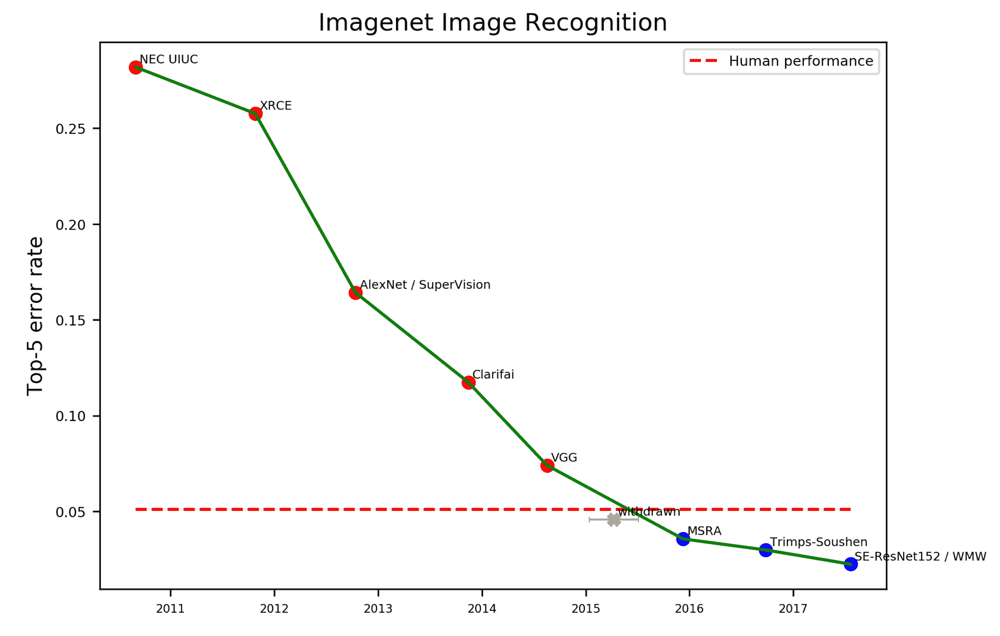

# 在人工智能中，应用比算法更重要

> 原文：<https://thenewstack.io/applications-matter-more-in-ai-than-algorithms/>

 [王济民

王济民是 Creative Ventures 的普通合伙人，这是一家专注于医疗保健、农业和工业技术的早期风险投资公司。他也是 Lioness Health 的联合创始人。](https://www.linkedin.com/in/jwang10/) 

任何看过电视节目“硅谷”的人都可以告诉你什么是有价值的创业公司:他们的算法。虽然“硅谷”实际上位于一个对创业老手来说太熟悉和太真实的不可思议的山谷中，但创造或毁灭一家创业公司的算法——即使是在人工智能/人工智能领域——不再非常准确。

事实上，即使我们今天看到的“人工智能创业公司”激增，也很少有真正在算法上有所差异的。人工智能现在真的只不过是软件的桌面赌注——它无处不在，令人期待。更重要的是什么目的和应用，它正在被应用。

## 很难击败全球人工智能研究社区

大约在 2015 年，我们开始看到人工智能初创公司的激增，特别是那些声称能够利用图像数据做有用的事情的公司。这不是巧合。正是在这个时间段，卷积神经网络(CNN)在学术文献中开始成熟，并得到更广泛的应用。

当然，神经网络甚至一些围绕现代 CNN 的框架都不是新的。2015 年之前，也有初创公司向风险投资家(VC)推销，声称他们能够利用一种高级图像识别算法赚钱，这种算法为苹果的 Face ID 和购物应用等技术提供动力，让你可以使用图片找到产品。

这些创业公司中的一些确实在发表的学术研究中比“最先进”有短暂的优势，但这种优势是短暂的，从实际市场的角度来看不是特别相关。

在这一点上，不仅在顶级研究机构，而且在谷歌和微软研究院这样的公司实验室(更不用说腾讯或百度这样的中国公司的人工智能实验室)都有数千名人工智能研究人员。根据 Nature 的数据，2019 年[的全球出版物产量为 403，000 份，并且还在继续增长。](https://www.nature.com/articles/d41586-020-03409-8)

任何一家初创公司和任何一组工程师都很难提出比更广泛的科学界更重要的基础算法突破。

## 数据壁垒正在消失

如果具体算法不重要，那么数据呢？我们有许多文章得意洋洋地宣称“数据是新的石油”，如果你接受算法优势可能充其量只是短暂的，这确实是有道理的。

然而，这一人工智能热潮的一个重要趋势是，随着算法开发的每一代发展，我们需要的数据呈指数级减少(以及数据“表示”的发展——为简单起见，读者可以只考虑算法的一部分)。

在 CNN 出现之前，我们可能需要几十万、几百万甚至几十亿的数据点来做 CNN 用几万个数据点所能做的事情。人工智能的许多最新发展，在这些更好的算法/表示和合成数据等技术之间(人工智能代理可以教会自己做像在围棋中击败大师这样的壮举)，涉及越来越少的数据来做越来越多的事情。([我其实就这个具体话题写了一篇比较长的文章](https://creativeventures.vc/2021/01/14/the-fall-of-data-moats/))。

## 它是关于应用的，就像其他事情一样

那么，如果不是算法，也不是数据，那么是什么将推动人工智能/人工智能创业成功呢？

从某些方面来说，和其他好的创业公司一样:应用。

从 Salesforce 到 Slack，甚至像优步和 Airbnb 这样的初创公司，都没有根本性的突破或技术胜利来推动他们的成功。所有这些公司都在其“堆栈”中使用了相当知名的技术这并不是因为有人使用了一种神奇的编程语言或者有一种更好的算法。

这些初创公司之所以成功，是因为他们投入了更多的工程资源，并在其类别内对基本的产品市场适合度进行了更多的循环迭代。基本上，他们更好地了解他们的客户和他们的需求，并在背后投入工程力量来制造产品，将这种理解转化为现实。

> 尽管人工智能/人工智能领域的初创公司可能看起来比普通的软件公司更像“科幻小说”，但我们已经到了没有什么不同的阶段。AI/ML 被赋予了很多，但它并不神奇。

我们应该期待的不是某个完美的算法会突然带来下一个谷歌，而是前景看起来更像应用程序或更现代的软件——成熟和知名技术在特定市场的应用，这些市场愿意为解决他们问题的精心设计的产品付费。这也是今天许多“人工智能初创公司”真正应该集中精力的地方。

<svg xmlns:xlink="http://www.w3.org/1999/xlink" viewBox="0 0 68 31" version="1.1"><title>Group</title> <desc>Created with Sketch.</desc></svg>