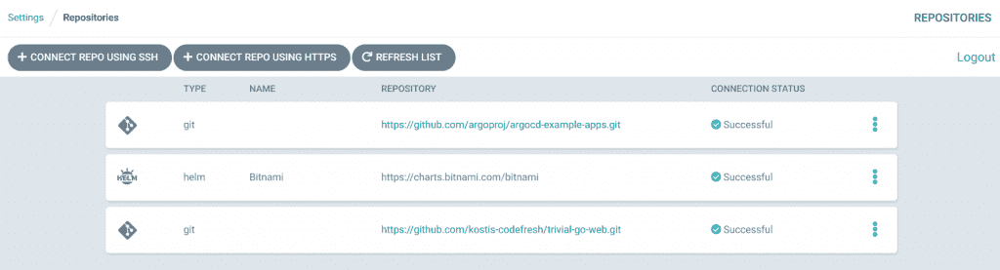
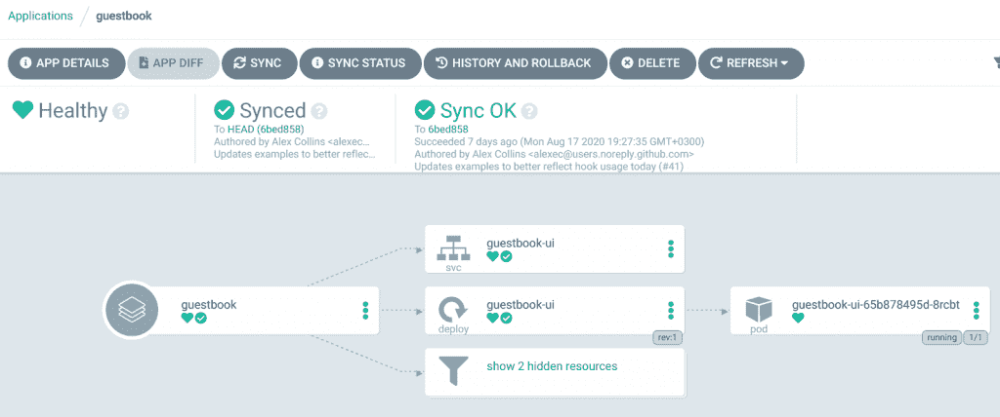
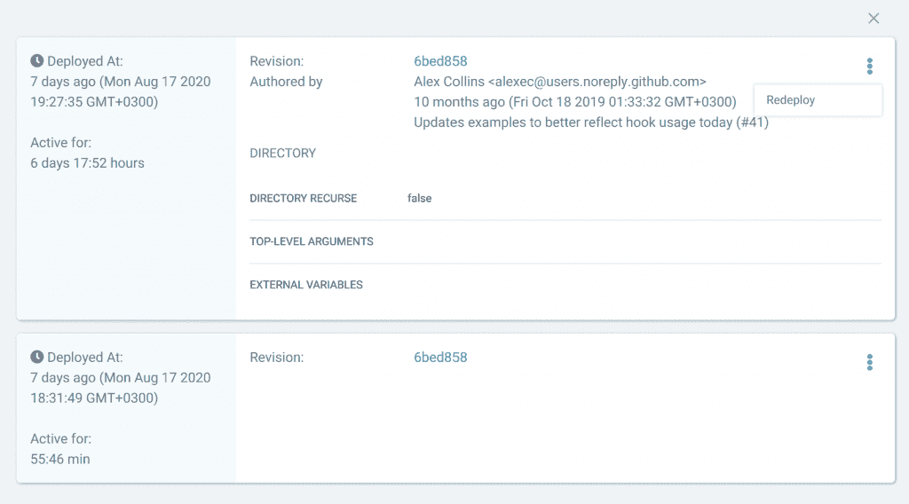
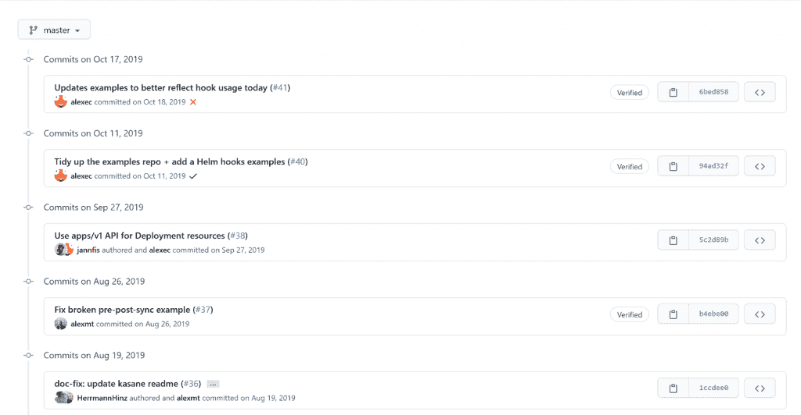
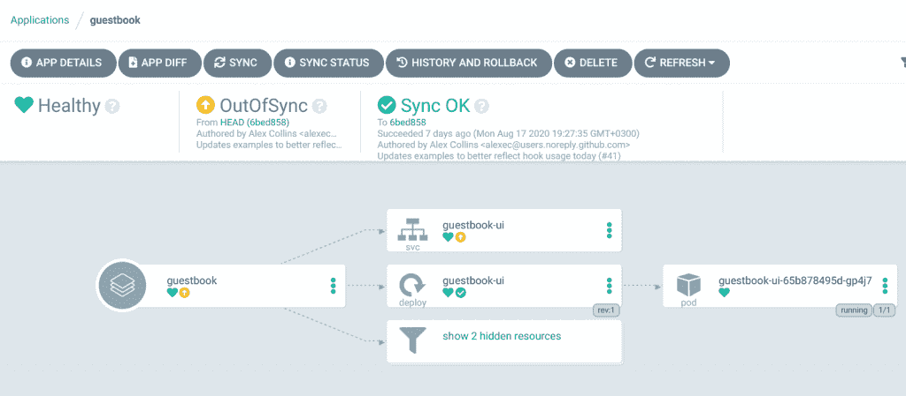
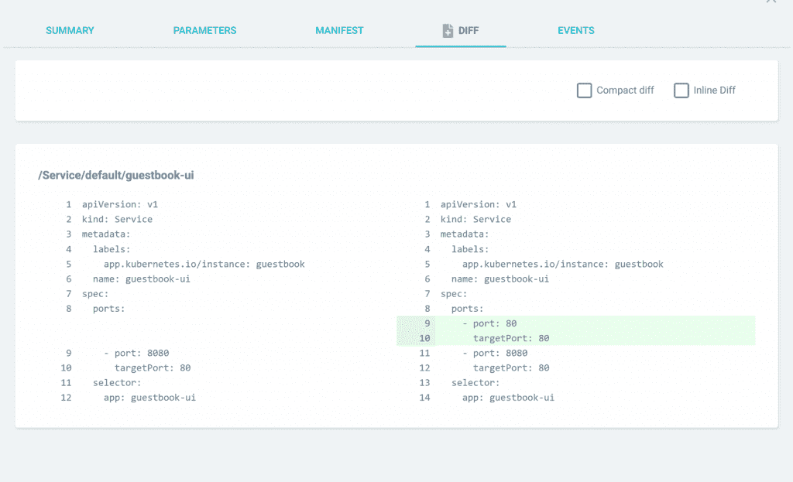

# 使用 ArgoCD 应用 GitOps

> 原文：<https://thenewstack.io/applied-gitops-with-argocd/>

[Kostis Kapelonis](https://www.linkedin.com/in/kkapelon/)

[Kostis 是一个软件工程师/技术作家双重身份的人物。他生活和呼吸自动化，良好的测试实践和无压力的部署。](https://www.linkedin.com/in/kkapelon/)

部署应用程序的传统方式要么是手工操作，要么是使用“推送”流程，即持续集成(CI)系统向 Kubernetes 集群(或其他部署目标)发送带有新软件版本的更新。GitOps 是另一种部署范例，集群本身从源代码控制中的清单中“提取”更新(使“Git”成为名称的一部分)。已经有几篇文章以抽象的方式解释了 GitOps 是如何工作的，但是很少有文章展示了所有的 GitOps 指令是如何映射到实际工具中的。

[Argo CD](https://argoproj.github.io/argo-cd/) 和 [Flux](https://thenewstack.io/gitops-made-simple-with-flux/) 是用 Kubernetes 实现 GitOps 工作流的两个主要解决方案。在某种程度上，他们甚至打算[合并成一个单一的解决方案](https://www.weave.works/blog/argo-flux-join-forces)，但现在情况不再是这样了[两个工具将保持独立](https://toolkit.fluxcd.io/faq/#is-the-gitops-toolkit-related-to-the-gitops-engine)。

在本文中，我们选择了 Argo CD 来说明 GitOps 在实践中的样子。Argo CD 是一个开源项目，也是 Cloud Native Computing Foundation 的一部分(目前是一个孵化项目)。

## 使用 git 作为真理的来源

这可以说是 GitOps(因此得名)最重要的宗旨。部署的应用程序的所有组件都应该存储在源代码控制之下。这不仅意味着源代码本身，还意味着描述应用程序如何在集群中运行的 Kubernetes 清单。

通常，清单与应用程序代码放在不同的 git 存储库中，但这并不是绝对必要的。

在 ArgoCD 中创建应用程序部署从存储库设置开始。在这里，您可以添加包含应用程序清单的公共或私有 git 存储库。ArgoCD 将使用连接的存储库来执行应用程序部署。

ArgoCD 最近也增加了对 Helm 库的本地支持。这意味着您现在可以直接连接打包的 Helm chart(由您的 CI 解决方案创建)的路径，ArgoCD 将自动监控它的新版本。

如果你不使用 Helm 或者普通的 Kubernetes 清单，你也可以使用 Kustomize 和 ArgoCD。

## 声明性部署

将所有东西放入 Git 后，下一步就是实际的部署。在这里，您可以看到 GitOps 的魔力，因为与遵循命令式方法(通常围绕定制 kubectl 脚本)的其他 CI 工具不同，ArgoCD 通过将应用程序“同步”到集群来执行部署。

同步过程实质上是将当前集群状态(最初为空)合并到所需状态(由 git 清单描述)。ArgoCD 引擎正在部署和监控所有应用程序组件，直到两种状态完全相同。

部署完成后，我们知道集群的状态与 git 中描述的完全相同。git 状态实质上反映了所有可能时刻的集群状态。

在集群和 git 之间拥有平等的状态听起来很简单，但实际上是 GitOps 的核心原则之一。令人震惊但却真实的是，大多数公司执行“牛仔”部署，即开发人员或操作员手动对集群执行更改。这些特别的变化从未被记录下来，而且非常脆弱。有了 Argo CD，这种行为就不再可能了——没有记录在 git 中的手动更改可以很容易地被丢弃，我们将在后面看到这一点。

在已经遵循[基础设施即代码](https://thenewstack.io/how-infrastructure-as-code-democratizes-scale/)实践的公司中，采用 GitOps 要容易得多，因为这意味着团队已经熟悉处理 git(和拉请求)作为执行部署的主要方式。

## 可重复且可审核的部署

软件团队经常问的两个经典问题是:

1.  环境 X 中现在部署的是什么版本？
2.  能否在环境 Y 中快速回滚到之前的版本？

这些问题有时很难回答。了解集群中部署的应用程序的版本并不总是容易的，因为有时在初始部署之后会以特别的方式出现几个“修补程序”或“补丁”。

有了 GitOps，事情就简单多了。git 存储库的内容告诉您应该在集群中部署什么。如果部署也成功同步——通过 ArgoCD 本身或另一个外部解决方案——那么 git 状态确实与集群状态相同。

Git 提交历史实际上可以作为集群部署历史。如果您能保证集群状态反映了上次 git 提交的内容，那么关于集群状态的推理就很简单了。

在 Argo CD 项目中执行回滚也非常容易。在传统的 CI 应用程序中，您需要找到并使用不同的参数触发各自的部署管道。

在 Argo CD 中，持续集成和持续交付之间有着明显的区别。您可以简单地选择另一个用于同步过程的 git 版本，并确保过一会儿集群将恢复到那个提交散列。

或者，您可以使用标准的 git 重置/恢复操作(如果您希望前滚),集群将最终跟随您的更改——通过 ArgoCD 自动同步或使用另一个解决方案来执行同步。

## 处理配置漂移

我们简要解释了在传统部署中，团队可能会多次对集群进行更改，而这些更改不会在任何地方记录下来。对于一次性更改、快速补丁或其他紧急更新，这是非常常见的情况。虽然 kubectl 是管理集群的一种非常强大的方法，但是团队也可能滥用 kubectl 并产生配置漂移问题。

配置漂移是一个众所周知的问题，因为它持续的时间越长，就变得越严重。不知道在一个集群或多个集群上具体部署了什么的团队可能会遇到许多部署失败的问题。

失败部署的一个典型场景是试运行环境和生产环境之间的差异。开发人员在试运行环境中测试他们的应用程序，并假设它也能在生产环境中工作。

开发人员将尝试执行生产部署，但会失败，因为有人对生产进行了临时更改，而这些更改不再反映在试运行中。

Argo CD 有一个非常聪明的方法来解决配置漂移问题。在初始部署发生后，Argo CD 持续监视集群并将其与 git 进行比较。

如果有人在集群中执行手动更改，ArgoCD 会检测到并标记部署为“不同步”。

这种不同步部署的即时可见性怎么强调都不为过。ArgoCD 不仅知道应用程序不再反映 git 清单的状态，而且它甚至为您提供了一个方便的 diff 视图来解释发生了什么变化。

在下面的例子中，有人篡改了应用程序服务公开的端口。

当你面对这种情况时，你现在可以选择行动。在大多数情况下，您可以简单地再次同步部署。这将放弃手动更改，并将集群恢复到与 git 提交时相同的状态。

如果您认为手动更改确实是必要的(也许这是一个紧急补丁)，您可以简单地将它提交给 Git。这样 ArgoCD 将再次比较集群和 git 状态，并意识到它们现在是相同的。

第一种情况(放弃手动更改)也可以完全自动化，以便 Argo CD 总是从 Git 获取集群状态。

Argo CD 基本上一劳永逸地解决了配置漂移问题。拥有大量集群且目前正遭受配置漂移的公司将能够通过采用 Argo CD 彻底改变其部署过程。

除了我们在本文中描述的基本 GitOps 特性之外，Argo CD 还有其他几个特性，如同步窗口、部署挂钩、应用程序分组等。

## 完成连续交付难题

Argo CD 只是一个更大的部署故事的一个组成部分。处理秘密、触发器、拉取请求、构建等，使得将 ArgoCD 与健壮的自动化平台配对变得很重要，该自动化平台可以提供软件生命周期的完整视图，并且还处理 CI 部分，因为 ArgoCD 期望已经创建了所有部署工件。

在 Codefresh，我们知道 Argo CD 不能在整个软件生命周期中单独使用。Argo 非常适合部署应用程序，作为交付过程的最后一步，但它必须与另一个平台相结合，该平台需要执行之前的所有步骤(例如，运行单元测试)。

这就是为什么在 Codefresh，我们刚刚推出了我们称之为 GitOps 2.0 的第一个组件，它不仅限于部署，而是结合了两个世界的优点(持续集成/交付和可观察性)。

拥有一个能够覆盖整个软件生命周期的解决方案是必不可少的——特别是对于那些希望在 Argo 监控的清单 Git 存储库中实践连续部署甚至自动执行提交的公司。

*欲了解更多信息，请访问 [Argo 网站](https://argoproj.github.io/)和 [Codefresh GitOps](https://codefresh.io/gitops/?utm_source=newsstack&medium=blog&utm_campaign=gitops-2-launch) 。*

<svg xmlns:xlink="http://www.w3.org/1999/xlink" viewBox="0 0 68 31" version="1.1"><title>Group</title> <desc>Created with Sketch.</desc></svg>