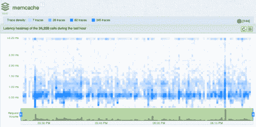
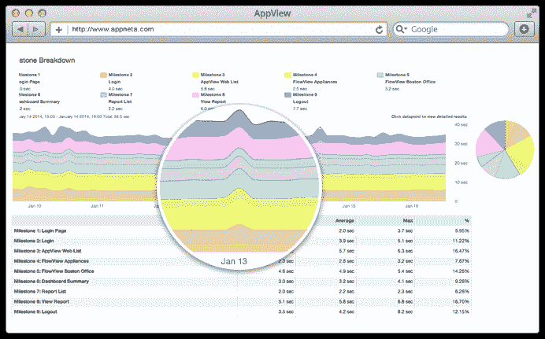

# AppNeta 为大规模微服务提供监控解决方案

> 原文：<https://thenewstack.io/appneta-offers-monitoring-solutions-microservices-scale/>

如果一个企业正在运行系统关键的应用程序，那么它很可能在其基础设施或工作流管道中的某个地方运行着一个监控解决方案。在最基本的层面上，监控从系统级的资源利用监控开始。然而，如果这种技术不知道分布在系统中的容器，就很难评估系统资源如何限制容器化应用程序的真正影响。

AppNeta 已经采取了一种独特的方法来帮助企业了解他们的主机和系统指标，尤其是那些使用容器的企业。应用程序可能会出现与资源可用性无关的问题，例如延迟、底层错误和其他问题。解决这些问题需要应用程序性能监控工具能够解决和跟踪整个堆栈中的这些问题。

## 简化监控洞察

AppNeta 首席技术官 [Dan Kuebrich 说:“仅仅监控生产环境最终是一种被动措施，而增加生产前监控可以为开发人员提供洞察力。](https://www.linkedin.com/in/kuebrich)

通过在将代码部署到产品中之前实现监控，开发人员可以在问题对最终用户产生负面影响之前发现问题。AppNeta 通过针对各种 DevOps 问题定制的[产品群](https://www.appneta.com/products)为用户提供了对进入其系统的各种请求的深入了解，这意味着可以在接到通知后立即采取行动。

当 HubSpot 面临着在其 200 多个应用程序准备和生产环境中实施性能监控解决方案的挑战时，该公司求助于 AppNeta。

app neta–应用性能仪表板

AppNeta 是众多提供基于容器的监控的公司之一。其他还有[新遗迹](http://newrelic.com/)、[网络安全管理软件产品](http://www.solarwinds.com/)、 [DataDog](https://www.datadoghq.com/) 和 [Zabbix](http://www.zabbix.com/) 。New Relic 和 Zabbix 都为完全扩展的基础架构提供了最新的警报以及各种集成工具。网络安全管理软件产品向其用户提供网络和系统监控以及数据库管理工具，这使其成为那些通过监控工作收集大量数据的用户的有力选择。 [DataDog](https://www.datadoghq.com/product/integrations/) 提供大量交钥匙应用集成选择，这使其成为基于连接各种 API 的基础设施的理想监控解决方案。

## 进入引擎盖下

为 AppNeta 的请求跟踪器提供动力是一个基于代理的工具，它允许在应用程序的主机、应用程序和 web 服务器级别跟踪请求。“AppNeta 可以通过自动部署系统自动安装，如 [Chef](https://www.chef.io/) 和 [Puppet](https://puppetlabs.com/) ，或者通过 **apt-get** 和 **yum** 手动安装，”Kuebrich 说。

安装该软件后，用户可以根据他们的 web 服务器入口点定义他们的定制应用程序，以可视化他们环境中的服务。AppNeta 还包括真实用户监控(RUM)、[综合事务监控](https://www.appneta.com/products/appview/)和系统内跟踪的所有请求的网络上下文，为用户提供可靠的端到端可视化体验。

AppNeta AppView:综合测试图表

系统和应用可见性最终取决于开发人员以及开发人员和运营团队是否能够访问、查看端到端监控系统提供给他们的问题，并对这些问题采取行动。通过使用 AppNeta 之类的软件，企业可以在其后端(用户的浏览器)和其间的网络上收集性能细节，从而更好地应对他们在大规模使用容器化应用程序时面临的诸多挑战。

新遗迹是新堆栈的赞助商。

通过 Pixabay 的特征图像。

<svg xmlns:xlink="http://www.w3.org/1999/xlink" viewBox="0 0 68 31" version="1.1"><title>Group</title> <desc>Created with Sketch.</desc></svg>