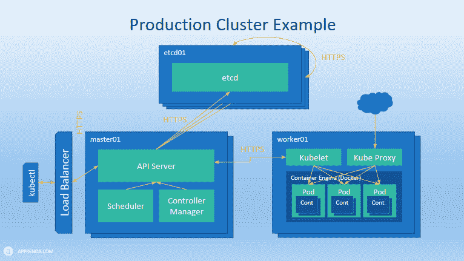

# Apprenda 领导的团队为 Kubernetes 管理 Windows 容器做准备

> 原文：<https://thenewstack.io/apprenda-led-team-preps-kubernetes-manage-windows-containers/>

Apprenda 正在领导修改 Kubernetes 编排引擎的工作，这样它也可以管理 Windows 容器，就像它管理运行在 Linux 上的容器一样。

Kubernetes 的 [Windows 特别兴趣小组](https://github.com/kubernetes/community/blob/master/sig-windows/README.md)正在带头努力，让 Apprenda 做大部分繁重的工作是有意义的。[这家公司](https://apprenda.com/)，自 2007 年以来一直提供以企业为中心的平台服务，对微软 Windows Server 和。Net 架构。今年早些时候，它扩展到了 Kubernetes，[收购了 Kubernetes 的初创公司 Kismatic](https://thenewstack.io/apprenda-acquires-kismatic-launches-kubernetes-distro/) ，并[发布了自己的商用 Kubernetes 工具包](https://apprenda.com/kismatic/)。

一个可以运行 Windows 容器的版本将会扩大编排引擎可以管理的企业应用程序的数量——并有可能扩大其可能的用户基础——以及容器的用户基础。

根据 Gartner 的数据，目前 85%的企业软件运行在 Windows 上。微软”。本月早些时候，Apprenda 产品高级总监迈克尔·迈克尔在 Kubecon 会议上介绍这项新技术时说。他说，增强的软件将为组织提供“Linux 和 Windows 之间真正的混合环境”。

有两种类型的 Windows 服务器容器。基本 Windows 容器与所有其他 Windows 容器共享 Windows 服务器内核。为安全而构建的 Hyper-V 容器嵌入在一个虚拟机中，拥有自己的内核。这个版本的 Kubernetes 将支持这两者。调用这两个容器的 API 是相同的，只是区别两者的标志不同。

“当我们开始设计我们的解决方案时，我们的主要目标之一是我们不想修改 etcd 或主组件上的任何东西，”Michael 说。etcd 软件是一个键值存储，用于跟踪集装箱。,

幸运的是，由于微软对 Docker API 的坚持，Kubectl 和主组件不需要任何修改就可以在 Linux 服务器上运行。

由于 Kubernetes 的模块化架构，开发团队可以将他们需要做的所有工作限制在为 Kubernetes 的 [kube-proxy](http://kubernetes.io/docs/admin/kube-proxy/) 提供一个抽象层，它与前端网络组件和 [Kubelet](http://kubernetes.io/docs/admin/kubelet/) 组件进行对话，后者充当每个服务器节点的节点代理。两者都放在运行 Windows Server 的工作节点上。(迈克尔指出，CoreOS 采取了类似的方法修改 Kubernetes，以支持 CoreOS 的 [rkt](https://github.com/coreos/rkt) 容器格式)。

请点击此处查看迈克尔的图表，了解这一切是如何协同工作的:

图形由 Apprenda 提供。

该团队不得不根除 Linux 的所有底层原语，并用最接近的 Windows 对等物替换它们。“大部分变化和大部分复杂性都与网络有关，”迈克尔说。

该团队必须努力解决两种类型的网络问题:pod 之间的通信和 pod 内部的通信。他解释说，这两者都要求 Windows 容器的处理方式与 Linux 容器略有不同。

单个 pod 中的 Linux 容器共享一个网络名称空间，允许它们进行通信。pod 只有一个 IP 号，因此容器通过本地主机调用相互通信。然而，Windows 没有网络名称空间抽象，所以每个容器都有自己的 IP 地址和网络堆栈。

Windows 也没有对软件定义的网络(SDN)的任何原生支持，因此诸如覆盖网络之类的 SDN 技术在 Windows 上不会太有效。“你不可能将一个 IP 分配给一个可以在整个集群中路由的 pod，”Michael 说。相反，开发团队使用 Windows 的[路由和远程访问服务](https://technet.microsoft.com/en-us/library/dn614140(v=ws.11).aspx) (RRAS)来实现可发现性。

kube-proxy 的工作也必须完成，许多工作为 Windows 没有 iptables 的单一等价物提供了变通办法，iptables 是一个用于设置网络数据包路由规则的实用系统。

微软工程师一直在帮助 Apprenda 完成这项工作，微软合作伙伴架构师 Brendan Burns 也在 Kubecon 大会上说。下面是该软件的运行演示:

[https://www.youtube.com/embed/UoUQtYgJf1k?feature=oembed](https://www.youtube.com/embed/UoUQtYgJf1k?feature=oembed)

视频

开发团队的目标是为今年晚些时候发布的 Kubernetes 1.5 准备好这些功能的实验“alpha”版本。在这项初步工作完成后，将开始支持 Kubernetes 的高级功能，如本地网络覆盖支持和持久卷存储支持。

专题图片:Kubecon 2016 上的 Windows Kubernetes 开发团队。

<svg xmlns:xlink="http://www.w3.org/1999/xlink" viewBox="0 0 68 31" version="1.1"><title>Group</title> <desc>Created with Sketch.</desc></svg>