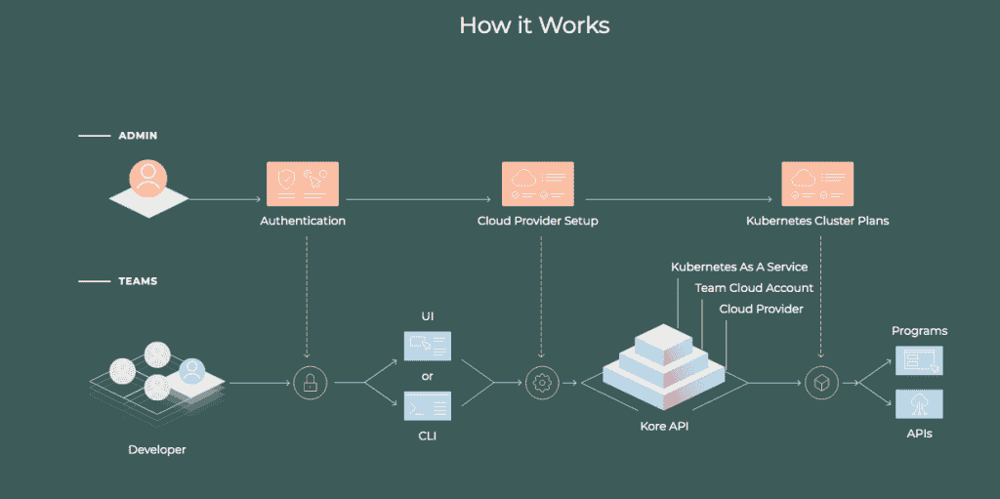

# Appvia:面向团队的自助 Kubernetes

> 原文：<https://thenewstack.io/appvia-self-service-kubernetes-for-teams/>

早在 2016 年与英国内政部合作时， [Appvia](https://www.appvia.io/) 背后的团队学到了很多关于开发人员如何工作的知识，以及什么适合他们，什么不适合他们。

该项目包括构建一个大型的多租户 Kubernetes 集群，支持 700 多名开发人员开发 400 个应用。

总部位于伦敦的 Appvia 从 40 个不同项目中吸取了经验教训，该团队参与了管理移民和安全的英国政府机构。由此产生的系统侧重于为开发人员提供自助服务供应，使复杂的技术易于使用，同时改善对组织的监督。

许多团队成员成为开源 Kubernetes orchestrator[kops](https://github.com/kubernetes/kops)的维护者，修补对家庭办公室至关重要的安全漏洞。

“我们非常以开发者为中心。即使有了家庭办公室，[我们在问]团队应该如何工作？他们如何获得所需的资源？Appvia 首席执行官 [Jonathan Shanks](https://www.linkedin.com/in/jonathanshanks/?originalSubdomain=uk) 表示:……这非常耗时且重复，因此我们首先围绕这一领域开发产品。

然后，他们回到绘图板，专注于如何将 Kubernetes 商品化，并“开始将云资源、安全性和成本可见性与团队联系起来，并开始围绕云增强团队的商业价值。”

Appvia 团队开发了两种开源技术， [Krane](https://github.com/appvia/krane) 和最近发布的 Kore。

Krane 是一个 Kubernetes 静态分析工具，它可以识别 Kubernetes 基于角色的访问控制(RBAC)设计中的潜在安全风险，并就如何减轻这些风险提出建议。

Kore 是一个在运营团队设定的框架内为开发人员提供 Kubernetes 自助服务的平台。它提供了

*   **跨环境和团队的安全一致的集群配置**。
*   **帐户管理**通过单一来源访问和控制整个组织。
*   **计划和模板**允许管理员定义团队可以消耗的资源。例如，您可以设置默认的 Kubernetes 集群计划，开发团队无需运行 CI、代码或脚本就可以使用这些计划。它可以是具有廉价实例类型的单个可用性区域，也可以是具有跨多个可用性区域的增强安全设置的生产计划，以实现弹性和按需实例。
*   **受管访问控制**提供了一种集中的方法来管理和配置角色、策略和权限，以确保开发人员安全工作，应用程序满足安全要求。这些控件可以使团队根据需要添加和删除成员对其项目的访问权限。
*   **对用户操作、集群创建和访问管理的可审计性**。

它适用于公共云、内部部署以及混合和多云环境。

从安全角度来看，提供配置的一致性尤其重要。要求手动配置每个群集不仅耗时，而且会导致人为错误，并导致安全性和稳定性问题。

Appvia Kore 重用了 Kubernetes 框架并增加了增强的特性。每个增强都在运营商框架下工作。操作符是特定于领域的特性，比如团队管理或 SSO 配置。Kore API 连接服务并管理每个运营商的数据协调。所有组件都作为 Docker 容器运行。

据 Shanks 称，其最接近的竞争对手是 OpenShift 和 Rancher 等公司。Kore 已经做好了生产准备，并正在快速开发，以创造落后于竞争对手的功能。

在一篇博客文章中，Shanks 坚持认为，大多数提供自我供应的技术都很复杂，需要很高的学习曲线，并且对开发人员不太友好。对于运营团队来说，在一个安全的环境中为开发人员建立数据库之类的东西也不是那么简单。

他认为 Kubernetes 的复杂性不一定通过使用托管的 Kubernetes 来解决。

“我认为这在行业中有点令人困惑，因为你的假设会是，‘好吧，如果我使用云管理的 Kubernetes，我们就排序了。是的，问题解决了。但实际上，(供应商)提供的东西有很大差距，”他说。

“许多管理 Kubernetes 的公司不明白你是如何构建云的。”

Appvia 在这个过程的早期就开始了，自动与云提供商建立账户。Shanks 认为这是一个独特之处——从一开始就帮助用户——并且专注于云，而不仅仅是专注于 Kubernetes。

Shanks 说，管理员可以定义帐户策略，比如说，每个团队都应该有一个非生产帐户和一个生产帐户，然后制定 Kubernetes 生产计划，这基本上是将最佳实践放在云提供商之上。

“我们把它打包了。我们称之为计划。它基本上只是生产参数，或在云中构建 Kubernetes 的最佳实践参数。…我们正在围绕该团队简化云服务。”然后，它管理该团队对 Kubernetes 集群的所有访问。

Shanks 在博客中提到的几个目标是使成本可见，并使团队易于管理和降低成本。对于像 [Harness.io](https://thenewstack.io/harness-io-translates-cloud-costs-to-developers/) 和 [env0](https://thenewstack.io/env0-self-service-for-infrastructure-as-code-plus-cost-visibility/) 这样的公司来说，这是一个越来越受关注的领域，更不用说一个名为 FinOps Foundation 的非营利贸易协会，该协会旨在帮助组织控制他们的[云成本](https://thenewstack.io/cloud-hangover-getting-a-grip-on-cloud-costs/)。

Appvia 采用开源项目，如 [kubecost](https://github.com/kubecost) ，你可以将数据推送到 [Prometheus](https://prometheus.io/) 中，然后显示成本可见性。

特征图片:*[自助| 180812-0040596-吉卡图](https://www.flickr.com/photos/jikatu/43118432105/in/photolist-28GeeDc-nPqbLZ-9hDi7v-2gonAnf-2ha82QE-ejcwUR-PD1XD4-qew5h8-nPppC4-34KLBr-HrUdXi-8FBu6H-Yi4aZ7-cBtovh-32RWkN-efQDaj-cJrhLE-9akxmJ-c13suf-4dSeVc-8KzQjF-bYg4bW-doEu2X-aEV4jw-77eRFB-6Y2tr1-71NnYB-4UCvUb-9arJwN-oWXdNY-fQq49-2wgFtQ-6eC7za-5SLbBi-o3yRDP-77exHc-QWUF16-aqSRad-xLCXo-6x7FBq-avCXjn-4kFeD5-kJpRV-8XcdMS-87WSrk-F1v4qS-NRkYja-a6G3a4-7798q5-21a2ES4)[吉米·拜科维奇](https://www.flickr.com/photos/jikatu/)。根据 CC BY-SA 2.0 获得许可。*

 *目前，新堆栈不允许直接在该网站上发表评论。我们邀请所有希望讨论某个故事的读者通过推特或脸书 T21 与我们联系。我们也欢迎您通过电子邮件发送新闻提示和反馈:[feedback @ thenewstack . io](mailto:feedback@thenewstack.io)。

<svg xmlns:xlink="http://www.w3.org/1999/xlink" viewBox="0 0 68 31" version="1.1"><title>Group</title> <desc>Created with Sketch.</desc></svg>*