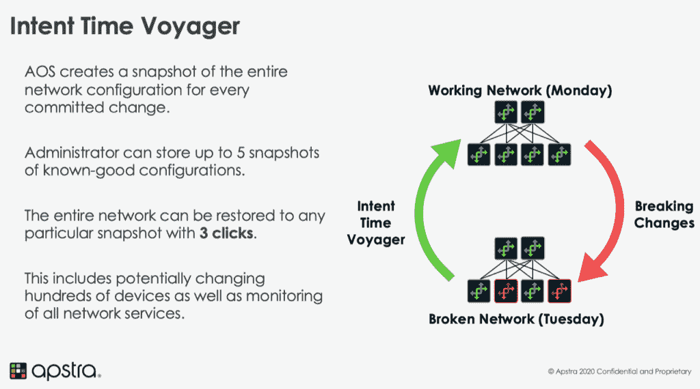

# Apstra 基于意图的网络将企业带入云平价

> 原文：<https://thenewstack.io/apstras-intent-based-networking-brings-enterprises-to-cloud-parity/>

对于一些公司来说，在带有微服务的 Kubernetes 上进行云原生部署是理所当然的。对于其他人来说，这些技术仍然是遥远的未来，当代的复杂性包括网络交换机、专有、特定于供应商的配置以及需要手动操作来管理的内部网络。对于后一类公司， [Apstra](http://www.apstra.com) 提供了[基于意图的网络(IBN)](https://www.vmware.com/topics/glossary/content/intent-based-networking) ，这意味着用一个响应系统管理员以结果为中心的请求的系统来取代配置网络和对网络问题做出反应的手动过程。

Apstra 自 2014 年以来一直从事提供基于意图的网络的业务，2016 年从隐身中崛起。Apstra 首席执行官兼联合创始人 [Mansour Karam](https://www.linkedin.com/in/mansourkaram) 将该公司视为在管理本地数据中心和向云原生、多云等迁移之间迈出了重要一步。

[https://www.youtube.com/embed/Rkle2FIr1-k?feature=oembed](https://www.youtube.com/embed/Rkle2FIr1-k?feature=oembed)

视频

卡拉姆说，这并不是说 Apstra 没有为云原生部署构建功能——它有一个在服务器上运行的代理，用于容器环境——而是说仍然有许多企业客户发现自己需要一个工具，提供一定程度的网络自动化，以加快他们的传统环境。

“我们的技术绝对支持多云，我们已经展示了它的演示，但我们的客户还没有准备好。如果您有一个仍然手动运行的数据中心，就很难利用多云技术。您首先需要的是实现数据中心的现代化，”卡拉姆说。“老实说，我们 90%的企业客户都在其大部分基础架构中运行 VMware。说到底，只是我们希望与哪个流程编排系统、哪个工作负载集成。构建这些集成很简单，我们是根据客户需求来完成的。”

Apstra 的核心是 Apstra 操作系统(AOS)，本周该公司推出了 Apstra AOS 3.2，它说“大大降低了运营成本，防止了停机，加快了部署，并为世界上一些最大的企业数据中心增加了现有人才。”

更具体地说，AOS 3.2 引入了意图时间旅行者，这是一个类似于时间机器备份工具，你可能会从其他上下文中熟悉。以前，Apstra 用户可以将更改恢复到以前的单一配置，但现在他们能够“将整个数据中心结构状态和配置恢复到特定时间点”，无论是向前还是向后，从而缩短了网络中断时的恢复时间(MTTR)。

卡拉姆解释说，意图时间旅行者的力量来自这样一个事实，它可以带你到整个网络历史的任何时间点，一切都重新开始。

“它真正强大的地方在于它位于意图层，”卡拉姆解释道。“您正在重新部署您当时拥有的服务，这意味着您正在更新整个网络状态。它非常强大，并且完全不受供应商限制。您没有考虑任何配置，也没有回滚配置。您所做的是在网络中回滚意图，然后无论您的网络中的供应商发生了什么，基本上这些供应商的配置都会由 AOS 完全无缝地升级。”

除了 Intent Time Voyager，AOS 3.2 还引入了对开源的 SONiC 网络操作系统(T2)的企业支持，该系统基于 Linux，旨在运行于不同厂商的交换机上。与 Apstra 提供单一的自动化入口点来管理各种不同的网络组件的初衷非常相似，SONiC 提供了“一整套网络功能，如 BGP 和 RDMA ”,其功能不受专有硬件的影响。

图片由来自 Pixabay 的 Gerd Altmann 提供。

<svg xmlns:xlink="http://www.w3.org/1999/xlink" viewBox="0 0 68 31" version="1.1"><title>Group</title> <desc>Created with Sketch.</desc></svg>