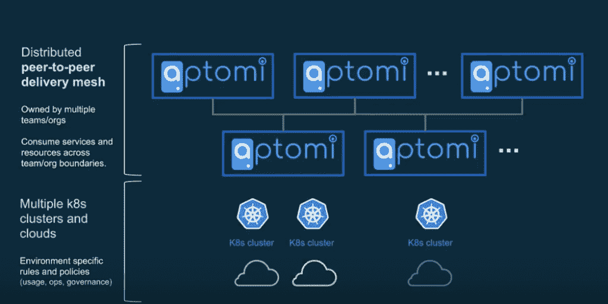
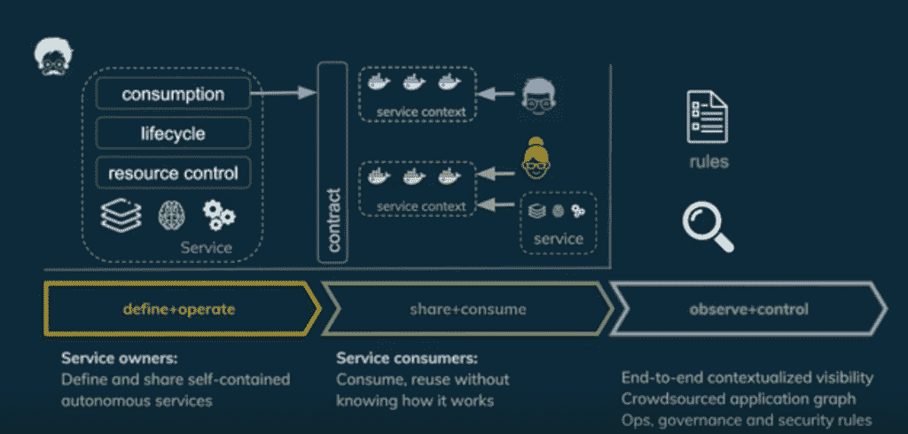

# Aptomi:多个团队的 Kubernetes 服务部署

> 原文：<https://thenewstack.io/aptomi-kubernetes-deployment-by-service-for-multiple-teams/>

在持续集成/持续交付(CI/CD)的世界中，焦点更加集中在等式的 CD 侧，特别是当容器、Kubernetes、微服务和无服务器技术增加了更多的复杂性时。

初创公司 Aptomi 专注于为 Kubernetes 部署提供服务，并与他们跨团队合作。

联合创始人 Roman Alekseenkov 说:“一旦你开始研究不同的组件如何相互作用，它们如何影响彼此的状态，你如何相互协调地部署它们，变化如何影响不同的组件等等，部署一个应用程序就不是那么简单了。

“真的没有一个框架可以让服务相互了解，并以一种减少抽象的方式推出它们，以及如何在不影响彼此的情况下完成协作流程。似乎缺少一个完整的层来提供这种服务级别的抽象，它允许您处理服务而不是容器。所以我们决定解决这个问题。”

他和联合创始人[迈克尔·德沃金](https://www.linkedin.com/in/dvorkin/)一直专注于构建一个完全声明式的应用交付平台——你指定事情需要如何进行，然后它会自动处理所有底层细节的部署和配置——Kubernetes、服务网格以及它们之间的东西。

## 声明交付

Mirantis 联合创始人兼首席营销官 Boris Renski 是该项目的天使投资人。

“我个人和整个米兰蒂斯都认为库伯内特空间是一片充满机遇的土地，”他在谈到自己对 Aptomi 的支持时说。“在米兰蒂斯，我们也一直在向这个方向投资，我们的重点是 [Spinnaker](https://www.spinnaker.io/) 。我相信像 Kubernetes 和 serverless 这样的智能基础设施的采用将会颠覆 CD 领域。”

这是一个成长的空间。一份市场和市场报告将[持续交付市场](https://thenewstack.io/ci-cd-with-kubernetes-tools-and-practices/)的价值定为 2017 年 14.4 亿美元，并预测到 2023 年将达到 38.5 亿美元，复合年增长率(CAGR)为 18.5%。与此同时，Gartner 估计[应用发布协调](https://www.gartner.com/doc/3878693/market-share-IT-operations)的市场在 2017 年增长了 37.5%，全球市场价值为 2.826 亿美元。

Renski 说，Aptomi 为 Kubernetes 在 CD 上的修复使其向声明式交付的范式更进了一步。

“以前，基础架构是愚蠢的，您必须将部署应用程序的“方法”完全嵌入到您的 CD 管道中——对虚拟机管理程序的 API 调用、配置 IP 表的 bash 脚本、装载存储的 Puppet 脚本等。，”他解释道。

随着 Kubernetes 和 serverless 的出现，基础设施变得越来越智能，越来越多的“如何”部分被卸载到基础设施级别的标准方法上；因此，CD 正从关注“如何”(虚拟机和 IP 地址)发展到关注“什么”(应用程序最终状态)；从命令式到陈述式。

[https://www.youtube.com/embed/GVB3kKocKi4?feature=oembed](https://www.youtube.com/embed/GVB3kKocKi4?feature=oembed)

视频

## 多个团队

[Aptomi](https://github.com/Aptomi/aptomi) 于 2017 年 4 月由 Renski、[Mirantis 前工程高级副总裁 Alekseenkov](https://www.linkedin.com/in/ralekseenkov/) 和 [Dvorkin](https://www.linkedin.com/in/dvorkin/) 推出，Dvorkin 是思科的杰出工程师，也是该公司开源政策声明和执行项目 [Noiro](https://www.lightreading.com/carrier-sdn/sdn-technology/cisco-takes-open-source-route-to-policy-revamp/d/d-id/713629) 的首席科学家。

Aptomi 用 Go 编写，是一个位于 Helm 和 Kubernetes 等微服务基础设施之上的薄层，使您能够跨多个环境和多个集群以不同的设置运行服务。它还支持 [ksonnet](https://ksonnet.io/) 和 YAML 文件。

“如果你想推出一个由几个组件组成的应用程序，比如 WordPress 和一个数据库，这其实很容易。但如果你想推出[多个组件]，越往前走就越难，”德沃金解释道。如果不同的团队拥有应用程序的不同部分，情况就更是如此。

“企业部署的大多数应用程序都属于最后一类——多个团队拥有多个组件——处理这种情况简直是一团糟。”

他说，然后你会有诸如服务发现、服务如何相互消费、功能、服务如何反应、如何监管、如何进行网络控制等概念——这不是一门已解决的科学。

你需要控制很多活动的部分——Kubernetes、API 管理、安全性、如何管理信任、身份和网络。然后你有多个环境，生命周期中的多个阶段和多个团队。所有这些复杂性成倍增加。

“我要处理的是大量的硬编码…配置文件、策略、规范。所有这些都管理得非常松散，几乎没有什么东西将它们联系在一起。Aptomi 试图将所有这些联系在一起，通过提供一个非常一致的服务模型，使应用程序非常容易部署，该模型针对分布式环境和分布式团队进行了优化，可以以同步的方式一起工作，”德沃金说。

## 清晰的所有权

Aptomi 提供了清晰定义的关注点分离。开发人员或团队定义服务及其依赖项，以及服务运行所遵循的操作、治理和安全规则。很清楚谁拥有这项服务。服务所有者可以指定其在多个集群或环境中的行为——如开发、阶段、生产——并控制生命周期和更新。Aptomi 使用性能、状态和运行数据来自适应地执行这些要求。然后，根据服务所有者制定的规范，其他用户和团队可以使用该服务。

Aptomi 允许您在上下文中观察和控制服务:您总是知道存在什么依赖关系、为什么存在、谁在运行服务以及在哪里运行服务。Aptomi 还可以回答关于更改规则和配置的效果的“假设”问题。德沃金在接受采访时说，如果出了问题，你总会有历史记录。

它不需要集中所有权，而是可以由多个团队以对等的方式使用。

在一篇关于[服务交换](https://medium.com/@mike.dvorkin/service-exchange-evolution-of-service-management-in-disaggregated-paas-world-6ca98b4561c3)的帖子中，德沃金解释说，这个想法是将服务定义为一个自包含的实体——而不是根据任何特定的实例。

他写道，然后配置和观察所有底层微服务架构组件，并通过 API 网关、服务网格和容器编排器等标准组件将更高级别的以服务为中心的策略转换为更低级别的可以理解和执行的格式。

“我们处于这个持续的执行循环中，我们将所有这些东西转换成容器，部署在 Kubernetes 集群的顶部，我们将底层的所有移动部分自动化，”德沃金说。“你不必考虑细节。我们会为您处理所有配置，让您能够专注于您的服务，而不是基础架构细节。”

它还紧密集成在 CI/CD 管道中，并允许您将一切都视为代码——您的服务定义、依赖项、策略以及服务如何交互。

通用执行引擎接受打包的代码和规则，并对它们运行连续的循环。它还考虑了一些实时数据。

“我们监控集群和应用程序的状态，我们还从其他一些管理系统获得输入，例如 APMs 可以将参数化的数据推送给我们……我们决定部署什么、在哪里部署以及这些东西如何相互交互。…部署后，我们依靠 Kubernetes 来运行容器，但我们也调用服务网格[等等。] …我们可以在下面配置所有的细节，”他说。

## “活的有机体”

这一领域的其他公司包括 Spinnaker，它由 Google 提供支持；Duplo 和 [Codefresh](https://codefresh.io/) ，刚刚筹集了由微软风险基金 [M12](https://m12.vc/) 领投的 800 万美元 B 轮融资。德沃金称 Codefresh 是一个“非常好的工具”，它具有更传统的 CI/CD 模型，用于定义工作流和在多云环境中运行 CD 管道。Spinnaker，【Mirantis 现在以商业包的形式提供，最近增加了自动化交付，具有[机器学习](https://thenewstack.io/extend-spinnaker-automated-delivery-with-machine-learning-and-custom-pipeline-logic/)和定制管道逻辑，用于多个云部署。Aptomi 位于 CD 管道和头盔之间。

“我们并不想描述整个应用程序。我们只是试图描述单个团队或开发者拥有的服务，”德沃金说。“其他人最终[使用]你的服务，这就是我们最终了解整个应用程序图的方式。通常应用程序不是静态的，它们会不断发展。【服务是】就像生命体一样，不断变化，随时可以更新。我们这样做是为了尽量减少对应用程序其余部分的影响。

“我们正在提供这种更具宣示性、基于意图的应用交付平台，”他说。“我们不是运行离散的步骤，而是运行这个强制循环，并不断适应运营环境和实际状态。”

<svg xmlns:xlink="http://www.w3.org/1999/xlink" viewBox="0 0 68 31" version="1.1"><title>Group</title> <desc>Created with Sketch.</desc></svg>