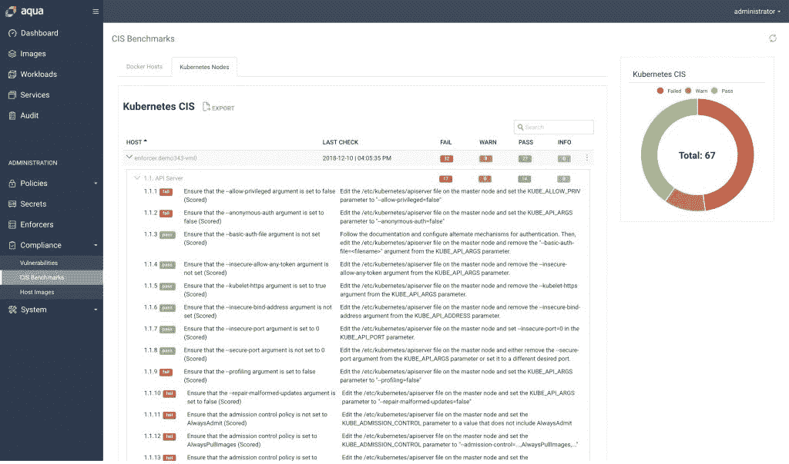

# Aqua Security 的 Kubernetes 基准获得 CIS 批准

> 原文：<https://thenewstack.io/aqua-securitys-kubernetes-benchmarks-get-cis-approval/>

向云原生应用和微服务的迁移涉及应用从开发到部署的整个生命周期中的实践转变。 [Aqua Security](https://www.aquasec.com/) 致力于在容器和云原生应用的整个生命周期中提供安全性，跨越所有平台和云，现在该公司的[Aqua Container Security Platform](https://www.aquasec.com/products/aqua-container-security-platform/)(CSP)已经通过了[互联网安全中心](https://www.cisecurity.org/) (CIS)基准的认证，可以将 Kubernetes 集群的配置状态与 CIS Kubernetes 基准标准进行比较。

这一消息是在 [KubeSec 企业峰会](https://info.aquasec.com/kubesec2018)上宣布的，该峰会与本周在华盛顿西雅图举行的[kube con+CloudNativeCon 2018](https://events.linuxfoundation.org/events/kubecon-cloudnativecon-north-america-2018/schedule/)会议同期举行。

Aqua Security 产品营销副总裁 Rani Osnat 在接受新堆栈采访时表示，为整个生命周期提供安全性对于容器和云原生应用程序至关重要。

“Aqua Security 是一个完整的生命周期安全解决方案。为了确保安全，你必须在开发过程中尽早开始。有很多自动化正在发生，随着代码更新的速度，这不是你可以用事后的解决方案来处理的事情，”Osnat 说。“你失去了上下文，无法理解各种组件的作用。你需要集成到 CI 工具、映像构建、注册表和运行时中的东西，包括 Kubernetes 本身。”

Aqua Security CSP 为基于容器和云的本地和云中应用程序提供安全性，支持跨 Kubernetes 和其他 orchestrators 的 Linux 和 Windows 运行时环境。

[CIS Kubernetes 基准](https://www.cisecurity.org/benchmark/kubernetes/)由 113 条具体建议组成，每条建议都包括描述、基本原理、审计和补救方法、影响和默认值。例如，最初的建议之一是“确保没有设置–basic-auth-file 参数。”该建议解释了背后的原因:“基本身份验证使用明文凭证进行身份验证。目前，基本身份验证凭据无限期有效，不重新启动 API 服务器就无法更改密码。为了方便起见，目前支持基本身份验证。因此，不应该使用基本身份验证。

“与发布高水平指导方针的其他机构不同，CIS 基准是具体的和说明性的，”Osnat 解释道。“Aqua Security 是目前唯一获得该认证的解决方案。我们进行了一些非常严格的测试，检查我们检查的内容是否符合 CIS benchmark 的预期，以及我们在通过/失败情况下提供的准确结果。”

通过 CIS 认证，Aqua Security 客户可以放心，Aqua Security 审计提供的结果准确反映了 CIS Kubernetes 基准中包含的标准。安全最佳实践和自动化小组的 CIS 执行副总裁柯蒂斯·杜克斯(Curtis Dukes)认为，这是一个寻求制定确保安全的标准的行业的必要发展。

“网络安全挑战每天都在增加，这使得对标准配置的需求势在必行，”Dukes 在 Aqua Security 声明中说。“通过 CIS 认证其产品，Aqua Security 展示了其积极解决基本问题的承诺，以确保标准配置在整个特定企业中得到使用。”

在一年多前发布 CIS Kubernetes 基准测试后不久，Aqua Security 发布了 [kube-bench](https://github.com/aquasecurity/kube-bench) ，这是一个开源工具，可以在您的集群上执行检查并返回通过/失败结果。该公司新认证的产品提供了这些相同的结果以及仪表盘等。

Aqua Security 是新堆栈的赞助商。

专题图片:Aqua Security 的 Liz Rice 在 KubeCon + CloudNativeCon 2018 上。

<svg xmlns:xlink="http://www.w3.org/1999/xlink" viewBox="0 0 68 31" version="1.1"><title>Group</title> <desc>Created with Sketch.</desc></svg>