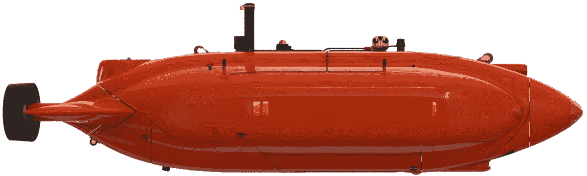

# 变形水下自主机器人 Aquanaut

> 原文：<https://thenewstack.io/aquanaut-the-shapeshifting-subsea-autonomous-robot/>

虽然机器人正在缓慢但肯定地融入我们的办公室和 T2 工厂，但它们也在更极端的环境中使用，比如海洋，在海洋中，它们可以被发现跟踪海洋野生动物，水污染，捕猎入侵物种，甚至绘制珊瑚礁面临的威胁。当然，这一切都是有道理的，因为水生环境——尤其是深海中的水生环境——对人类来说特别难以进入，通常需要大量的专业知识和专门的设备才能通过。

一个潜在的解决方案是 [Aquanaut](https://www.houstonmechatronics.com/aquanaut/) ，这是一个变形的水下机器人，由德克萨斯州的初创公司[休斯顿机电公司](https://www.houstonmechatronics.com/) (HMI)创建。这个机器人是由一个包括一些前美国宇航局工程师的团队建造的，它在某种程度上介于通常用于收集数据的无缆[自主水下航行器](https://en.wikipedia.org/wiki/Autonomous_underwater_vehicle)(AUV)和体积更大的遥控航行器(ROV)之间，正如它们的名字所暗示的那样，需要人类操作员远程实时控制它。Aquanaut 的设计允许它从类似于光滑紧凑的潜艇的东西转变为装备有两条长臂的模糊人形形式，这允许它在水下执行各种任务。看着它走:

[https://www.youtube.com/embed/DZPjsB--qas?feature=oembed](https://www.youtube.com/embed/DZPjsB--qas?feature=oembed)

视频

## 重新思考水下机器人

Aquanaut 旨在解决海上石油和天然气行业的一个持续问题，即维护海上平台的成本。虽然这些平台可以由水面上的人相对容易地维护，但在水下却是另一回事，因为这些钻井平台通常在水下有一堆杂乱的基础设施，可以延伸到水下许多英尺。传统上，在 300 米深度以下，这种任务由 ROV 完成，ROV 由容纳一组训练有素的操作人员的支持车辆提供动力并系在其上。虽然这种方法几十年来一直相对可靠，但是这种操作非常昂贵，通常每天从数万美元到数十万美元不等。

因此，石油和天然气公司正在寻找更具成本效益的解决方案来维护其深水基础设施也就不足为奇了。目前市场上没有其他类似的设备，这就是 Aquanaut 可以发挥巨大作用的地方，因为它不仅能够执行与 ROV 相同的任务，而且可以在没有连接到支持车辆的麻烦下完成任务，并且只需要人类操作员的最少监督。

Aquanaut 能够完成变形要归功于四个线性致动器，这赋予了它独特的变形能力，使它的船体能够顺利分离，露出两个控制推进器和带有力感抓手的手臂，然后用于执行更精确的操作，如转动阀门或使用其内置的维护工具之一。一旦变形，Aquanaut 的头部就会旋转，露出立体摄像机、各种传感器和声纳系统，使它能够绘制和构建其环境的 3D 渲染图，就像典型的 AUV 可能做的那样。最重要的是，Aquanaut 的续航里程为 200 公里(108 海里)，全部由锂离子电池供电。

还有易用性:人类监管者可以使用计算机和鼠标的常规设置向 Aquanaut 发送命令，而不是像使用 ROV 那样使用操纵杆来控制它。据 [IEEE Spectrum](https://spectrum.ieee.org/robotics/humanoids/meet-aquanaut-the-underwater-transformer) 报道，Aquanaut 还运行在[机器人操作系统](https://www.ros.org/) (ROS)上，这是一套广泛使用的机器人开发软件。

当然，拥有一辆无缆汽车的优势也转化为没有与总部直接有线连接的劣势。与 ROV 不同，Aquanaut 必须使用声学调制解调器，这意味着传输数据时带宽较低，延迟较高。

为了解决这个问题，Aquanaut 只向人类管理者发送其 3D 地图的压缩部分。为了确保机器人的自主操作顺利进行，HMI 计划在海洋表面部署一支由自主船只组成的舰队，充当机械化中间人，在潜水员和头顶轨道上的通信卫星之间传递数据。该公司最近在美国宇航局提供的一个巨大的封闭水箱中成功完成了测试，并将于本月晚些时候在开放水域测试其最新版本的 Aquanaut。

特征图像:Aquanaut 如何变形:1)隐形“潜艇”模式下的机器人。2)顶部船体分离，露出手臂和头部。3)头部向上旋转，露出立体摄像头、传感器和声纳系统。4)机器人的手臂伸出来，并配有力感夹持器。所有图片由[休斯顿机电公司](https://www.houstonmechatronics.com/)提供

<svg xmlns:xlink="http://www.w3.org/1999/xlink" viewBox="0 0 68 31" version="1.1"><title>Group</title> <desc>Created with Sketch.</desc></svg>