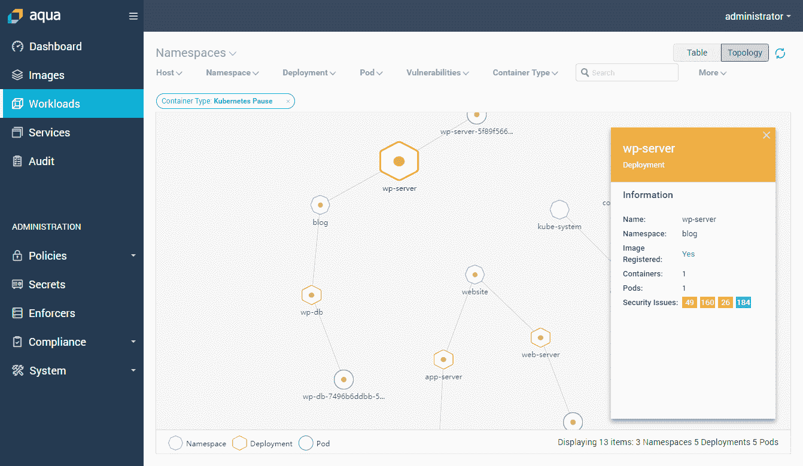

# Aqua 的“护栏”用于保护无服务器容器和功能

> 原文：<https://thenewstack.io/aquas-guardrails-for-securing-serverless-containers-functions/>

Cloud Foundry Foundation 报告称，无服务器正在以惊人的速度被评估和采用,与 2016 年容器的速度相当。

根据 [Aqua Security](https://www.aquasec.com/) 的 [Rani Osnat](https://www.linkedin.com/in/raniosnat/) 的说法，虽然将基础设施管理卸载给第三方的前景对许多公司来说仍然是一个有吸引力的提议，但很少有人会全力以赴地采用无服务器技术。用例与容器不同，但是安全性对两者来说都是一个问题。

“容器和无服务器—我们不认为它们是竞争对手。他们是互补的，”他说。“这个或那个是不会赢的。公司会两者都用。因此，统一安全策略也是有意义的。”

该公司最近发布了云原生安全平台 Aqua CSP v3.5，为无服务器容器和无服务器功能增加了保护。

对于像 AWS Fargate 这样的无服务器容器，安全问题反映了其他容器的安全问题——包、映像；嵌入的秘密意味着在测试过程中使生活变得更容易，但是后来被遗忘并且没有被删除；配置差。

Aqua 产品营销副总裁 Osnat 表示，无服务器功能的生命周期非常短，用于事件触发功能、中间件和批处理场景，因此攻击面较小，风险也较小。然而，权限提出了一个独特的问题。

“当你建立一个 Lambda 函数时，你可以根据运行它的 Amazon 环境给它一定的权限。开发人员倾向于自由使用这些功能，因为他们不希望任何东西破坏这些功能的运行。一个例子是访问 S3 桶，允许 API 触发器。因为函数运行的时间很短——可能只有几毫秒——传统的运行时控制、行为监控就不那么重要了。更重要的是控制您实际部署的内容，因为您在运行时实际执行任何内容的能力是有限的。他说:“如果你真的抓住了问题，你基本上是在后知后觉。

他说，客户基本上感兴趣的是知道他们开始部署的东西是安全的，并知道他们面临什么样的风险。

为此，Aqua CSP v3.5 提供了:

*   **无服务器功能的风险评估:**检查功能的已知漏洞、嵌入的秘密(密钥和令牌)以及云权限。
*   **容器加密:** Aqua 现在可以加密容器图像的全部内容，当它被实例化为容器时用一个密钥解密。
*   **通过 Workload Explorer** 提高在 Kubernetes 和 Docker 环境中运行工作负载的可见性。
*   **上下文运行时策略**
*   **细粒度管理访问控制**

“我们试图做的是给客户统一管理[容器和无服务器技术]的能力，”Osnat 说。

第一步是为他们提供工具，以确保他们的部署是安全的，并以一种他们从风险角度可以接受的方式完成。并密切关注开发人员在做什么。

“你需要一些护栏。我们提供这些护栏，并允许客户定义这些护栏是什么，”他说。

“我们谈论的是拥有数百个应用程序和不同团队的公司，无论是开发运维团队还是云体系结构团队、安全团队、合规团队，您都拥有这种复杂的权限和访问权限，您需要让人们控制一切。

为了控制不同的应用程序，您需要不同的信任级别、不同的遵从级别，同时，您还需要可重用的组件。

“您可能有运行在不同应用程序上的 MongoDB 容器，但是它们需要有不同的策略，这取决于它们是内部应用程序还是面向客户的应用程序；他们需要有不同的策略，这取决于他们是否符合 PCI 标准。因此，您希望让他们能够精确控制在何处以及如何应用这些策略。那么在管理端，谁可以查看什么，谁可以管理什么？

“我们给管理员提供了几十个参数来控制这些东西的行为。例如，您可以基于什么集群、运行在什么命名空间上……Kubernetes、它们在什么注册表中、它们基于什么映像，以及您应用的各种标签来制定不同的策略。

然后你区分人们如何访问它。例如，开发人员可能会得到关于漏洞的反馈，以便他们可以修复漏洞，但他们无法改变策略。审计员将能够获得可见性和审计报告，但他们不能更改策略。安全人员也许可以改变策略，但他们不能改变 Aqua 在集群上的部署方式。

“这确实是一个非常精细的职责分离实施，结合了上下文相关的策略来控制安全的多个方面，”他说。

他说，该公司将在不久的将来添加更多的运行时安全工具，尽管它在 3 月份宣布了一套名为“MicroEnforcer”的运行时安全控件[，用于亚马逊的 Fargate 和](https://thenewstack.io/aqua-extends-container-security-platform-kubernetes-cloud-services/)[微软的 Azure Container Instances](https://azure.microsoft.com/en-us/services/container-instances/)(ACI)。

8 月，它开源了一个名为 [Kube-hunter](https://kube-hunter.aquasec.com/) 的工具，帮助搜索 Kubernetes 集群中的安全问题。在一篇博客文章中，技术传道者 [Liz Rice](https://twitter.com/lizrice) 将其比作自动化渗透测试。

您可以在 New Stack 的“[无服务器技术指南](https://thenewstack.io/ebooks/serverless/guide-to-serverless-technologies/)”电子书中了解有关监控无服务器应用所面临的挑战及其对企业安全状况的影响的更多信息。

Aqua Security 和 Cloud Foundry 是新堆栈的赞助商。

通过 Pixabay 的特征图像。

<svg xmlns:xlink="http://www.w3.org/1999/xlink" viewBox="0 0 68 31" version="1.1"><title>Group</title> <desc>Created with Sketch.</desc></svg>