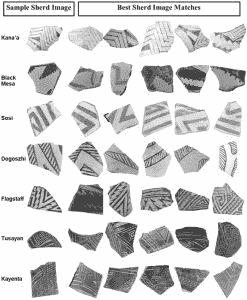

# 考古学家利用深度学习分析古代普韦布洛陶瓷

> 原文：<https://thenewstack.io/archaeologists-use-deep-learning-to-analyze-ancient-ceramics/>

关于考古学以及它是如何完成的，有很多误解。与普遍的看法相反，考古学家并不总是挖掘恐龙骨骼，也不是所有的考古学家都是带着时髦帽子和牛鞭的冒险寻宝者。通常，真正的考古工作是极其乏味的。用铲子和簸箕小心而缓慢地刮去土壤，而被研究的文物并不特别迷人:通常包括过去的日常物品和过多的陶器碎片——在考古学的说法中也称为“陶片”。

毫不奇怪，识别这些陶片可能是一项耗时的工作，考虑到一次典型的考古挖掘可能会产生数百——如果不是数千——的陶器碎片，这可以帮助专家绘制出一个遗址的时间表，并了解更多关于曾经占据它的文化。麻烦在于，区分各种类型的碎片所需的专业知识可能需要多年的训练才能形成，即便如此，专业意见也可能存在差异。

幸运的是，来自[北亚利桑那大学](https://nau.edu/)的一个专家小组现在已经成功地展示了一些工作可以通过机器学习来自动化，使用一种被称为[卷积神经网络](https://thenewstack.io/deep-neural-network-ai-reconstructs-mysterious-image-hidden-in-picasso-painting/)或 CNN 的人工神经网络，它依赖于一种被称为[深度学习](https://thenewstack.io/deep-learning-broadens-the-reach-of-artificial-intelligence/)的人工智能技术。像 CNN 这样的深度学习人工智能模型旨在模仿生物大脑的结构和功能，CNN 被用于各种任务，如[图像](https://thenewstack.io/researchers-build-an-interpretable-ai-that-shows-how-it-thinks/)和[视频识别](https://thenewstack.io/these-ai-synthesized-sound-effects-are-realistic-enough-to-fool-humans/)，图像分类和医学图像分析。

## 潜在的强大工具

特别是，研究人员将注意力集中在记录一种来自美国西南部的特殊彩陶的图像上，这种彩陶被称为图萨扬白色陶器。这些手绘器皿起源于今天被称为亚利桑那州东北部的地区，可以追溯到公元 825 年至 1300 年之间，古代普韦布洛人用它们来储存食物和水。该团队特别选择了这种陶器类型，因为它具有深色绘画的几何图案，与浅色表面形成强烈对比，这确保了实验中分析的图像有很高比例是实际可用的。

研究人员在最近发表在*考古科学杂志*上的[论文](https://www.sciencedirect.com/science/article/pii/S0305440321000455?via%3Dihub#!)中解释道:“我们的结果表明，经过适当训练，深度学习模型可以为装饰过的碎片的数字图像分配类型，其准确度相当于，有时甚至高于四个专家级的当代考古学家。”。“这项技术还提供了新的工具，用于可视化诊断设计元素的重要性和陶器碎片组之间的整体设计关系。”

首先，研究小组在图萨扬白瓷专家的帮助下，对最初的 3000 张陶片照片进行了分类。在这些图像中，分析师们一致同意对大约 2400 幅图像进行分类，然后使用这些图像来建立一个“共识数据集”，以训练卷积神经网络，并提高其识别这种独特类型的潜在准确性。为了确保机器学习模型能够充分处理图像变化，一些分析过的照片被随机旋转或调整大小。

该团队的卷积神经网络基于稍微修改过的 [VGG16](https://thenewstack.io/world-movie-actresses-write-ai-research-papers) 和 [ResNet-50](https://thenewstack.io/why-its-notoriously-difficult-to-compare-ai-and-human-perception/) 版本，这两个先前开发的 CNN 被选中是因为它们经过了预先训练，并且不需要太多的计算能力来运行。这种所谓的[迁移学习](https://thenewstack.io/how-transfer-learning-can-make-machine-learning-more-efficient/)——预先训练的模型被重新用于执行第二个相关任务——有助于加速训练过程。

该团队方法的一个有趣特征是，在对陶器碎片进行分类的过程中，该模型可以生成图像的颜色编码“热图”，以“解释”它是如何对图像进行分类的。例如，它可以显示照片中的哪些陶器图案与独特的图萨白陶器高度相关(显示为红色)，或者不太相关(编码为蓝色)。最终，在比较 CNN 和四位人类专家在分类碎片方面的表现时，该小组的实验表明，CNN 做得和其中两位专家一样好，同时优于另外两位专家。

虽然该团队承认，这种基于机器学习的方法不适用于没有重要装饰标识符的普通陶片(或“普通器皿”)，但他们指出，人工智能无疑将有助于加快某些类型陶瓷的分类和识别，特别是在有大量样本要处理的情况下。

在未来，研究人员希望通过更大的训练数据集来提高这种模型的准确性，并将其与人类分析相结合，以帮助识别更模糊的人工制品，这些人工制品无法进行简单的分类。

最后，该团队表示，其长期目标是开发一个自动化程序，该程序将协助专家，而不是取代他们，并将他们解放出来，进行更广泛的分析，而不仅仅是识别，这将有助于极大地推动该领域的发展。

“机器学习模型是提高陶瓷设计分类的客观性、可复制性、速度和效率的潜在强大工具。我们设想一个陶瓷分析师向 CNN 模型数据库提交一个碎片，得到的不仅仅是预测的类型，而是一组外观非常匹配的碎片，以及关于碎片背景和地理位置的附加信息。”

在[论文](https://www.sciencedirect.com/science/article/pii/S0305440321000455?via%3Dihub#!)中了解更多信息。

<svg xmlns:xlink="http://www.w3.org/1999/xlink" viewBox="0 0 68 31" version="1.1"><title>Group</title> <desc>Created with Sketch.</desc></svg>