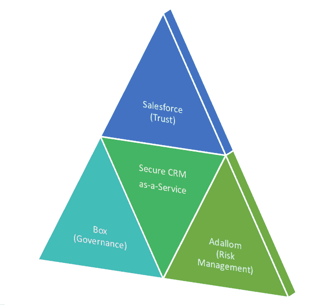

# 为新手开发者设计 SaaS 和 PaaS

> 原文：<https://thenewstack.io/architecting-a-saas-and-paas-for-the-neophyte-developer/>

一个新的 PaaS 和 SaaS 组合正在形成。为什么？App 开发。如果应用程序开发真的要蓬勃发展，它需要用于业务数据的 SaaS 平台和 PaaS 来使应用程序开发变得可访问。但它需要更多。它需要在存储层进行更深层次的抽象，以允许来自业务部门的新手开发人员构建在遭受攻击时风险最小的应用程序。

在本周的 Dreamforce 上， [Salesforce1](http://www.salesforce.com/lightning/) 展示了 PaaS 作为新开发人员构建应用程序的一种方式，以及所有必备的业务需求的价值。它展示了松散耦合的系统是如何很容易地组装起来的。但这也说明了为什么必须使用一流的集成组件进行组装，这些组件在构建时考虑了数据，以此作为降低风险和暴露的一种方式。

SaaS 已经成为商业世界中相当标准的东西。像它的老软件一样，SaaS 有许多不同的版本。然而，将应用程序和存储工作负载迁移到云中消除了许多长期困扰 IT 的依赖性和冲突问题。换句话说，我们已经解决了 SaaS 的许多问题。现在，随着应用对业务如此重要，我们看到了 SaaS 向更像 PaaS 的环境进行下一次演进的需要，这种环境培育了基于服务核心功能的生态系统。

自然，随着亚马逊和微软等 IaaS 公司也转向 PaaS，以及 Pivotal CF 等纯 PaaS 的快速增长，PaaS 标签描述了不同平台的聚宝盆——一些专注于快速将应用程序推向市场，一些专注于自动化和数据分析，一些定制了可靠地构建、测试、部署和管理新应用程序所需的所有工具。每种风格都有其优势和使用案例，但由于本周是 Dreamforce，我将重点关注 Salesforce1 平台。

任何植根于 SaaS 的 PaaS 都具有专门构建的集成组件的优势；具有各种通用框架抽象层、身份和数据处理模型的库。当这些工具和功能被集成，而不是由客户组装，并允许应用程序中所有层的规则和代码结构的联合时，它们为客户提供了更高级别的生产力、敏捷性和效率。

随着 SaaS 和 PaaS 之间的界限继续模糊，以及提供商生态系统的交叉，我们正在见证“同类最佳”集成的回归，这让人想起世纪之交的 ERP 时代。

作为 SaaS 的 PaaS，Salesforce1 提供了一个一致的层，解决了客户关系管理的许多方面，包括营销自动化、协作，现在甚至还有[分析](https://thenewstack.io/with-new-analytics-service-salesforce-challenges-startup-visualization-crowd/)。另一个这样的 PaaS，Box，解决了许多经常围绕云中内容的治理问题，最后一个是 Adallom，它本质上是一个风险管理即服务即平台，提供跨多个云服务提供商的“单一控制台”风险和威胁评估。

【T2

如果我们考虑将这三个平台放在一起作为企业级安全 CRM 的超级 SaaS，那么当具有内置治理和坚如磐石的 API 的解决方案已经存在时，为什么还要在 Salesforce 中开发存储层呢？证据:是的，Salesforce1 有一个存储层，但信息治理控制不是该服务的一个组件。例如，如何为 Salesforce1 中的数据创建数据丢失防护(DLP)策略？Salesforce1 平台在数据保留方面值得信赖，但在管理 Salesforce 内部的文件时，Box 的治理功能是一个显而易见的插件。盒子是解决存储层问题的平台，这让[盒子对于 Salesforce](http://blog.box.com/2014/09/close-more-sales-deals-with-the-latest-box-for-salesforce-integration/) 的效用显而易见。

有些事情超出了信任和治理的范围。例如，当用户受到威胁时会发生什么？作为风险管理层，将防欺诈机制应用于跨平台的数据；当应用程序设置、用户交易或数据交互超出可接受的标准偏差时，它会生成可操作的见解和相关警报。 [Adallom 插入我们的{\\ f 6527 {\\ f 6527 }{\\ f 6527über-SaaS {\\ f 6527}【T8 ]}以减少被网络钓鱼的用户、行为方式有风险或可疑的用户(例如，一个用户同时从加利福尼亚州登录 Box 和从中国登录 Salesforce ),以及一个通常每天共享几个文件的用户突然共享数百个文件，或者用户使用个人电子邮件地址共享机密文件。](http://blog.box.com/2014/10/partner-spotlight-managing-content-security-and-governance-with-adallom/)

在许多方面，SaaS 提供商向 PaaS 的演进与采购退回到 IT 领域是相称的。这是因为避免“影子 IT”的最佳方式是提供有竞争力的云服务，既能满足业务部门的需求，又能满足整个组织的法规和安全要求。它还应该注意从 DevOps 和“同类最佳”框架中吸取的经验教训，并将它们应用于构建健壮的跨平台 SaaS 基础架构。

Tal Klein 是 Adallom 的营销副总裁，Adallom 是新堆栈的赞助商。

<svg xmlns:xlink="http://www.w3.org/1999/xlink" viewBox="0 0 68 31" version="1.1"><title>Group</title> <desc>Created with Sketch.</desc></svg>