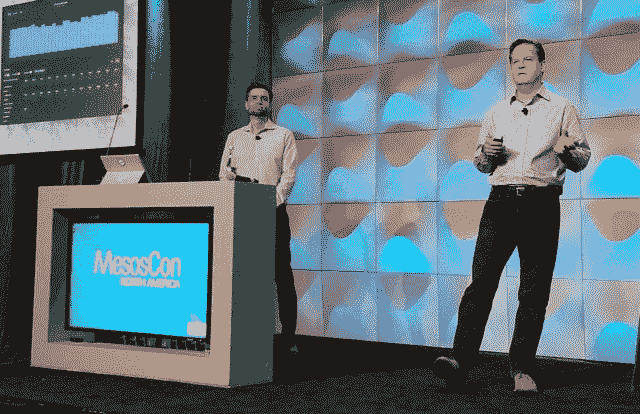

# 中间层 DC/OS 为地理空间数据带来了大规模实时处理

> 原文：<https://thenewstack.io/architectural-requirements-customers-require-processing-millions-events-per-second/>

突然间，地球成了世界上最重要的实时数据来源之一。因此，越来越多的学术机构、研究机构、应急响应团队、人道主义和救援组织以及情报机构收集这些数据(气候信息、旅行和通勤数据、犯罪统计数据、体育赛事出席率、高速公路交通流量)的业务也在增长(是的，它们也在增长)。

这些使用情形需要超出传统企业基础架构所能提供的规模。这意味着对高吞吐量、无延迟和下一代协调程度的需求不断增加，以处理天气数据、高速公路交通和来自无限节点的任何其他信息，这些节点能够以编程方式捕获和提供数据进行分析。

正在出现的是对从这些节点吸收输入、安全地处理数据并孤立地这样做的平台的需求。

## 时空临界点

地理空间软件提供商 [Esri](https://www.esri.com/en-us/home) 负责实时和(非常)大数据 GIS 开发的[亚当·莫伦科夫](https://twitter.com/amollenkopf)解释道:“随着物联网*的出现，我们现在看到的是一类新的客户。”。“他们不能只使用几台每秒处理数千个事件的机器。我们的客户可能每秒需要数百万个事件，这取决于他们的使用案例。采用我们的传统架构，并试图在数十台、数百台或数千台机器上部署这种架构，实际上并不合理或站得住脚。这需要一种新的方法。”*

Esri 的[地理空间制图平台 ArcGIS](https://www.arcgis.com/features/index.html) 已经从一个全球制图应用程序发展成为一个复杂的*地理编码*系统，吸收大量不同的数据源-包括众包-并实时生成 3D 分析图。在 ArcGIS 的中心是 Mollenkopf 所描述的时空数据库 T10，在 3D 动画的辅助下，它不仅能够呈现现在的结果，还能够呈现最近的结果。你可能会说，显然，这样的应用程序不是每个人都可以使用的，就像谷歌地图或天气频道应用程序一样。但是 Esri 的建筑师们已经开始问这个问题了，为什么不呢？

“如果你将数据中心的一架机器的概念视为一个逻辑单元，”他本月早些时候在 2017 年中尺度会议上告诉与会者，“我们只会将它视为一个我们调度工作运行的操作系统。所以我们不把它看成 33 台机器；我们把它看作是一大堆资源。我们有大量的内存，大量的存储空间，大量的 CPU 资源可以利用。我们计划在上面运行工作，这就是 DC 操作系统的全部内容。DC/操作系统为我们通过集群部署这些应用提供了一个不同的起点。”

机器本身必须被隔离，原因很多，仅仅从安全性开始。但是它们应该是可管理的，就像它们是同一个单元一样。

从表面上看，这听起来像“[超融合](http://www.datacenterknowledge.com/archives/2017/03/20/isnt-hyperconvergence-converging)”，越来越多的服务器内置了管理服务器硬件的方法。但 HPE 一直在试验为其 ProLiant 服务器的某些型号预装 DC 操作系统，作为其自己的超融合系统的替代方案。这表明某些类别的客户需要一种调度机制来提供更深层次的控制，以及更可靠的衡量性能的方法。

几年前，Esri 与 Mesosphere 合作开发了一个内部平台，莫伦科夫称之为 Trinity。他发现自己在向顾客解释，不，这不是宗教参考；不，它不是以原子弹项目命名的。应该是[《黑客帝国》中的一个角色](http://matrix.wikia.com/wiki/Trinity)

Trinity 是一个托管服务堆栈，部署在 Mesosphere 的数据中心操作系统(DC/OS)上，它结合了 Scala 语言，用于将数据组装到集线器中的连接器；Kafka 吸收了代表这些中心的经纪人的数据；Spark，用于将数据作为离散主题使用，以及托管 ArcGIS 专有的地理空间分析；维护时空数据档案的弹性研究:Spark(再次)用于对该档案执行批量分析；最近， [Apache Play framework](https://www.playframework.com/) (基于 Akka 构建)使用经典的控制台方法快速开发 web 应用。

(您可以使用 Azure 或 AWS 以及 Trinity 堆栈的关键组件，通过下载软件包并按照 GitHub 上的说明执行[，来提供和部署 Trinity at work 的开源演示，使用真实世界的物联网数据。)](https://github.com/amollenkopf/dcos-iot-demo)

这个方案缺少的是 Docker。虽然容器化是 Esri 解决方案的重要组成部分，但该公司需要为自己及其合作伙伴维护多种部署选项。Mesos 在处理它所认为的“框架”时确实提供了灵活性相比之下，Mollenkopf 认为，从 Esri 的合作开始，Docker 就会在期权方面束缚 Esri 的手脚。

Esri 架构决策的另一个原因是，需要在地理空间应用程序和支持它们的基础设施之间建立更紧密的关系。

## 时间不一致性

如果你已经看到了这样一个假设，即任何应用程序，一旦被容器化和编排，至少比其旧的、单一的架构有一些好处，那么在全球范围内，这个假设就站不住脚了。许多高可用性、数据库驱动的应用程序都是在考虑服务器部署的情况下创建的。在实时时代的初期，“传统”架构利用计时算法和处理流水线来衡量底层服务器的能力和局限性。

1996 年，著名的[计算机科学教授 Azer Bestavros](http://azer.bestavros.net/) 用简单明了的术语解释了这种情况:“数据库系统是为了管理并发任务之间共享的持久数据而设计的，”Bestavros 教授写道。在处理并发事务时保持逻辑一致性是大多数数据库的主要要求之一。在实时数据库中，还必须考虑数据的时间方面和事务的时间约束。数据的时间一致性要求外部世界的实际状态和数据库内容所代表的状态必须足够接近，以保持在应用程序的容许限度内。”

教授继续说，如果没有对底层操作系统及其维护的组件的全面建模，这种接近性是无法保证的。软件平台与物理基础设施的分离恰恰切断了这种联系，这种分离使这种规模的虚拟化变得可行。

多年来，[软件开发人员不敢为虚拟化基础设施构建实时数据库驱动的系统。直到最近，确保确定性、可预测的性能的主要方法依赖于虚拟化所禁止的高级软件和低级硬件之间的密切联系。结果，简单地虚拟化世纪之交所依赖的实时系统，使它们变得不可靠。](http://www.embedded-computing.com/embedded-computing-design/the-need-for-embedded-virtualization-in-real-time-multiprocessor-multi-os-systems)

## 决策准备

“我们需要一些东西进来，基本上创造一个范式的转变，”Todd G. Myers 宣布，他是国防部[国家地理空间情报局](https://www.nga.mil/Pages/Default.aspx) (NGA)的高级架构师。

从左至右:NGA 系统工程承包商凯文·菲茨亨利；NGA 高级建筑师 Todd G. Myers 在 2017 年洛杉矶中尺度大会上发言。

NGA 是美国实时地理空间数据的主要储存库，这些数据由美国庞大的传感器和卫星收集。但它需要从国防部以外的资产中收集大量商业收集和处理的数据(包括来自 Esri 的数据)，这迫使该机构重新思考其商业模式。Myers 在本月早些时候在洛杉矶举行的 MesosCon 主题会议上表示，从技术角度来看，ng a 一直在寻求的范式转变涉及整合 Mesos 框架、容器服务和更具商业性质的事务性 IT 管理方法。

地理空间数据的处理是国防部雇员称之为“IC”的情报社区的一个关键的现代功能。为了保持其在这个社区的中心地位，NGA 需要合作伙伴。但它不会通过政府机构通常的工作方式来获得合作伙伴:通过广告向候选供应商招标，并花几个月的时间来考虑他们的申请。

因此，它构建了一个名为 NSG 数据分析架构服务(NDAAS)的平台，采用类似云的供应模型。在这种情况下，单个租户在事务基础上对地理空间数据的访问是有限的。租户定义他们自己的工作以及他们希望如何运行这些工作。为了让员工更容易管理一切，NGA 采用了一种政策模式，将每项工作隔离开来，但将它们放在平等的基础上。

“我们正在努力精简以跟上数据量的增长，”Myers 告诉 New Stack，“这些数据需要作为产品或服务提供给人道主义组织，或[任务空间](https://www.nga.mil/ProductsServices/GEOINTAnalysis/Pages/MissionFlyThroughs.aspx)，或国防部任务合作伙伴。我们实现这一目标的方式是一样的。”

NGA Scale 的堆栈由大约 17 个开源组件组成，其中大部分是新的堆栈读者和 Mesos 用户所熟悉的，包括 Kafka、Jenkins、Ansible、ElasticSearch、用于关系查询的 PostgreSQL、用于软件定义的网络的 WeaveWorks、用于数据缓存的 Redis、作为文件系统的 GlusterFS 以及用于调度长期运行服务的 Marathon。迈尔斯说:“我们正试图摆脱数据库和服务器的紧密耦合，以及短暂的数据管道。

他指出，在过去，NGA 确实缓存了某些数据簇，以供特定客户快速访问，你可以猜到他指的是哪些数据簇。但是，当 NGA 开始在 Mesos 上部署其服务堆栈并使用 DC/操作系统进行管理时，它发现积累这些缓存并将它们移动到指定位置的行为消耗了太多的时间和资源，以至于它消除了从一开始就拥有缓存所获得的任何优势。

毫不夸张地说，当您的客户空间是整个地球时，为了获得几秒钟的优势而搜索“边缘”最终是浪费时间。

迈尔斯说:“在大多数情报机构中，NGA 被认为是一个更具前瞻性的机构。“我们正在充分利用这个机会，推出我认为是下一代的东西。”

Esri 和 NGA 在地理空间技术的全球分级方面的经验表明，单一、集中、传统的“命令和控制”系统并不能很好地扩展-至少，机器技术并不比人的组织更好。将平台组件化，并启用配置和扩展每个组件的选项，为整个组织提供了更大的灵活性。对于我们赖以生存的这个越来越小的时空传感器集群来说，这种自由将变得更加珍贵。

[中间层](https://d2iq.com/)赞助了这个故事。

<svg xmlns:xlink="http://www.w3.org/1999/xlink" viewBox="0 0 68 31" version="1.1"><title>Group</title> <desc>Created with Sketch.</desc></svg>