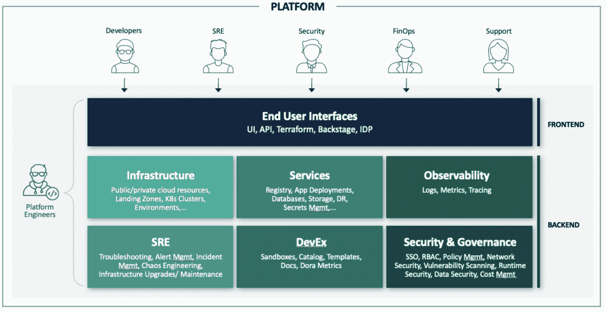

# 平台工程团队的架构和设计考虑事项

> 原文：<https://thenewstack.io/platform-engineering/architecture-and-design-considerations-for-platform-engineering-teams/>

平台工程并不是一个新概念，在谷歌、亚马逊、脸书、网飞和许多其他大公司中已经存在了很长时间。对于任何大规模的产品工程团队来说，平台都是一组标准的服务、框架和模式，它们最初是由一个或多个团队开发的，供组织中的其他团队使用。

工程组织的其余部分要么使用这些平台服务来开发其他应用程序或服务，要么作为内部工具。

当开源、商业框架和平台作为服务和工具不可用时，产品团队过去常常在内部构建许多这样的共享服务和工具。一个很好的例子就是 Google 的内部容器管理平台 Borg，它最终成为了 Kubernetes。

另一个很好的例子是 Kafka，这是 LinkedIn 最初为内部使用而构建的开源消息平台。类似地，最初为内部使用而开发的亚马逊网络服务(AWS)的 S3 和 EC2 成为了 AWS 公共云的核心基础。

由于这些平台、框架和工具作为开源或商业产品的可用性，[平台团队](https://thenewstack.io/platform-engineering-wont-kill-the-devops-star/)不再需要为应用程序开发或自助式云基础架构构建它们。

## 什么是平台？

那么，在云原生应用程序开发、部署和管理的背景下，平台到底是什么？它是内部开发人员平台、开发人员自助服务门户、开发人员体验工具还是简单的开发人员入职工具？有没有开发者以外的用户在使用平台？

所有问题的答案似乎都是“是”。我们现在所指的平台是以上所有内容以及更多内容的组合。由于大多数基础服务都是开源或商业产品或两者兼而有之，因此平台工程团队的主要目标是使这些服务和工具易于发现，以自助方式随时可用，并且更易于使用 API、UI、自助门户、Terraform 等标准接口。

例如，平台团队可以向他们的最终用户提供集群或容器作为服务，这样每个业务部门或应用团队就不必供应或管理 [Kubernetes 基础设施](https://thenewstack.io/a-deep-dive-into-architecting-a-kubernetes-infrastructure/)。另一个例子是应用程序部署即服务，平台团队通过提供 Argo CD 即服务等工具来自动化应用程序部署过程。

> 为了最终取得成功，平台团队不仅要解决他们的开发人员用例，还要解决其他内部团队的用例。

在幕后，平台团队可能会利用各种商业或开源框架以及一些定制的自动化。虽然开发人员是该平台的主要内部用户，但其他团队，如 SRE、安全、产品支持和 FinOps 也可以从该平台中受益匪浅。

为了最终取得成功，平台团队不仅必须处理他们的开发人员用例，还必须处理他们其他内部团队的用例。

这种平台可能有一个或多个用户界面，开发人员和其他内部用户可以利用这些界面，在平台团队最少的帮助下，以自助方式轻松地使用这些服务。

对于不同的用户角色，用户界面可能不同。例如，开发人员可以使用 Backstage(一个用于构建内部开发人员门户的开源框架)作为自助服务门户，以访问他们所有的开发资源，如目录、模板、部署管道、开发/测试环境等。该团队可以使用 Terraform 进行基础设施管理和维护。

用户界面的背后是平台的后端，它汇集了组织的所有通用框架、基础设施、服务和工具，并通过一个或多个用户界面将它们作为标准服务提供给最终用户。

组织的安全性、治理和法规遵从性要求也被纳入后端，以应用于所有平台服务，从而在整个组织中一致地实施这些要求。

## 平台架构

在其最简单的形式中，该平台可以被视为两个组件(如下所示)—前端包括一个或多个最终用户界面，后端为前端提供必要的基础架构、服务和工具自动化，因此使最终用户能够以自助方式使用这些功能来提高工作效率、加快产品开发以及实现一致的安全和治理策略控制。

开发者的前端可以是一个简单的本土门户，一个先进的后台部署，或者一个商业内部开发者平台(IDP)解决方案。类似地，对于 SRE 团队，前端可能由平台团队开发的一组公共 Terraform 模块组成，用于供应和管理基础设施。

对于一些团队来说，这可能意味着可以登记到 git 存储库中的基础设施资源的声明性规范，并且基础设施资源是通过 GitOps 自动提供和管理的。

后端本质上是基础设施自动化、应用服务、开发人员体验工具、SRE 工具和框架以及安全和治理策略管理工具的集合。平台团队通常通过在这些基础设施、服务和工具之上添加一个额外的自动化层来构建这个后端，以使它们通过各种前端可用。

例如，可以开发一个自定义插件，允许开发者从后台门户创建一个开发者沙箱。类似地，它可能是一个 Terraform 模块，用于创建具有所有必需的附加组件和策略的 Kubernetes 集群，SRE/运营团队可以使用它来创建具有一致配置的集群。平台后端的每个主要组件描述如下:

## 基础设施

该组件提供了调配和协调公共/私有云资源所需的自动化。自动化可能包括为复杂资源(如 Kubernetes 集群、完整环境等)提供基本的基础架构资源，如虚拟私有云、身份和访问管理角色以及负载平衡器。平台团队通常使用基础设施即代码和 GitOps 实践来实现自动化。

## 服务

每个应用程序团队都在他们的应用程序开发中使用各种服务和工具，这些服务和工具不是核心应用程序的一部分。这些服务可能从基本服务(如容器注册、CI/CD 管道和 Vault as a service for[secret management](https://thenewstack.io/hashicorps-releases-hcp-vault-to-combat-secrets-management-fatigue/))到高级服务(如消息传递、缓存、数据备份、灾难恢复等)。

平台团队将这些服务自动化，并通过一个简单的界面提供给应用团队，以进行板载/集成，从而减少应用团队的工作量和认知负荷，使他们能够更加专注于核心应用开发，以加快产品交付。

## 可观察性

可观察性包括从正在运行的系统中收集可用于故障排除和修复问题的数据，分析资源使用情况以优化性能，收集容量规划的指标或构建早期预警系统以在问题发生前检测任何潜在问题，等等。

日志记录、度量和跟踪是可观测性堆栈的基本组成部分。平台团队通常使用开源和/或商业解决方案，并可能实现额外的自动化，以无缝集成各种数据收集应用程序；他们将其提供给开发人员和 SRE/运营团队进行分析和故障排除。

## SRE

除了可观察性工具，SRE 和运营团队还使用许多其他工具和技术来管理和运营大规模应用基础设施。其中可能包括车队基础设施管理和运营自动化、混乱工程、事件管理、警报管理、用于高级调试的定制故障排除工具、自我修复等。

平台团队可能会对这些工具中的一些开源和商业产品进行标准化，并提供给 SRE 团队。类似地，平台团队可以为设备群管理、高级调试和自我修复类型的用例开发定制解决方案，因为这些用例可能非常特定于其基础设施和应用。

## 开发者体验(DevEx)

每当开发人员开始开发新的服务或应用程序时，他们经常被迫从事重复性的工作。这在拥有许多内部应用程序团队、产品团队和业务单元的大型组织中尤其普遍，在这些组织中，团队之间通常很少共享代码和工具。这些重复的任务可能包括为已经存在的新服务创建样板代码模板，建立测试平台，启动开发/测试环境，等等。

除此之外，开发人员还需要了解他们所拥有的服务的信息——它使用什么资源、服务的健康程度、最后一次更改的时间以及如何查看最新的日志。平台团队可以通过利用 Backstage 或其他开发人员门户的统一开发人员门户来提供这些功能，以及自动化此类任务中涉及的可重复任务的功能。

## 安全和治理

InfoSec 和安全团队为整个组织使用的所有组件、服务和基础架构定义了安全框架和基准安全状态。这可能需要在所有系统中一致地执行所有安全政策和做法，以满足安全基线状态，持续验证基线以检测任何偏差，并在发生违规时快速补救。

安全基准策略包括单点登录和基于角色的访问控制、网络安全、用于在资源级别实施精细合规性和安全策略的开放策略代理(OPA)、漏洞图像扫描、运行时容器安全、CIS 基准测试等。

> 平台团队需要在应用开发、部署和管理的每个阶段自动应用这些成本控制策略，在基础设施层面也是如此。

对于治理来说，成本控制政策对于每个组织都是至关重要的。平台团队需要在应用开发、部署和管理的每个阶段自动应用这些成本控制策略，在基础设施层面也是如此。例如，这可能意味着为 Kubernetes 集群部署自动安装一组经批准的系统附件和 OPA 策略、网络策略和成本控制策略。

## 结论

平台工程没有放之四海而皆准的方法。它归结为每个组织的具体要求、优先事项以及他们希望通过平台实现的目标。该平台不仅仅是一个 IDP 或后台部署或自助服务门户。开发者不一定是平台的唯一用户。平台团队必须彻底了解所有内部用户角色及其需求，并为平台开发合适的后端和用户界面，为所有内部用户提供最大价值。

<svg xmlns:xlink="http://www.w3.org/1999/xlink" viewBox="0 0 68 31" version="1.1"><title>Group</title> <desc>Created with Sketch.</desc></svg>