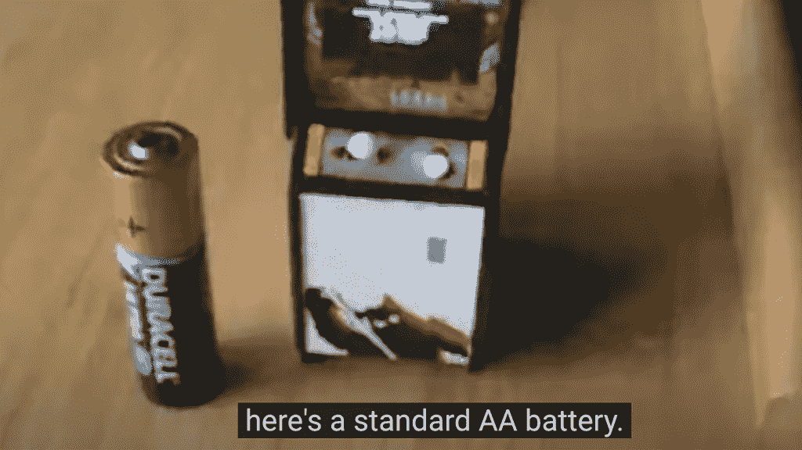

# Arduino Fan 打造世界上最小的太空入侵者游戏

> 原文：<https://thenewstack.io/arduino-fan-builds-the-worlds-smallest-space-invaders-game/>

震惊。难以置信。不知何故，一个 Arduino 爱好者制作了一个只有 3.1 英寸高的太空入侵者街机游戏。只有 80 毫米高——它的操纵杆由一个小小的皮下注射针头制成。

YouTube 上的一段视频自豪地宣称它是“世界上最小的全功能太空入侵者模型。”

[https://www.youtube.com/embed/FOn4Yli62UM](https://www.youtube.com/embed/FOn4Yli62UM)

视频

但这也是极客们所做的特殊魔法的一个例子——一个来自一个非常坚定的修补者的应用极客的鼓舞人心的故事。

## 一个疯狂的蒸汽朋克自己做

原来，世界上最小的太空入侵者机柜是英国布莱顿附近的开发人员、UNIX/Linux 系统管理员和工程师 Nicholaus D. Cranch 的作品。克兰奇在项目网站 Hackaday 上的[简介](https://hackaday.io/NuIotaChi)中称自己是一名“程序员、工程师和博学家”，根据他的[专业网页](http://www.nix-consulting.co.uk/about/)显示，他自 20 世纪 80 年代以来一直从事计算机工作。

在他的网页上，他回忆说这是“一个没有图书馆来做复杂事情的时代。一个你必须自己做所有事情的时代。那时，你必须从机器中挤出最后一滴处理能力，将所有东西都装进最小的空间。”

所以毫不奇怪，克兰奇现在是一名技术顾问。

但这也给他的生活带来了一些有趣的副业。

“几年前，我买了几个非常便宜的 I2C·有机发光二极管屏幕，只是为了玩玩，”克兰奇在视频中谈到他的太空入侵者项目。这个小屏幕只有 25 毫米宽——大约相当于美国 25 美分硬币的宽度——只有 128×64 像素。“它们非常便宜，大约 4 美元，”克兰奇在一封电子邮件中告诉我。

但是你永远不知道一个需要 25 毫米小屏幕的创意项目什么时候会出现。

克兰奇也是蒸汽朋克的狂热爱好者，他开始将其中一个微型显示器改造成蒸汽朋克配件，并巧妙地命名为“控制论增强型义眼”。这是一种机械地将视觉放大放大镜降低到适当位置的设备，使用超声波检测来计算距离，并使用光响应电阻器来控制其内置虹膜的孔径。

控制论增强型义眼。照片由托尼·让桑拍摄。

机械伺服系统然后定位一个适当供电的、增强视力的单片眼镜——这一切都由一个开源电子原型平台 Arduino 控制。有机发光二极管屏幕提供了其数据的微型显示(装在一个棱镜中)。

克兰奇称之为他的“疯狂的 Arduino 蒸汽朋克项目”这不是他唯一疯狂的计划。他告诉我，他现在正在计划一个机械驱动的日晷，以及一顶内置布谷鸟钟的绅士帽。

但是小小的屏幕似乎发出了它自己隐含的挑战。

他能把它变成一个小小的电子游戏柜吗？

## 灵感的闪现

克兰奇首先抓住一个微小的 Arduino Pro 微板，为 SSD1306 有机发光二极管屏幕供电。

Arduino 爱好者传统上求助于两个流行的图形显示驱动程序库——但不幸的是，Cranch 发现 Adafruit GFX 库和 U8Glib 库都太慢了，占用了太多的可用内存。根据他的视频，此时他将实验描述为“彻底的失败”，并继续他的余生。

但是他后来通过一次巧妙的黑客攻击恢复了这个项目。克兰奇意识到有一个更简单的库，只用于显示字母(而不是图形)，名为 [SDD1306_text](https://github.com/mgcastro/SSD1306_text/blob/master/SSD1306_text.cpp) 。他告诉我，他发现它的性能“快得多，使用的系统资源更少”，尽管它最终还是不够快。

但是把它作为一种框架，克兰奇灵光一现，意识到他可以把游戏的所有符号都当作一种字母。“所有的象形文字(包括外星人、基地等。)都是 5 像素高的，所以我把这个库精简到只有精华部分，硬编码成 5 像素高的字符。”

或者，正如他在后来的一封电子邮件中所说，“这是一个 ASCII 库，但你不必让‘A’看起来像‘A’。”

他还修改了图形驱动程序，使它只对游戏中改变位置的部分进行更新。(“在主程序循环的每一次迭代结束时……被改变的区域被发送到屏幕上，”克兰奇在[项目网站 Hackaday](https://hackaday.com/2022/01/12/arduino-and-an-oled-make-this-space-invaders-cabinet-tiny/#comment-6414413) 的一篇评论中说。)

但是，唉，即使是这样也还是太慢了——直到他发现了第二个变通办法。驱动程序将接受不同的时钟频率，更快的 800KHz，而不是默认的 100KHz。

在这一点上，克兰奇只剩下 512 字节的内存可以使用——用于实现整个太空入侵者游戏。但是像任何优秀的自己动手的程序员一样，他只是简单地编写了适当的代码，并把它放入他可用的空间。

“游戏代码完全是我自己的，”克兰奇告诉我。"我找到了原始游戏的视频，并对其进行了编码."

## 收尾

最后，克兰奇用手工切割的 1.5 毫米厚的胶合板制作了自己的小柜子。(克兰奇在视频中解释说，“开火”按钮和操纵杆是由“从一只旧鼠标中清理出来的”微型开关控制的。)他用一个旧 CD 盒包住屏幕，上面覆盖着大小合适的图形，这些图形是他用彩色激光打印机打印出来的，然后粘贴到位。

在比赛间隙，它甚至在等待下一个季度时显示 1978 年的原始动画，包括显示最高得分者的姓名首字母。

当他在报纸上描述或分享照片时，反应出奇的温和。但在现实生活中看到这个小柜子——然后被邀请去玩它——带来了他深情地描述为“孩子般的兴奋:这就是我创作这个视频的原因。”

这段引人注目的视频包括正在玩的游戏的[片段——捕捉到它极小的哔哔声。“请原谅我的手指碍事，”克兰奇说，“但它真的那么小。”](https://youtu.be/FOn4Yli62UM?t=248)

看到这最后的爱的努力，我不得不问克兰奇，是不是有什么特别的爱好驱使他在过去所有的经典视频游戏中选择《太空入侵者》？

当 1978 年第一部《太空入侵者》上映时，他才 12 岁，他回忆道:“我过去常常去游乐场，但对于我作为报童每周挣的有限的 2.8 英镑总是非常小心。”

他说，他的母亲“对‘在愚蠢的电子游戏上浪费金钱’也非常严厉。”"

太空入侵者并没有进入克兰奇的生活，直到他的学校购买了几只 Commodore 宠物，允许他们在雨天玩耍——他记得这只安装了一个游戏:太空入侵者。他说，即使在那个时候，“因为个子小，不爱说话，又不是‘人群’中的一员，我从来没有机会打球。”

现在他有了一台属于自己的机器——尽管克兰奇坚持说他不是被苦涩的怀旧情绪所驱使。(克兰奇在邮件中指出，1984 年，他的家人购买了一台二手辛克莱家用电脑 ZX81，“附带了一大堆游戏”。"但是，我很快发现比起玩，我更喜欢编程.")

相反，他回忆说《太空入侵者》是如此经典。这款标志性的游戏让人们惊叹不已，并突破了 20 世纪 70 年代硬件的界限。”因此，当谈到副业项目时，他认为这是完美的选择——“对那个时代来说很复杂，但在 Arduino 的可能性范围内。”

他的项目在网上获得了新粉丝的广泛赞赏，这让他很感动。"对周日下午基本上令人分心的事情有这样的兴趣真是令人羞愧。"

<svg xmlns:xlink="http://www.w3.org/1999/xlink" viewBox="0 0 68 31" version="1.1"><title>Group</title> <desc>Created with Sketch.</desc></svg>