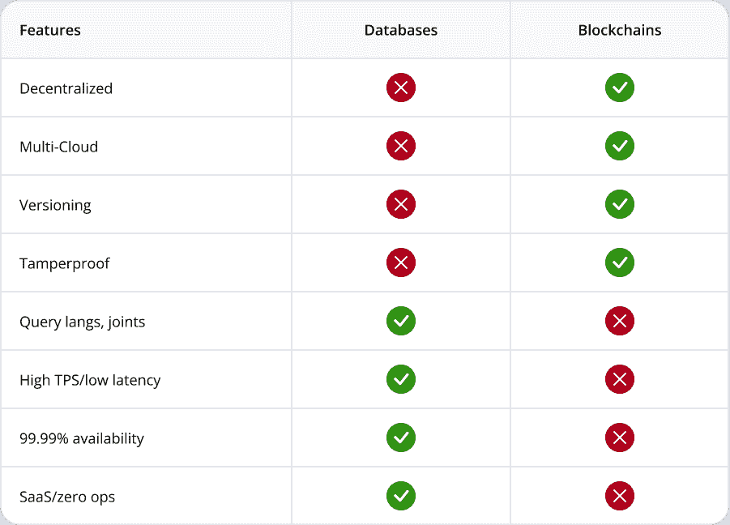

# 是区块链数据库吗？

> 原文：<https://thenewstack.io/are-blockchains-databases/>

 [蒂姆·瓦格纳

蒂姆·瓦格纳博士是 AWS Lambda 的发明者，曾任 AWS Lambda 和亚马逊 API 网关服务总经理。他还曾在比特币基地担任工程副总裁，管理设计、安全和产品管理团队。蒂姆联合创立了 Vendia，以帮助各种规模的组织更有效地跨云和公司共享数据，并担任其首席执行官。](http://www.linkedin.com/timawagner) 

随着一些数据库现在支持版本控制和校验和，以及区块链存储更多类型的数据，这些技术正在走向融合吗？

在本质上，现代的基于云的数据库是为了使数据持久，通常是通过在不同的物理设备上存储数据的副本。像 [Hyperledger Fabric](https://www.hyperledger.org/use/fabric) 这样的区块链是复制和存储数据的另一种方式，有时甚至包括传统的数据库作为其架构的一部分。

那么，这些技术的根本区别是什么？在完全不同的需求驱动下，他们会永远保持独立吗？或者，它们正处于一个碰撞的过程中，数据存储的最终未来表现是同时拥有两者的元素？

在本文中，我们来看看这些技术的来源和发展方向。

## 数据世界中的表亲

数据库和区块链肯定有相似之处:假设我们在区块链的定义中包括物化世界状态，这两种技术都支持读取和写入数据值。两者都提供一些“交易”和订购的味道；可能只需做一点工作，应用程序就可以安排一个更新在另一个更新之前或之后发生，并可以知道更新何时完成。还有(这里故意眯着眼)，这两家都是某种意义上的耐用品商店。数据库被设计为在机器崩溃时不会丢失数据，并且—如果您在与可用性无关的位置有足够的节点—区块链甚至可以在任何单个副本永久移除或丢失的情况下存活。很相似，对吧？

## 区块链功能

然而，当我们更仔细地观察时，数据库和区块链技术开始有所不同。例如，区块链有一些通常在普通数据库中找不到的属性。在用户可见的功能中包含分类帐意味着它们可以支持版本控制(对历史信息的访问)和沿袭(您可以确定数据何时被更改以及由谁更改)。区块链还典型地提供了一些不变性和“防篡改”的味道——有可能知道之前存在的任何东西是否已经丢失或被破坏。一些数据库提供自动备份，但这与完整历史或完整性验证不是一回事。公共区块链通常也有一个最终用户身份的全局概念，它直接连接到事务模型和语义中——这不是数据库的传统特性，可能除了一些内置的日志支持之外。

区块链还有另一个定义性特征:*分权*。传统的数据库，即使是现代的基于云的数据库，也被设计为由一个实体拥有、保护和管理。事实上，你可以说，保持对数据的控制与其所有者隔离是现代云数据库的一个定义性特征，其中数据安全性、隔离和治理被认为是关键的设计原则。

相比之下，区块链是*去中心化的*总账——不是为了持久性而分布在云提供商数据中心的机器之间，而是分布在多方。这些方可能有业务关系，但他们通常不“信任”IT 意义上的另一方:他们中的每一方通常都有自己的数据副本、自己的硬件和软件系统、自己的安全团队和协议，等等。

想想 Visa 或 Mastercard 这样的信用卡公司，Wells Fargo 这样的发卡银行，以及 Amazon.com 这样的供应商，很容易理解为什么公司需要共享数据(例如，用户使用信用卡在亚马逊上购买衬衫)*和*为什么拥有完全独立的 it 系统是一项实际需求。

随着去中心化而来的是我们倾向于与区块链联系在一起的各种能力:一致的、不可变的、完全有序的、不可否认的数据复制，可以跨越公司、云、区域、客户和技术栈。简而言之:*单一的真相来源，在各方之间自动维护，无论他们居住在哪里*。这是一种非常强大的机制，通常不会出现在典型的数据库提供商的特性列表中。

## 数据库功能

数据库还有一系列大多数区块链人没有的能力。(为了保持我们的比较在某种程度上等价，我们将这里的“数据库”定义限制为广泛采用的云托管 SQL 和 NoSQL 数据库，如 Google Spanner、Azure CosmosDB 和 AWS 的 Amazon Aurora 和 Amazon DynamoDB。)这些服务具有许多特性，这些特性对于构建可伸缩的企业级应用程序非常重要，这些应用程序可以存储和操作任务关键型业务应用程序中的实时数据:

*   **查询语言(包括连接和事务):**数据库和区块链最明显的区别之一是，数据库中的数据可以被原子分组，并以强大的方式访问；最常用的是 SQL。“连接”——或者更广泛地说，数据库本身搜索和分组它所保存的数据的能力——是区块链上不容易提供的强大功能，其中每个单独的项目通常必须被孤立地检索，然后在应用程序逻辑中处理，以执行连接、联合、嵌套查询或任何其他重要的访问模式的等效操作。类似地，ACID(原子性、一致性、隔离性、持久性)事务允许用户在应用程序级别将更新原子地分组在一起，这在区块链不一定可用，但在现代云数据库中是已知的。
*   **高可用性**:当区块链创建“链级”持久存储时，如果有许多区域和云隔离的团体使用它，每个单独的节点通常运行在一台机器上，因此*无法从服务器故障中恢复。单个服务器崩溃会导致该节点 100%中断*。相比之下，像 DynamoDB 或 CosmosDB 这样的服务中的表对单个机器甚至区域中断具有很高的弹性。因此，数据库与区块链的不同之处在于，它提供了 99.99%或更高的可用性，无需所有者付出任何努力，也不会增加部署的复杂性。
*   **高吞吐量和低延迟**:像以太坊这样依赖于工作证明的公共链可能需要几分钟才能达到“最终结果”(数据永远不变，没有机会被更改)。甚至像 Hyperledger Fabric 这样的私有许可区块链也可能需要几秒钟才能完成。以太坊的吞吐量大约为所有用户每秒 [15 笔交易](https://blog.coinbase.com/scaling-ethereum-crypto-for-a-billion-users-715ce15afc0b) (TPS)。Hyperledger Fabric 的吞吐量取决于其部署细节，但很难实现比[每秒几百笔交易](https://arxiv.org/abs/2110.09221)更好的持续无错误性能。相比之下，亚马逊的 DynamoDB 可以实现 8900 万 TPS 的个位数毫秒延迟，而这只是他们数百万客户中的一个——虽然 AWS 没有公布，但总容量无疑要高得多。
*   **较低的每笔交易成本**:由于高度多租户的基于云的实施，像我们在这里讨论的数据库在每笔交易的基础上非常经济高效。在 2022 年 1 月期间，最低的每日平均以太坊单笔交易成本为 25.83 美元(最高约为该金额的两倍)，而美国东部地区亚马逊 DynamoDB 的按需数据库写入成本为 0.00000125 美元，使得以太坊比传统数据库至少贵 20，664，000 倍。
*   **SaaS/零运营/内置扩展**:在像比特币基地这样的公司部署生产规模的区块链，需要生产级的区块链基础架构，需要一个庞大、知识丰富的团队，庞大的基础架构开支来手动管理区块链存储并通过备份创建本地化冗余，以及对基础架构和在其上运行的区块链软件进行复杂、持续的监控。相比之下，像 Google Spanner 或 Azure CosmosDB 这样的数据库是“不干涉的”——开发人员永远看不到底层服务器、操作系统、数据库软件部署、机器级扩展操作等。因此，无论数据库表变得多大，底层存储都会自动扩展。对于一家没有多余高级工程师(或没有大笔资金支付他们)的公司来说，这是一个巨大的拥有成本差异，尤其是当数据库的每笔交易成本低于区块链时，以及需要将区块链部署扩展到 24x7x365 的峰值容量时。

表 1 总结了数据库和区块链之间的关系:

表 1:数据库和第一代区块链的高级功能比较。[1]云服务提供商之外的数据库公司可能会提供多云功能，但没有一家能够达到自行部署的区块链的水平。

## 一起成长？

显然，区块链和数据库已经从足够不同的起源出现，在用例需求和实现技术方面，现在看起来相当不同。但是这些差异注定会存在吗？让我们来看看一些有趣的趋势线，它们可能会预测未来的状态。

虽然尚未接受多方去中心化，但云数据库*正在获得一些功能，使其更接近区块链式的功能:*

*   Google Spanner 允许单个所有者(帐户)拥有一个跨越多个地理区域的表，其中每个区域都可以让所有其他区域看到更新。
*   雪花允许一个云上的表所有者与另一个云上的另一家公司的读者共享该表。
*   [亚马逊 QLDB](https://aws.amazon.com/qldb/) 和[甲骨文区块链表](https://docs.oracle.com/en/database/oracle/oracle-database/21/nfcon/details-oracle-blockchain-table-282449857.html)支持分类——一种不可变的有序更新日志，可以帮助建立变化的谱系，并提供版本化查询，可以检索过去存在的数据，而不仅仅是现在的数据。

类似地，区块链也开始采用数据库的一些特征:

*   像 [Infura](https://www.infura.io) 和 [Alchemy](https://www.alchemy.com/) 这样的公司现在提供“区块链即服务”，试图创建更高可用性、完全托管(“无服务器”)的解决方案，这些解决方案更像传统的云服务，而不像单独自我部署、容易出错的区块链节点。(当然，纯粹主义者可能会抱怨，让一个集中的机构提供区块链功能会破坏其分散的本质。)
*   像 [IPFS](https://ipfs.io/) 这样的协议正试图扩展区块链支持的狭窄数据类型范围，包括作为“网络文件系统”运行，它也可以将大型、非结构化或半结构化数据视为“链上的”
*   众多研究人员、从业者和企业正在寻找通过批处理和其他所谓的“L2”(第二层)解决方案来模拟更低交易成本的方法。作为一个具体的例子，[比特币基地](https://www.coinbase.com)通过将许多用户的购买批量处理到一个单一的复合交易中，解决了以太坊之类的区块链的吞吐量限制和较高的单次交易成本。
*   有许多方法可以将众所周知的区块链分类帐格式[，如以太坊](https://medium.com/validitylabs/how-to-interact-with-the-ethereum-blockchain-and-create-a-database-with-python-and-sql-3dcbd579b3c0)，转换成更传统的数据库；有效地支持在其上使用 SQL 等查询语言，即使基础以太坊协议不直接支持这种功能。
*   像 [Vendia](https://www.vendia.net) (我是其联合创始人兼首席执行官)这样的公司在将经典数据库功能(如脏读避免和 ACID 事务)与区块链和分布式账本技术相结合方面发挥着积极的研究作用。

简而言之，*我们将看到数据库和区块链技术继续朝着彼此发展*。在区块链方面，原因是显而易见的:数据库功能集和业务对这些用例的运营和成本预期已经出现了几十年，这是有充分理由的，而且这些理由不会消失。商业区块链解决方案将不得不满足这些商业期望，否则将面临死亡的考验。

数据库采用区块链功能的压力稍微微妙一些。这是一种良性竞争，哪个客户不希望能够穿越旧版本的数据，知道自己的数据是防篡改的，睡得更香，或者通过将沿袭直接集成到数据模型本身来消除应用程序日志的开销？但除此之外，数据库用户也在越来越受监管的环境中运行:GDPR 和 CCPA/Prop 24 使得不仅有必要在公司内部，而且有必要跨公司控制 PII。金融和其他管理法规要求比以往任何时候都更仔细地跟踪任何涉及金钱或信用的内容，包括能够审计什么内容、何时以及由谁更改的。越来越注重公平和透明的政府机构不太可能对那些容易“忘记”旧数据副本或不容易与审计员、其他机构或消费者共享的数据存储解决方案感到满意。在这种影响各种规模、形状和行业的环境下，区块链的特色不再让人觉得新奇或独特；它开始读起来像是典型企业应用程序的“必备”要求。

## 预见未来，就在今天

在 Vendia，我们相信未来不是关于数据库还是区块链，而是它们将作为一个单一的、统一的数据抽象存在——一个同时获得表 1 中列出的所有功能的“绿色复选标记”的抽象。

原因很简单。所有公司都需要在内部和外部共享数据，他们不能强迫所有数据的生产者和消费者同意一个单一的、集中的 IT 堆栈。同时，处理这些数据的应用程序需要满足它们对数据库的所有传统期望:从具有严格 SLA 的高可用性正常运行时间，到完全托管(“无服务器”)支持，再到高速、低成本的事务处理。Vendia 的创建理念是，这两种技术并不相互排斥，而是一枚硬币的两面，将它们结合起来可以为下一代应用程序提供最佳的企业数据管理体验。

## 更进一步

想了解更多关于区块链或其与数据库功能集成的信息吗？Vendia 博客有许多文章，包括这些功能如何出现在[现代应用](https://www.vendia.net/blog/lean-app)中，并通过数据感知 API 公开。

<svg xmlns:xlink="http://www.w3.org/1999/xlink" viewBox="0 0 68 31" version="1.1"><title>Group</title> <desc>Created with Sketch.</desc></svg>