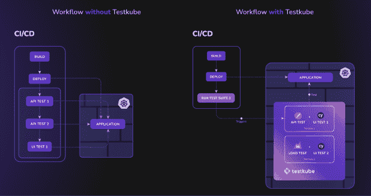
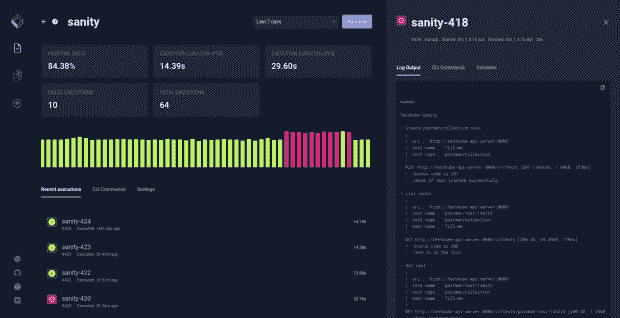
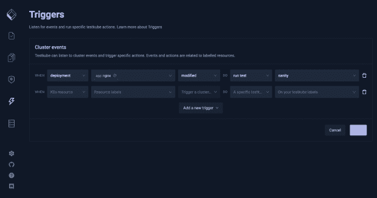

# Monolith CI/CD 管道会扼杀你的软件质量吗？

> 原文：<https://thenewstack.io/are-monolith-ci-cd-pipelines-killing-quality-in-your-software/>

当开发和 DevOps 团队开始在他们的 CI/CD 管道中为单片应用增加测试时，他们释放了巨大的利益。他们不仅可以更快地部署，减少伴随每次合并的手动流程和干预，而且还可以放心地部署，不会将错误引入生产环境。

但是微服务几乎改变了 CI/CD 管道的一切。对于更复杂的微服务架构，跨越多个集群和数十或数百个单独的节点，团队跟上其集群复杂性的一种方法是构建非常复杂的 CI/CD 管道。他们试图通过纯粹的稳健来恢复信心。

最后，他们构建了 CI/CD 管道，类似于 cloud native 最初让我们远离的单片应用程序。CI/CD 管道是紧密耦合的菊花链，其中每一步都依赖于最后一步才能正确运行，而不是更小和独立的构建、代码覆盖、审查、测试等过程。

虽然整体管道对应用生命周期 CI/CD 涉及的每个部分都有影响，但它们对健壮测试的商业价值构成了最大的威胁。

## 整体式 CI/CD 管道适合测试吗？

不幸的是，测试经常与单片 CI/CD 管道紧密耦合，因为它们完全相互依赖。没有您的 CI/CD 管道，您就不能运行任何测试，并且您的管道如果不能完成您的测试并收到一个通过/失败的返回，就不能完成运行。

这给试图自信地提交的开发人员和负责优化他们的管道的 DevOps 团队带来了一些模糊而复杂的挑战:

*   当您只需要一次测试的结果时，您可能需要重新运行您的 **整个** **CI/CD 工作流程。这减缓了发育。在等待结果的时候，很难切换几分钟的环境来继续另一个分支的工作，过多的运行也会在月底累积成昂贵的账单。**
*   **您不能跨多个 CI/CD 工具或工作流重用任何测试逻辑。**当然，您可以将您的 CI/CD 逻辑复制粘贴到您的管道的多个步骤中，但是您也复制了您的维护工作。每当您对测试的一个迭代进行重要的更改时，您都需要在其他地方做同样的事情。
*   你最终会得到不一致的执行和报告。作为测试套件的一部分，你可以使用端到端测试(Cypress.io)，负载测试(k6)，API 测试(Postman 和 SoapUI)，可靠性测试(cannon . io)等等。将所有这些测试紧密集成到一个单一的管道中，您可以登录六个服务和 web 应用程序来查看最新执行的结果。忘记能够在没有大量手动干预的情况下将您组织的测试结果整理成有价值的报告。

这个问题让我们思考:如果我们构建的 CI/CD 管道更像[微服务而不是单片](https://thenewstack.io/why-you-should-start-testing-in-the-cloud-native-way/)会怎么样？当您将 CI/CD 管道从您创建、管理、执行和查看测试的方式中分离出来时，这正是您所得到的。它解放了您的团队，让您能够像进入云原生和微服务一样灵活地工作。

## 为什么您应该分离 CI/CD 和测试

当我们谈论解耦时，我们不是在谈论断开 CI/CD 和完全测试。我们说的是两者能够独立运作。您的 CI/CD 解决方案的变化(GitHub Actions、Jenkins、ArgoCD 等。)并不意味着你需要改变你的测试工作流程或者脚本，反之亦然。

实际上，这种分离意味着您的 CI/CD 管道可以通过一系列简单的 API 调用来触发测试直接在您的测试环境中运行。这产生了小的、可重复使用的和可组合的 CI/CD 组件，不需要维护它们的整体过去。而且因为你的测试平台(还有你的测试人员！)可以独立于 CI/CD 管道的状态执行特定的测试，重新运行*很简单，您需要通过一个测试*来移动您的拉请求。

解耦带来立竿见影的技术优势:

*   通过执行 API 调用来触发测试，您可以在多个 CI/CD 管道中重用测试相关的步骤。
*   您可以轻松地添加或编辑现有的测试，而不必担心无意中影响您的 CI/CD 管道。
*   测试可以在任何需要的时候运行，既可以由您的工程团队手动运行，也可以通过 CI/CD、API 等自动运行。

商业利益可能不太明显，但同样重要。您的分离 CI/CD 管道让开发人员以最高的速度工作，从您庞大的过去中剥离所有的痛苦和时间浪费，让他们有信心发挥他们的魔力，而不用担心他们会中断生产。

因为您的测试更加可编辑和灵活，所以更容易对它们进行微调以完善最终用户体验。这意味着更少的错误、更好的性能和更稳定的实时应用，所有这些都直接关系到您组织的底线，无论您的优先事项是减少保留还是最大化收入。

虽然我们 Testkube 已经考虑将 CI/CD 和测试分离一段时间了，但它才刚刚开始进入云原生世界。从我们已经从我们的社区获得的反馈来看，它一定会为开发运维团队和质量保证团队带来非凡的变化——这是一条通往云原生测试的快速通道，甚至比过去的 monoliths 更加强大。

## 在您的 CI/CD 管道中使用 Testkube 进行云原生测试

Testkube 是一个开源的测试框架，允许你以 Kubernetes-native 的方式执行、编排和可视化你的所有测试。它使用定制资源定义(CRD)来定义和配置测试，允许您通过 API 调用而不是复杂的、紧密耦合的 CI/CD 管道从集群内部执行测试。

当您试图分离您的 CI/CD 管道和您的测试时，有两种方法可以采用:

首先，有熟悉的同步部署管道。在这种情况下，您从您的 CI/CD 管道中删除您的测试，并用运行在您的集群中的对 Testkube 的 API 调用来替换它们。如果您的测试失败了，您的管道会立即停止，阻止您在产品生命周期中进一步开发您的 bug。为了找出您的代码哪里出错了，您跳转到 Testkube UI 来查看您的执行及其日志，并诊断问题。

第二种方法，如果您想要一种更 GitOps 风格的策略来构建 CI/CD 管道，您可以配置 Testkube 来基于您的集群或其资源的变化状态触发测试。在这种情况下，Testkube 不仅仅是在您的集群内部独立安全地运行，测试与您的 CI/CD 管道分离。

您的 CI/CD 和 pipeline 是两个独立的过程，您的测试执行不可诊断地只报告它在您的应用程序中发现的内容。然后，您可以将 Testkube 连接到 Slack，或者通过任何 webhook，通知您的团队测试何时失败以及如何失败。

在云原生时代，最大化您的 CI/CD 管道的有效性的两种可行方法，作为额外的好处，Testkube 不仅帮助您解耦您的测试管道，它还确保:

*   您不必维护特定于测试的 Docker 映像或大量脚本文件。
*   您正在利用 Kubernetes 的核心功能，加上您已经维护和付费的集群计算，来扩展测试执行，最大限度地减少您对任何 CI/CD 提供商的依赖。
*   您可以使用多种测试工具——Postman、Cypress、k6 等等——并在一个仪表板中查看您的结果。

## 开始使用 Testkube

准备好脱钩了吗？

为 Mac、Linux 或 Windows 安装 Testkube 以构建更简单、可重用和可组合的测试。我们的即插即用架构[集成了](https://testkube.io/integrations)和最流行的测试工具，如 Cypress、Postman、k6、SoapUI 等等。

对于来自其他 DevOps 和 GitOps 爱好者的提示，请查看我们活跃的 [Discord](https://discord.com/invite/6zupCZFQbe) 或在 GitHub 上找到我们的整个[开源项目！我们也在](https://github.com/kubeshop/testkube) [Twitter (@testkube_io)](https://twitter.com/Testkube_io) 上，在这里我们总是分享我们成为最完整和最受欢迎的 Kubernetes-native 测试框架的旅程中的最新消息。

<svg xmlns:xlink="http://www.w3.org/1999/xlink" viewBox="0 0 68 31" version="1.1"><title>Group</title> <desc>Created with Sketch.</desc></svg>