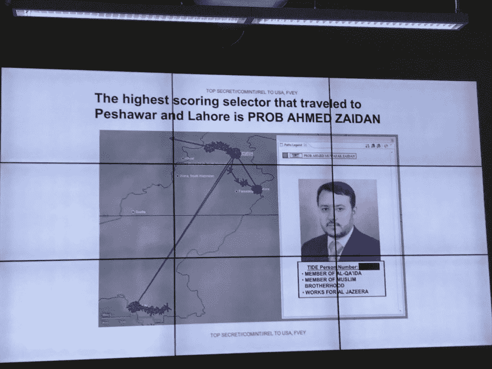
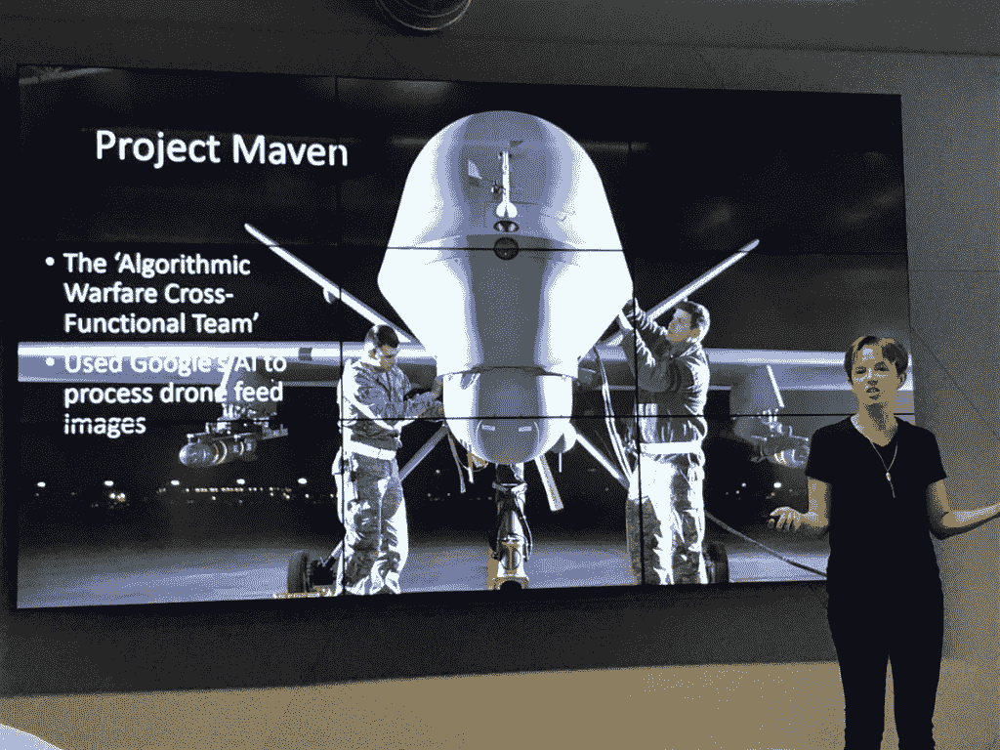
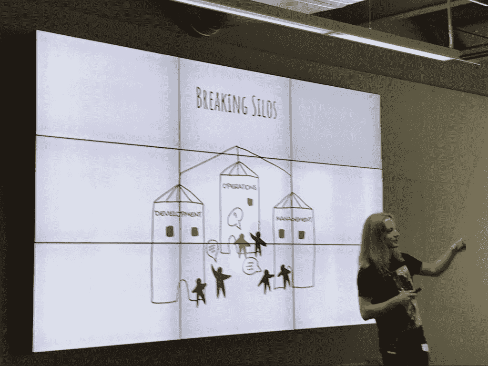
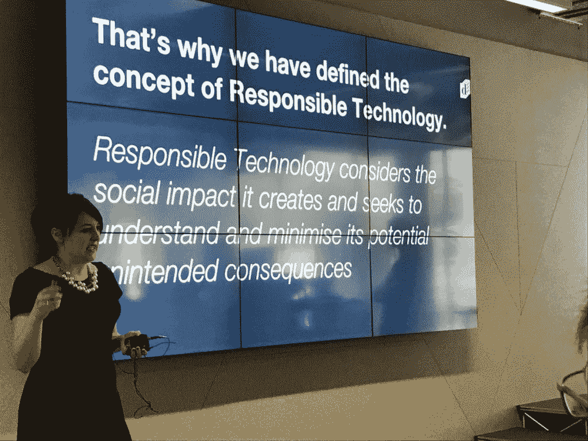
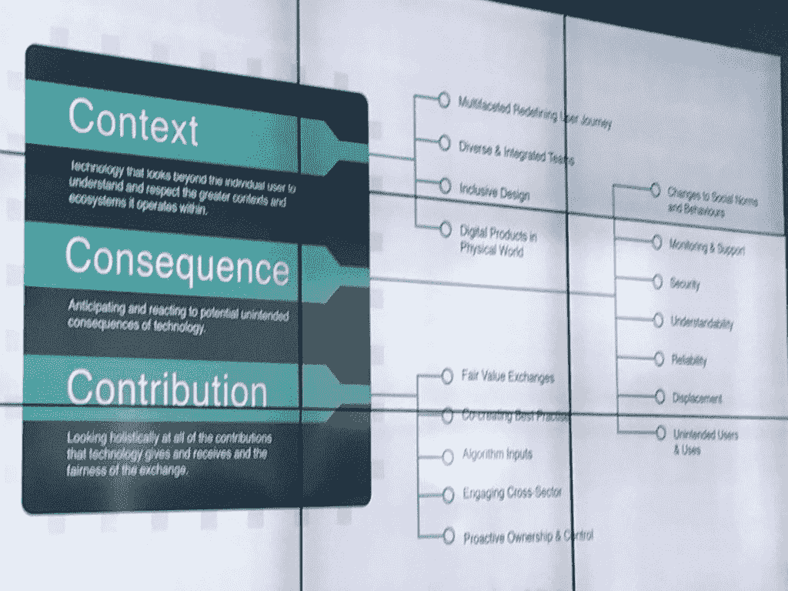

# 程序员在道德上(和法律上)对他们的代码负责吗？

> 原文：<https://thenewstack.io/are-programmers-ethically-and-legally-responsible-for-their-code/>

科技行业道德吗？一定要这样吗？而消费者对功能的需求比安全更重要。而且千禧一代反正连隐私都不在乎。

这些都是关于技术伦理的常见误区。最大的误区是，开发人员不关心他们正在编写、测试或发布的代码是否合乎道德。或者这才是真正的神话？2018 年，超过 100，000 名国际开发者社区成员参加的[年度堆栈溢出开发者调查](https://insights.stackoverflow.com/survey/2018/#ethics)首次讨论了编码中的道德问题。让我们总结一下对这四个问题的回答:

*   如果响应的开发人员发现了不道德的目的，他们还会继续写代码吗？58.4%的大多数人说不，而超过三分之一的人说要看是什么。
*   开发人员如何报告不道德的代码？几乎一半的人说这取决于，而大约三分之一的人说只在公司内部。大约 13%的人公开表示。
*   开发者有义务考虑他们代码的道德含义吗？几乎 80%的人回答是。
*   谁对完成不道德行为的代码负有最终责任？大约 58%的人回应了高层管理人员，23%的人说是想出这个主意的人，而只有 20%的人认为编码者有责任。

这似乎与大众汽车公司的一名开发人员的说法一致，该开发人员因参与该汽车公司销售远远超过美国环境标准的柴油汽车长达十多年而被判入狱三年，但他们被设计成看起来没有达到标准。大众员工的律师丹尼尔·尼克森(Daniel Nixon)在主张软禁时表示，他的当事人并不是排放欺诈的“主谋”，而是梁“盲目地执行了对其雇主的错误忠诚”

这个轶事证据反映了一个趋势，即虽然开发人员承认他们应该在他们编写和发布的代码中考虑道德问题，但最终，他们感觉不到责任的重量——大多数人认为责任落在领导层身上。

[男女同校伦理会议](http://coedethics.org/)的创始人安妮·柯里说，不是开发者不在乎，而是他们认为他们没有任何力量来改变现状——她认为他们在乎。虽然会议有很多关于决策的心理学和哲学基础，以及一些利润和统治世界可以赢得道德辩论的例子，但它也有一些可操作的要点。今天，我们将分享开发人员可以做些什么来影响他们公司的道德决策，以及他们这样做的几个例子。

## 如果谷歌能做到，任何人都可以吗？

会议以吓一吓人群开始——这是缺乏技术道德或准确性实际上导致无辜生命损失的更极端的情况之一。人权律师柯里·克里德分享了[签名打击](https://en.wikipedia.org/wiki/Targeted_killing)的故事，这是基于机器学习算法的定点无人机杀戮，最著名的是由美国军方对地理位置生活模式、社交网络和旅行行为模式类似恐怖分子的人进行的。

前美国国家安全局和中央情报局局长迈克尔·海登有一句名言:“我们靠元数据杀人。”

当一个嵌入基地组织的记者仅仅因为他是一个现场的好记者而成为“已知恐怖分子”结果的第一名时，这个数据是有内在缺陷的。

“数据并不完美，从来都不完美，但这就是现代战争的现状，”克里德说。"算法和战争正在对什么是威胁或不是威胁做出概率判断."

她说，这些缺陷在无人机战争中造成了数百甚至数千平民死亡，更不用说那些在阿富汗、叙利亚和伊拉克等活跃战区死亡的人了，她说仅在 2017 年就有 6000 名平民死亡。Crider 说，由于人类正在使用算法和偷工减料，这导致了“对平民生活的漠视”

这个问题可能会引发一场道德辩论——最好的开发人员应该努力改善这些致命签名搜索结果背后的机器学习，还是科技公司应该置身于防御范围之外？

当科技巨头[赢得与美国国防部](https://www.theregister.co.uk/2018/03/07/google_is_assisting_the_pentagon_to_develop_ai_models_for_its_drones/)合作开发人工智能算法来处理无人机视频馈送时，许多谷歌员工对此有话要说。谷歌表示，它与 Project Maven 的合作是为了“非进攻性用途”，但 4%的员工持不同意见，[通过《纽约时报》给他们的首席执行官](https://static01.nyt.com/files/2018/technology/googleletter.pdf)写了一封公开信，称谷歌不应该参与战争。谷歌决定不再续签其 Project Maven 合同，甚至创建了一套新的[人工智能原则](https://www.blog.google/technology/ai/ai-principles/)，其中包括其人工智能研究不应用于武器。

“我认为 Project Maven 的例子表明，作为开发人员，你们实际上拥有比你们想象的更多的权力，”Crider 对观众说，“你们可以也应该提出问题:

*   我实际上在建造什么？
*   供应链是什么？
*   还有什么其他用途？"

她结束了自己的演讲，说开发人员需要认识到自己的权力，不仅要协商薪酬，还要协商工作，提出问题，当你不知道答案时，向更有知识的资源(如人权律师事务所)寻求帮助。

> "我们都有集体责任获得更多信息."—柯里·克莱德

## 负责任的发展

所以开发人员有权力，但是负责任的开发过程是什么样的呢？这是智囊团[的萨姆·布朗和](https://doteveryone.org.uk/)[集装箱解决方案](https://container-solutions.com/)的Á·达姆·桑多的谈话主题。

Sándor 表示，让技术责任成为新的规范归根结底是为了跟踪数据如何在公司内流动。

他问“如果数据被盗，是谁的问题？是开发人员没有思考、运营人员没有保障还是管理层没有提供足够的预算？在这种情况下，人们很容易认为‘这不是我自己的问题，我只是机器中的一个齿轮。’"

Sándor 认为，打破公司内部的孤岛和敏捷运动正在把所有人——项目经理、UX 设计师、软件开发人员——放到同一个团队中，现在是在这些过程中建立道德的最佳时机。这意味着共享所有权的多学科团队越来越受欢迎，这意味着开发人员拥有完全生产的软件。

“这就是我们如何让强大的开发团队建立联系，”他说。

> "开始与公司内部的人交谈，你以前从未谈论过这个问题."—延庆成

布朗说，她认为开发者和产品所有者一直拥有这种权力，但她的数据责任智囊团正在努力将所有这些整合到一个有意义的行动计划中。这一切都始于对负责任技术的定义。

她接着说，开发者和产品所有者“必须承认这些技术对我们的关系、我们的社区以及构成我们社会的机构所产生的影响。”

最重要的是，这意味着确保技术:

*   不制造或加深不平等
*   承认并尊重尊严和人权
*   让人们对其使用充满信心和信任

这导致开发了 [3C 模型](https://medium.com/doteveryone/a-model-to-help-tech-companies-make-responsible-technology-a-reality-837c50713c65)来支持这种方法，让开发人员和参与组织在项目的每个阶段提出问题并考虑责任。

这种适应性强的框架归结为开发人员认识到:

1.  **背景**——当你从一开始开发时，实际上理解技术如何在更广阔的世界中运作，包括你如何理解用户的旅程，与多元化的团队一起建设，以及包容性的设计
2.  **后果** —该技术将如何被监控和支持，它将如何影响社会规范、安全性、可靠性，以及预期的意外后果
3.  **贡献** —整体考虑跨职能、跨部门所有权、算法输入和最佳实践。

很快，每个人都将实施一项负责任的技术产品评估。即使在回顾期间停下来回顾负责任的和道德的标准，也可以导致更道德的行为，包括在你的文档和待办事项中的道德考虑，包括看看你错过了什么或没有资金测试，如果你发布一个不太安全的新产品，对用户透明地行动。

> “如果没有足够的预算来构建安全基础设施，就不要构建任何东西。了解自己的极限对行为道德也很重要。”Á·达姆·桑多

“你做过这些需要考虑负责任的事情吗？布朗说:“实际上，你必须停下来考虑，并有一份清单，你可以在给定的过程中的所有责任领域进行对照。

> “你必须思考每天对你来说什么是重要的，什么让你晚上睡觉——然后你可以向前迈出一步。”安德里亚·科克

她澄清说，没有黄金标准，但道德和道德评估是持续改进的一部分。每个人都将创建一个仪表板来衡量和领导培训，以支持行为。这不仅仅是道德问题，也是好生意的问题。

是的，这些似乎都是简单的想法，就像敏捷开发世界不需要更多的框架和画布一样，但是许多演讲者提出了这样的想法，你应该从小处着手，这将导致授权。

最后，柯里不把男女同校伦理仅仅看作是一个会议，而是一场运动的对话起点，因为她希望让伦敦成为最终将在科技界流动的技术伦理涟漪的中心。

<svg xmlns:xlink="http://www.w3.org/1999/xlink" viewBox="0 0 68 31" version="1.1"><title>Group</title> <desc>Created with Sketch.</desc></svg>