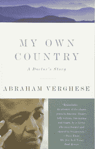

# 数据驱动医学让我们失去人性了吗？

> 原文：<https://thenewstack.io/are-we-losing-humanity-with-data-driven-medicine/>

当我们走向大数据世界时，我们是否应该最后看一眼周围，看看是否有任何有价值的东西被遗忘了？上周，一位斯坦福大学的医学教授问我们，数据驱动医学会让我们失去什么。

在*纽约时报*杂志的一期“健康特刊”中，Abraham Verghese 博士警告说，如果不更加重视患者与医生的互动，我们所有的技术都可能将医生变成“医院中收入最高的办事员”，他说我们正在向电子健康记录和机器学习[发展，这可能会产生一些负面影响](https://www.nytimes.com/interactive/2018/05/16/magazine/health-issue-what-we-lose-with-data-driven-medicine.html?mtrref=mail.google.com)。

“我们 3.4 万亿美元的医疗保健系统每年要为超过 25 万例因医疗失误造成的死亡负责，”Verghese 写道，称之为“大致相当于，比如说，一架大型喷气式飞机每天坠毁。”他将部分责任归咎于我们对数据的依赖，而不是直接来自患者的信息。“肯定有一部分是因为没有听故事，以及把身体当成文本阅读的能力下降。”

当他想到医疗职业时，他认为临床前阶段是“愤世嫉俗之前”，在学生发现“病房的焦点不是围绕着病人，而是围绕着学生、住院医生和主治医生花费大部分时间的掩体后面的计算机。”但是他也分享了一个关于电子健康记录的肮脏秘密。“EHR 的大部分内容，尤其是它所编码的体检，都是虚构的奇迹，因为我们人类不希望在模板中留下空白或空白。”结果，医生的每日进展记录“变成了臃肿的剪贴怪物，不准确，很难涉水而过……多年来，我遇到过‘双脚脉搏完好无损’的独腿患者，以及‘心音正常，没有杂音或疾驰’的其他患者，他们的机械心脏瓣膜的滴答声和杂音如此之大，以至于隔壁床的患者需要耳塞。”

Verghese 和他在斯坦福大学的同事一起，从全国各地的医生那里收集了 200 多个故事，其中一位前医生在一次考试中错过了一些东西，导致了真正的后果。“其中大多数是因为考试没有按照要求进行……这些事情不会在 EHR 留下任何痕迹，因为记录的考试似乎总是完整的。”

“我担心这样的错误会出现，因为我们被困在了机器医学的掩体中，”Verghese 写道，并补充说“这是一种可以预防的失败。”

## 好的，坏的，丑陋的

当然，也不全是坏事。一些研究人员已经在研究使用 EHR 来识别处于危险败血症感染风险中的医院患者的算法。本月早些时候，美国卫生与人类服务部引用了“越来越多的证据表明，使用先进的健康信息技术与整体安全护理有关。”他们报告说，到 2015 年，96%的医院都在使用经过认证的 EHR 系统(78%的办公室医生也在使用)。但他们承认，它也“在部署到复杂的临床环境中时，带来了新的挑战和风险。”

Verghese 博士的文章警告说，伴随着所有这些膨胀而来的是另一个不可避免的结果:“对于所有投入到数据收集和输入的努力，数据经常被忽略。”根据一些研究，这是一个数据超载的世界，因为医生已经花了将近两个小时在电子病历上，而他们每花一个小时在病人身上。“EHR 所做的是帮助减少用药错误；它是实验室和影像信息的绝佳聚集地；笔记总是清晰可辨。但是，领先的电子病历从来都不是在理解护理习惯或医生或护士的用户体验的情况下建立的。”

本月，一项试图改变这种状况的努力启动了。美国卫生与公众服务部宣布了一项名为“[简易 EHR 问题报道挑战](https://www.cccinnovationcenter.com/wp-content/uploads/2018/05/Easy-EHR-Prize-Challenge-FRN.pdf)”的比赛(由国家卫生信息技术协调员办公室举办)，提供 8 万美元的奖金——第一名 4 万美元，第二名 2.5 万美元，第三名 1 万美元——以更好地捕捉关于 EHR 系统的*投诉*。他们的声明承认，可用性问题“会对医疗质量和患者安全产生负面影响”，为了解决这个问题，医疗专业人员需要更好的工具来“捕捉、分析和理解错误是如何发生的以及为什么会发生……”不幸的是，如今不完全退出 EHR 系统很难报告问题，而且工作流中断“对用户来说是一个很大的负担，以至于他们避免报告。”我们的 EHR 系统没有得到他们需要改进的用户反馈——留下了一个重要的问题没有解决。

“无论是通过设计、开发、部署、操作还是其他缺陷，研究还表明，除了让最终用户感到沮丧并给患者带来可避免的风险之外，EHR 还会导致不良事件，达不到安全相关可用性的预期。”

甚至在电子健康记录的日常操作中也存在问题。Verghese 博士写道，尽管根据 2009 年美国复苏和再投资法案，有 350 亿美元专门用于“让医药无纸化”，但在医院之间共享病历仍然很复杂。“这不像发送一个标准的 Word 文件，”他写道——所以他们仍然经常通过传真到达。(即使医院在同一个城镇，即使它们使用完全相同的记录保存系统，这也可能是真的。)

展望未来，他希望我们建立的任何医疗人工智能系统都将从良好的数据开始。“垃圾进来会产生垃圾出去——经过消毒的、漂亮的、彩色编码的垃圾，但仍然是垃圾。”

## 每个病人都讲述了一个故事

Verghese 医生对高质量医患互动的追求已经成为一场运动。除了医学学位，他还获得了爱荷华大学爱荷华作家工作室的艺术硕士学位，并最终写出了两本最畅销的回忆录。

“他的写作，无论是非小说还是小说，都与他将医学视为一种热情而浪漫的追求的观点有关，”根据[他在亚马逊](https://www.amazon.com/Abraham-Verghese/e/B000AP9LZ0/ref=la_B000AP9LZ0_ntt_srch_lnk_2?qid=1527214080&sr=1-2)上的作者页面。“他认为检查病人的床边仪式是一种关键的、节省成本的、由来已久的和必要的(但受到极大威胁的)巩固医患关系的技能。”

2015 年，奥巴马总统[授予](https://obamawhitehouse.archives.gov/the-press-office/2016/09/22/remarks-president-presentation-2015-national-medals-arts-and-humanities)一枚当年的国家人文奖章，“因为他提醒我们，病人是医疗事业的中心”，称赞“他在医学中强调同理心的努力。”

“我仍然发现，了解一个住院病人的最好方法不是盯着电脑屏幕，而是去看那个病人，”他在他的网站上解释道。“因为正是在床边，我才能弄清楚什么对病人来说是重要的，以及你积累的数据是如何有意义的。”

这也是他在 2011 年题为“医生的触摸”的 TED 演讲中提到的主题

“我不是勒德分子，”他在一段被观看了 140 多万次的视频中强调。“我在斯坦福教书。我是一名使用尖端技术的医生。”

“但我想在接下来的 17 分钟里向你说明，当我们简化体检时，当我们倾向于安排检查而不是与病人交谈和检查时，我们不仅忽视了可以在可治疗的早期诊断的简单诊断，而且我们失去的远不止这些。我们正在失去一种仪式。我们正在失去一种仪式，我认为这种仪式具有变革性和超越性，是医患关系的核心。”

Verghese 认为，医学界的行为就像真正的病人是数据的收集，他开始称之为病人。“病人在美国得到了很好的照顾。真正的病人经常会想，人都去哪了？他们什么时候过来给我解释一下？谁负责？”他还指出,“巡视”病人仍然包括讨论他们的数据，讨论电脑上的图像——所有这些都发生在“远离病人的房间里”

他认为“原始仪式”很重要，仪式是“变革性的”，并补充说，未来十年最重要的创新将是“人手的力量——触摸、安慰、诊断和带来治疗。”

“我总是觉得，如果我的病人放弃了对神奇医生和神奇治疗的追求，并开始与我一起走向健康，那是因为我已经通过检查赢得了告诉他们这些事情的权利。在交流中发生了一些重要的事情。”

Verghese 以他的书【T2:我自己的国家:一个医生的故事】中感人的一段摘录结束了他的演讲，这本书描述了他在 20 世纪 80 年代出现在艾滋病患者临终病床前的亲身经历。他正在进行一个仪式，这是“医生需要向病人传达的一个信息…

“我会永远，永远，永远在那里。我会帮你度过难关。

“我永远不会抛弃你。我会陪你到最后。”

* * *

# WebReduce

特写图像是[医生展出的 1891 年](http://www.tate.org.uk/art/work/N01522)卢克菲尔德斯爵士 1843-1927 年由亨利塔特爵士 1894 年赠送的。

<svg xmlns:xlink="http://www.w3.org/1999/xlink" viewBox="0 0 68 31" version="1.1"><title>Group</title> <desc>Created with Sketch.</desc></svg>