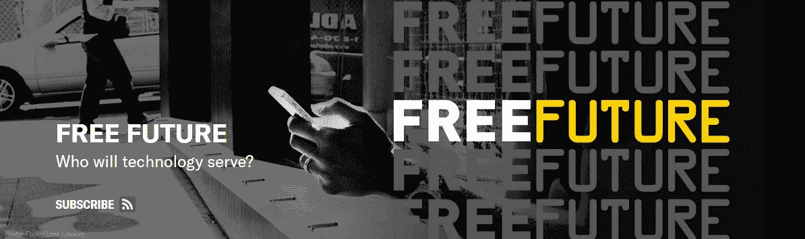

# 人工智能驱动的安全摄像头，我们准备好了吗？

> 原文：<https://thenewstack.io/are-we-ready-for-ai-powered-security-cameras/>

当强大的基于云的分析工具可以应用于安全摄像机的镜头时，会发生什么？

美国公民自由联盟言论、隐私和技术项目的高级政策分析师杰伊·斯坦利(Jay Stanley)在一份新的 50 页报告和一段新视频中探讨了这个问题，该视频认为智能摄像头“对我们的隐私构成了重大威胁。”斯坦利的前景是可怕的。美国公民自由联盟的“自由未来”博客上的一篇预告文章[警告说:“一大批机器人监视警卫即将到来”。](https://www.aclu.org/blog/privacy-technology/surveillance-technologies/army-robot-surveillance-guards-coming)

[https://www.youtube.com/embed/1dDhqX3txf4?feature=oembed](https://www.youtube.com/embed/1dDhqX3txf4?feature=oembed)

视频

报告指出，今天的摄像机现在可以捕捉高分辨率视频，然后将其传输到云中进行存储和分析，这探讨了新兴的 32 亿美元“视频分析”行业的问题。当我们接近世界的摄像头被人工智能增强的那一刻，“就好像一台伟大的监控机器一直在我们周围成长，但在很大程度上是愚蠢和惰性的——现在，从某种意义上说，它正在‘醒来’，”他写道。

美国公民自由联盟检查了 40 多篇关于计算机视觉的论文，以帮助预测什么技术可能会到来。“我们发现，计算机科学家正在追求的能力，如果应用于监控和营销，将创造一个具有惊人洞察力和洞察力的计算机观察者监视我们生活的世界。”人工智能已经可以识别人类正在采取的行动——比如戴上帽子，或者摘下眼镜。但该报告也警告说，研究人员正在研究能够识别情绪、行为和“我们的运动模式”的人工智能。

虽然不知道市场会采用哪一种，但“计算机科学家正在追求的能力，如果应用于监控，将创造一个具有惊人洞察力和洞察力的计算机观察者监视我们生活的世界。”

## 机器看着机器

美国公民自由联盟的报告指出，今天最先进的相机提供了超高分辨率和夜视传感器——人工智能现在正被应用于追溯性地提高图像的分辨率。其他形式的“计算摄影”包括光场相机——根据维基百科，它允许在照片拍摄后进行某种聚焦，不仅捕捉光线的强度，还捕捉光线传播的方向。

然后，该报告引用了 2014 年的一项研究，该研究发现，美国每 8.1 人就有一台监控摄像头，比地球上任何其他国家都多。

一个脚注指出，芝加哥警方已经可以访问 20，000 个摄像头，并且“许多其他城市也在努力将私人摄像头集成到警察网络中。”

现在，如果这段视频可以和网上收集的信息相互参照会怎么样？

该报告还引用了纽约市复杂的“域名识别系统”，该系统是与微软合作开发的，包括摄像机和车牌阅读器。2012 年，警察局长雷·凯利表示，该系统已经可以“跟踪与嫌疑人相关的汽车所在的位置，以及它在过去几天、几周或几个月的位置。”如果发现一个可疑的包裹，“NYPD 可以立即…回顾过去，看看是谁把它留在那里”，然后还可以确定那个人去了哪里。

但是为什么就此打住呢？展望未来，该报告怀疑这项技术是否会被先发制人地使用。“广域监视研究的另一个目标是对受试者进行‘生活模式’分析——检测他们运动和活动的规律，以便发现他们的情况，预测他们将在哪里，或者在这些模式出现变化和异常时发出警报。”

那么这些年来已经拍摄的视频片段呢？美国公民自由联盟报告说:“能够进行实时审查的相同分析能力也允许对现有的视频库进行分析。”

## 它已经在这里了

该报告提供了更多早期技术已经被应用的例子。已经安装了视频分析软件，以检测 2018 年发生枪击事件的佛罗里达州帕克兰周围学校的可疑或“异常”行为[。2007 年，T2 的商业铁路开始使用它们进行安全监控。一家公司声称，通过识别诸如坐立不安、坐立不安和其他潜在可疑的肢体语言等迹象，它可以在商店扒手入店行窃之前发现他们*甚至有一家公司提供“人群管理解决方案”*](https://www.washingtonpost.com/technology/2019/02/13/parkland-school-turns-experimental-surveillance-software-that-can-flag-students-threats/)

一些公司已经在销售“声音分析”产品，声称可以检测特定的 T2 情绪。

一家视频分析供应商声称，他们的技术可以识别人群中哪些人发烧，使用测温相机来检测“定义温度范围内的感兴趣目标”。

该报告还提到了亚马逊的云服务——具体来说，就是他们向警察部门提供的面部识别服务。“云服务意味着在监控摄像头上部署实时人脸识别不再局限于复杂和财大气粗的组织；任何小型警察局或街角商店现在都可以利用亚马逊这样的公司的大量分析专业知识来支撑其本地摄像头。”但除了面部识别，亚马逊还提供更复杂的视频分析。与此同时，谷歌的 Nest home 安全系统也提供自己的异常检测云分析服务。

这份报告还增加了一些需要考虑的东西。“术语‘异常检测’在研究文献中被广泛使用，但似乎没有认识到，更不用说尴尬了，人们担心识别‘异常’的人和行为是普遍监控和监视可能创造的那种令人压抑的顺从社会的核心部分。”

注意到观看视频的人工智能代理“便宜且可扩展”，该报告停下来问了几个问题，“随着我们从收集和存储监控转向大规模自动化实时监控。”

## 意想不到的后果

这种变化甚至可能是其他项目意想不到的结果。“对自主机器人和自动驾驶汽车的追求正在推动大量研究，作为一种副产品，这些研究将导致更智能的监控视频分析。”毕竟，自动驾驶汽车将需要准确预测其他汽车(以及行走的人类)的未来运动。“如果计算机能够很好地理解通过它的‘眼睛’传输的视频流，从而允许机器人在世界上四处移动并与人互动，它就能够理解监控摄像头流中发生的许多事情。”

当谈到分析数字数据时，该报告指出，深度学习提供了一条“捷径”。然后，最困难的部分变成了寻找训练数据集。

随着人工智能能力的增加，监控技术的使用是否会扩大，只是为了继续提供所需的数据？

该报告承认，“正如在大多数快速发展的技术市场一样，几乎可以肯定的是，视频分析公司正在营销很大一部分蛇油。”但是，正如斯坦利在他的博客文章中所说，“然而，根据经验，这通常不会阻止他们被部署——以及伤害无辜的人。”

随着变化的步伐加快，它们可能会突然到来——数十亿个，”代表着企业和官僚权力延伸到我们生活的枝蔓中，监视着我们每个人，并不断塑造我们的行为……想想当我们在高速公路上行驶，看到一辆警车在我们身后行驶时是什么感觉。我们想一直有这种感觉吗？”

当摄像系统知道我们的名字和身份时会发生什么？“人脸识别是一个巨大的隐私威胁，有可能将每个监控摄像头变成一个数字检查站:一个全面的分布式跟踪网络中的一个节点，大规模地捕捉人们的身份、关联和位置。”

当相机可以正确猜测我们与他人的社交互动细节时，会发生什么？

该报告最终警告了“无处不在的人工智能相机”及其对社会可能产生的影响:跟踪“我们每一个有意识和无意识的行为，加上我们天生的社会自我意识，将我们变成生活在心理压迫世界中的颤抖、神经质的人，在这个世界中，我们不断意识到，我们的每一个最小的举动都被记录、测量和评估，并与数百万其他人的类似行为进行对比——然后以不可预测的方式对我们进行判断……”

他们的结论？“政策制定者必须应对这项技术的巨大力量。他们应该禁止将其用于大规模监控，缩小其部署范围，并制定规则以最大限度地减少滥用。”该报告提出了一些具体建议，以最大限度地减少“黑暗可能性”，包括:

*   “任何政府实体都不得在未经过透明的审议流程并获得相关监管立法机构批准的情况下部署视频分析系统……”
*   “个人应依法有权访问已存储的关于他们的任何特定数据，并质疑和更正不准确的数据……”
*   “法律诉讼中使用的视频分析系统做出的任何决定或决定背后的全部逻辑和操作都应强制向所有各方披露……政府应遵守由学术机构和非政府组织以及受影响社区等无利益方制定的算法透明度和公平性的当代最佳实践。”
*   “美国政府机构根本不应该从事广域监视。”

报告的最后几页建议，同样的限制也应该适用于私营企业:“例如，视频分析不应该被用于收集客户数据用于营销目的。任何决定使用这项技术的公司都需要对此保持透明。”

但该报告最大的信息是，视频分析“只是新兴监控基础设施的一个例子”。

报告最后指出，我们可以通过其他方式被“监视”——通过仔细分析我们留下的各种数据线索。(它特别提到了物联网设备可以收集的新类型数据。)因此，从这个意义上来说，它认为，这些担忧不仅仅局限于人工智能监控安全摄像头的特定可能性。相反，这种情况为一个更大的讨论提供了一个起点，“这是一个在缺乏强有力的隐私保护的情况下，我们如何受到越来越多的计算机审查影响的案例研究。”

私人和政府组织都有收集人们数据的动机，尽管他们“直到现在都受到实际分析这些海量数据的实际费用的限制。”

那么当这种情况改变时会发生什么呢？

* * *

## WebReduce

<svg xmlns:xlink="http://www.w3.org/1999/xlink" viewBox="0 0 68 31" version="1.1"><title>Group</title> <desc>Created with Sketch.</desc></svg>