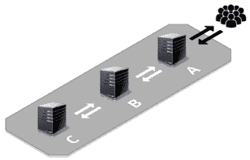
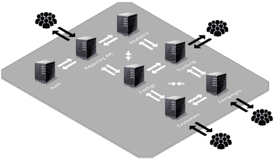
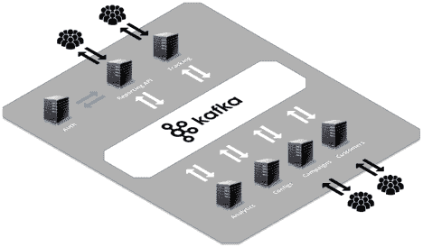

# 你的微服务是否过于健谈？

> 原文：<https://thenewstack.io/are-your-microservices-overly-chatty/>

阿米尔·索查米

阿米尔·索查米是铁源公司的建筑和安全总监。他对技术充满热情，不断学习最新技术以保持敏锐，并创建具有积极业务投资回报的高度可扩展和模块化的解决方案。Amir 喜欢与团队和个人一起工作，以实现他们的目标。跟进和他聊关于:共情，瑜伽，徒步，创业，AdTech，机器学习，流处理，持续交付&微服务。

将应用程序分解为细粒度的微服务会如何引入可能导致大灾难的复杂性，以及如何避免这种复杂性。

在 ironSource，我们使用面向服务的架构(SOA ),它已经存在了几十年，并采用了它的最新迭代——微服务。使用微服务方法进行应用程序开发使我们能够提高弹性并加快上市时间。开发、测试、部署更容易，最重要的是，当我们的整个应用程序堆栈分解成小块时，更改和维护它更容易。

也就是说，将一个应用分成更小的单元并不意味着所有的东西都能马上完美运行。去年，我们观察到几个服务可用性问题，经过大量调查，我们意识到要避免这些问题，以特定方式实施微服务非常重要。在我们的研究中，我们发现并减轻了一些不良做法，以防止潜在的末日场景。在本文中，我将深入探讨帮助我们的 R&D 团队享受微服务全部好处的技术之一，让他们晚上睡个好觉。

## 我的服务相互耦合吗？

传统的“请求驱动”架构(例如 REST)是最简单和最常见的服务通信模式(例如，服务 A 向服务 B 请求一些信息并等待。服务 B 随后做出响应，并将信息发送给服务 A)。

使用 HTTP APIs 是开发人员学习和经常使用的基本知识之一。请求何时被相应的服务接收和确认是很清楚的，并且有很多工具可以调试 HTTP APIs。因此，这是我们在整个系统的服务之间进行通信的默认方法。“请求驱动”通信的简单性在快速移动、交付新特性和扩展我们的系统以适应所有需求方面为我们提供了很好的服务。

不幸的是，这种模式需要服务的紧密耦合。虽然在小系统中它工作得非常好，但是对于由几十个服务构建的应用程序来说，这种耦合阻碍了开发的灵活性并阻碍了快速扩展。

微服务“请求驱动”通信的一个例子，服务 A 依赖于 B 和 c。

使用这种模式时要注意的主要风险是，每个“核心”服务(例如上图中的服务 C)都会成为单点故障。这意味着，它可能会造成性能瓶颈，或者更糟糕的是，相关服务的停机时间。因此，整个依赖链被打乱了(即一场大灾难)。这听起来似乎很容易解决，但是添加到链中的每个服务都需要服务发现机制(或者甚至是大型系统中的服务网格)、故障转移/重试、断路器、超时和缓存机制，这使得完美的端到端工作成为一个巨大的挑战。

在实践中，在整个系统中使用同步通信(如 REST)会使整个系统表现得像一个整体，或者更准确地说，像一个分布式整体，这阻止了人们享受微服务的全部好处。

过度健谈的微服务的一个例子(又名意大利面条)

为了理清这种混乱，在 ironSource，我们将许多核心服务转移到使用异步事件驱动架构进行通信。我们的方法是让我们的核心服务在信息更新时发布它提供的信息，而不是等待另一个服务请求该信息。通过使用“推”而不是“拉”，我们的系统实时处理数据。现在，我们可以放弃许多复杂的缓存管理和清除机制、服务发现和重试技术，这些技术是我们在使用同步服务通信时为了维护系统的可靠性和性能而使用的。

此外，服务现在可以异步地向弹性消息代理发布事件(在我们的例子中是 Kafka)。他们信任代理将消息路由到正确的服务，接收方订阅他们感兴趣的关键事件。添加订阅者很容易，这样他们就不会给发布者服务增加负担。

微服务异步通信的示例，但授权服务除外

## 那为什么是卡夫卡？

我们选择了卡夫卡，因为它非常有弹性和可靠。它有一个很棒的社区和文档资源。与其他消息代理不同，Kafka 使我们能够以高度可用的方式复制数据，并控制数据保留策略，因此即使在事件被多个消费者消费后，它们也可以被保留。事件根据保留策略在流中自动过期。因此，如果您正在使用事件源，并且想要从事件日志中再现一个状态，那么它可以作为一个持久存储源来重建当前和过去的状态。此外，Kafka 为高级场景(如流和实时聚合)提供了原生支持(使用 KSQL)，并与我们基础架构中的许多组件(如 Spark streaming、Cassandra、Elasticsearch、S3 等)原生连接，因此它使我们的生活稍微轻松了一些。

在异步通信中，一个服务可能仍然依赖于另一个服务，这意味着双方之间的 API 和依赖性仍然存在。但是，如果一个服务失败或过载且响应缓慢，这不会影响其他服务，因为它们现在是松散耦合的，并且包含响应所需的一切。

因此，公共事件总线的好处是，它消除了我们的核心服务同步通信时的单点故障和性能瓶颈，例如，队列仍然可以保留发送到服务 B 的消息，直到它备份并能够使用它们。

这就引出了“一跳”规则:

服务应该是自包含的，并管理自己的数据。允许一个服务调用其他服务会增加请求的开销，并可能导致非常慢或无响应的服务。如果您发现您需要在几个服务之间来回进行多次调用，我鼓励您探索使用异步事件驱动模式或者甚至将这些服务合并成一个服务(micro-monolith)是否可以为您提供更健康的服务。

当然，每个规则都有例外。在某些情况下，为了响应请求，您需要有意识地决定在服务之间进行同步通信。

例如，同步通信的一个经典案例是拥有一个集中式身份验证服务，该服务从多个面向用户的 API 获取同步服务器调用，以便验证和验证用户令牌。身份验证服务的分离释放了开发和部署方面的灵活性，为任何需要身份验证的服务创建了高度的内聚性，并让团队能够独立且高效地工作。此外，这种分离为身份验证服务和使用它的其他服务提供了不同的自动伸缩模式和资源分配。最重要的是，它使您能够同步阻止任何身份验证失败的用户请求。

## 等等，如果事件总线成为单点故障怎么办？

在使用事件总线消除系统中的故障点时，您可能会担心事件总线本身是否是一个单点故障。好吧，继续做你一直为健壮性和可伸缩性所做的事情:分发它，部署事件总线的多个实例以实现高可用性，并确定你是否需要处理重试。使用 Kafka，您将获得许多选项和配置来调整它以获得高可用性。如果您有多个不同的用例和大负载，我的建议是考虑旋转多个集群，甚至考虑在多个数据中心部署一个集群(使用主动-主动或主动-被动拓扑)。考虑到这一点，我建议检查一下如果完全丢失事件总线会发生什么。虽然结果看起来很明显，但实际上你测试的不仅仅是失败，你也在测试恢复。了解您的系统如何应对故障对于确保弹性至关重要。

## 把所有的放在一起

我们的服务现在正在发出事件，这将产生一个事实日志:

1.  可再现的:系统在给定时间点的状态可以通过重放事件日志来再现。
2.  冗余:使用 Kafka 对日志进行分区和复制，以实现高可用性。
3.  与任何特定的数据存储无关:事件通常使用 JSON、Avro 等格式序列化。
4.  不可变的:事件一旦发出，就不能更改。

日志使我们能够通过处理事件(即事件源)来重建当前和过去的状态。事实的单一来源成为存储事件的数据仓库。每个使用日志数据的服务都变得独立，不再与任何一组微服务耦合，无论它们是启动、关闭还是运行缓慢。将服务从同步依赖中解放出来改善了我们的故障隔离，并且我们的系统几乎不受单个模块故障的影响。整体可靠性和性能提高了，这对我们的业务来说是一个巨大的胜利。

## 下一步是什么？

我们已经将我们的应用程序分解为细粒度的微服务，我们已经在所有东西中间放置了一个弹性事件总线来协调通信，并使每个服务都是独立的。我们甚至将我们的团队组织成“小队”或足够小的团队，他们可以吃两个披萨。在本系列的下一篇文章中，我们将进一步探讨可能引发危险信号的问题:

1.  对一个微服务的更改是否需要对其他微服务进行更改？
2.  一个微服务部署会要求同时部署其他微服务吗？
3.  有没有跨大量微服务工作的开发人员团队？
4.  微服务是否共享大量相同的代码或模型？

<svg xmlns:xlink="http://www.w3.org/1999/xlink" viewBox="0 0 68 31" version="1.1"><title>Group</title> <desc>Created with Sketch.</desc></svg>