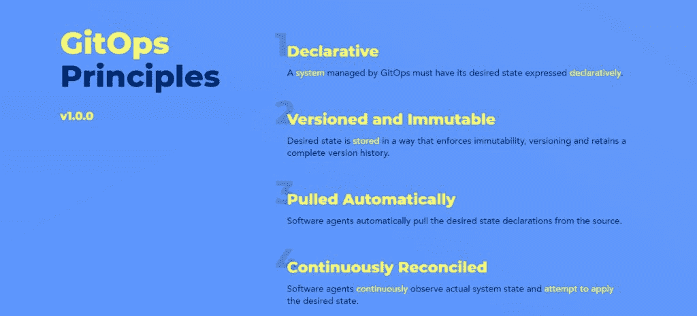

# 阿尔戈 CD 和通量是 CNCF 毕业生:但现在呢？

> 原文：<https://thenewstack.io/argo-cd-and-flux-are-cncf-grads-but-what-now/>

Argo CD 和 Flux 获得 CNCF 毕业资格无疑是对 GitOps 在社区中生存能力的有力肯定。但是现在两个项目都在几天之内达到了这个里程碑，这对社区意味着什么，这将改变用户体验？

显然，GitOps 被认为是 Kubernetes 部署的核心组件。但是，随着这些项目加入其他 19 个项目的行列，包括[特使](https://thenewstack.io/envoy-gateway-offers-to-standardize-kubernetes-ingress/)，当然还有 [Kubernetes](https://thenewstack.io/primer-how-kubernetes-came-to-be-what-it-is-and-why-you-should-care/) ，这是否会实质性地改变 GitOps 的进程？

Argo CD 的和 [Flux 的](https://github.com/fluxcd)支持者、主要贡献者和维护者以及其他支持者表示，这是一个重要的里程碑。这是因为毕业是一个很大的“规模使用安全”的信号， [Alexis Richardson](https://uk.linkedin.com/in/richardsonalexis) 说，他是 [Weaveworks](https://www.weave.works/) 的创始人兼首席执行官，该公司是 Kubernetes for Flux 的 CI/CD 的领先 GitOps 提供商(Richardson 还因发明了 GitOps 一词而受到称赞)。

理查森告诉 New Stack，这个过程涉及 12 到 18 个月的顶级企业和“超大规模尽职调查”，涵盖安全性、可扩展性、多租户、社区和可用性。“标准真的不能再高了，所以结果是一次大规模的信任投票，”他说。

事实上，脱离地位应有助于保持项目通过的势头，同时改善 Argo CD、Flux 和 GitOps 的安全和治理(下文将详细介绍)。

“毕业意味着象征着一个产品‘跨越鸿沟’，所以为了做到这一点，工具需要成为主流，” [Dan Garfield，](https://www.linkedin.com/in/dan-garfield) [Codefresh](https://thenewstack.io/codefresh-runner-run-ci-cd-pipelines-inside-a-kubernetes-cluster/) 的联合创始人兼首席开源官，与 Intuit、Akuity、BlackRock 和 [Red Hat 一起，Codefresh 是 Argo CD 的主要维护者。](https://www.redhat.com/)“这确实是一个采用度的衡量标准，尽管它不是一个硬数字。”

从宏观角度来看，这意味着随着云原生基础设施和部署的逐渐成熟，两家最大的 GitOps 提供商已经发展到能够满足 Kubernetes 环境不断发展和变化的要求。毕竟，很难找到不使用 Argo CD 或 Flux 的任何规模的开发和部署应用程序的组织，[企业管理协会(EMA)](https://www.enterprisemanagement.com/) 的分析师 [Torsten Volk](https://www.linkedin.com/in/torstenvolk) 告诉新堆栈。“Volk 说，毕业现在允许企业 DevOps 团队在 Argo 和 Flux 采用方面停止前进，因为它们现在被认为在大规模上“可以安全使用”。为了强调这一点，Argo 和 Flux 团队展示了他们快速果断地应对 2022 年摆在他们面前的安全挑战的能力，这一点很重要，同时也令人印象深刻。”

## GitOps 什么

关于 GitOps 是什么，不是什么，已经有很多讨论，有些是矛盾的。出于本文的目的，作为“真实的单一来源”——Richardson 最初创造了这个短语 Git 存储库包含作为代码的应用程序配置定义，反映了应用程序或 Kubernetes 集群配置的状态。Git 上的应用程序的期望状态被自动拉出，并被持续监控，并与正在运行的应用程序进行协调。

加菲尔德和理查森都提到了这个 [opengitops.dev](https://opengitops.dev) 作为他们所说的行业定义，因为该组织的定义有助于确保“gitops 有一个规范的来源，”加菲尔德说。

GitOps 操作符，如 Argo CD 和 Flux monitor git，将 git 作为所需状态的不变数据源，并将所需状态应用于实际状态。Git 的不可变结构还可以在运行时发现漏洞时自动修改集群中的应用程序和代码——这是不可避免的。同样，如果有人直接修改运行时，比如在安全漏洞期间，GitOps 操作员将自动检测这些更改，并用 Git 中的期望状态覆盖它们。

GitOps 工具，如 [Flux](https://thenewstack.io/gitops-made-simple-with-flux/) 和 Argo CD，持续监控 Git 存储库中定义的应用程序定义和配置，并将这些配置的指定状态与其在集群上的实时状态进行比较。Argo CD 报告任何偏离其指定状态的配置。这些报告允许管理员自动或手动将配置重新同步到定义的状态。同样，Git 总是作为唯一的真理来源。

“在 2022 年，组织已经集体认识到，对于管理 DevOps 管道，除了声明性的、不可变的和完全自动化的方法，没有其他选择，”Volk 说。“每次我们允许管道中存在缺口，都会给我们的组织带来不可估量的运营风险，这是我们无法接受的，因为我们正在扩展云原生应用程序平台。”

## Argo CD 与通量的关系

Argo CD 和 Flux 都有它们的用途和变化，这在前面已经介绍过了。也就是说，Argo CD——像 Flux 一样——利用 Git 中可用的历史来轻松审计更改历史或恢复到重大更改应用之前的工作版本。加菲尔德说，这意味着从失败中更快地恢复，对发布新软件更有信心。

Argo CD 对于组织最大限度地降低试验风险至关重要，因为它使回滚对部署代码、应用程序代码或基础结构代码的任何更改变得简单而可靠。“当谈到作为应用程序的一部分引入或增强机器学习模型时，这变得特别有趣，”Volk 说。“Argo 利用 Kubernetes 容器编排来并行运行计算密集型培训作业，而不会减慢管道的其余部分。这有助于组织采用机器学习功能，而不会危及其 DevOps 管道的健康和性能。”

通量通常会自动回复漂移变化。Richardson 说，它会在每个协调间隔自动恢复它管理的资源的任何漂移，Flux 还可以配置为每当其控制器应用任何配置更改时发送通知，告诉什么资源已经更改。“没有手动模式，这与 GitOps 的定义相反，在 GitOps 中，变化总是以连续的方式从真实的来源自动应用，”理查森说。

有“Flux reconcile”，你可以运行它来触发早期同步，但它运行的是定期调度的相同同步，GitOps 的定义是这种协调是连续进行的，所以用户为阻止自动连续应用而做出的任何改变都将违反 GitOps 原则，[weave works 的开源支持工程师 Kingdon Barrett](https://www.linkedin.com/in/kingdon-barrett-73100a2) 说。

“我们确实有用户在现场这样做，我们有一个手动门控更改的提案，这将使这在形式上成为可能，但在这里添加“或手动”对我来说意味着用户可以以某种方式在‘仅检查’模式下运行 Flux，接收关于漂移的通知，查看发生了什么变化，并决定恢复它，这不是 Flux 今天的功能。除非 Flux 被暂停/禁用，否则它将始终处于强制状态。”

Volk 说，组织通常将 Argo 和 Flux 视为两个竞争平台，开发者更喜欢 Argo 的可用性和简单性，平台运营商喜欢 Flux 作为他们的“瑞士军刀”，以保持在 GitOps 管道的顶端。沃尔克说:“结合这两个平台可能是一种可行的方法，通过不断地将整个应用环境与其源代码同步，为运营商提供确保完全合规性控制的能力，同时开发人员可以使用 Argo 在 Flux 控制的 Kubernetes 集群上轻松定义、部署和跟踪他们的应用代码。”

然而，Richardson 指出，Flux 和 Argo 对图形用户界面有不同的处理方式。Flux 有一个 API 主导的方法，支持多种 GUI。他说，Weaveworks、AWS、Azure 和 D2IQ 等平台提供了与自己的安全性和工作流相集成的 GUI，并补充说 Weave GitOps 是“主要的开源 GUI”。

<svg xmlns:xlink="http://www.w3.org/1999/xlink" viewBox="0 0 68 31" version="1.1"><title>Group</title> <desc>Created with Sketch.</desc></svg>