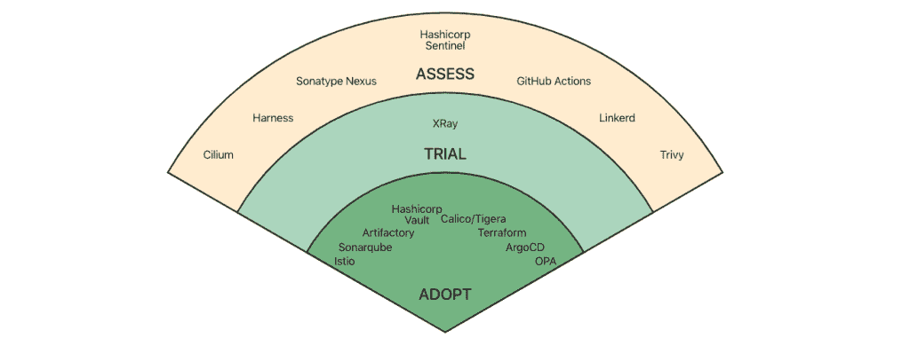

# ArgoCD 得到了 CNCF 的认可

> 原文：<https://thenewstack.io/argocd-gets-devsecops-nod-with-cncf/>

以 [GitOps](https://www.gitops.tech/) 为中心的应用部署和生命周期管理平台 [ArgoCD](https://argo-cd.readthedocs.io/en/stable/) 正在通过成为一个公认的 DevSecOps 工具来扩展其影响范围。在成为 Kubernetes GitOps 的流行 CD 工具后，ArgoCD 现在已经在[云本地计算基金会](https://cncf.io/?utm_content=inline-mention) (CNCF) [技术雷达报告](https://deploy-preview-16--cncf-radar.netlify.app/2021-01-secrets-management)中获得了 DevSecOps 的“采用”状态。这是继 ArgoCD 在 2020 年被列入 CNCF 技术雷达的“评估”类别之后。

“总的来说，ArgoCD 正在成为一个 CD 工具，也是一个 DevSecOps 工具，因为它促进了跨职能组织内的安全发布，”[云本地计算基金会](https://cncf.io/?utm_content=inline-mention)的生态系统经理 [Katie Gamanji](https://www.linkedin.com/in/katie-gamanji/?originalSubdomain=uk) 告诉新堆栈。

CNCF 终端用户技术雷达是一套基于 CNCF 终端用户社区经验的新兴技术指南。2021 年第三季度第六版的主题是 DevSecOps。

CNCF 将 DevSecOps 描述为将安全性集成到云原生应用的发布周期中的实践。它建立在 DevOps 的基础上，弥补了开发和安全团队之间的差距，并自动化了许多安全流程。CNCF 说，雷达团队选择 DevSecOps 作为主题，因为成员们认为这是应用程序开发中变化最快的领域之一。

Gamanji 说，具体到 ArgoCD，ArgoCD 被广泛采用来围绕应用程序发布建立自动化。Argo CD 在 2020 年被列为连续交付技术雷达的“评估”工具，因为它为集群内的应用程序带来了自动协调。与此同时，GitOps 模型改进了部署安全模型，因为秘密和令牌在集群内存储和可用，而不是由传统的 CI/CD 工具单独管理，Gamanji 说。

“因此，ArgoCD 也出现在 DevSecOps 雷达的‘领养’圈下面，”她说。

Gamanji 说，由于 GitOps 涉及从 Git 存储库中定义的状态中提取更改，默认情况下，它具有不同的安全含义。她说，ArgoCD 安全性有多种处理方式:例如，用户可以检查配置差异，并在产品发布前进行验证。此外，ArgoCD 可以配置为在管理集群内的资源时具有受限的权限，她指出。这些不同的可能性有助于解释它在 GitOps 和 DevSecOps 中对 CD 的采用。

同时，ArgoCD 是 DevSecOps 技术雷达中列出的几个工具之一。DevSecOps 类别中的微分段部分是由于工具的广泛选择以及需求如何根据网络拓扑而变化。在许多方面，选择的自由是一件好事，[Discover Financial Services](https://www.linkedin.com/company/discover-financial-services/)的云架构总监 Keith Nielsen 说。他说:“毫无疑问，有很好的工具可以让你真正改善你的安全状况。”

在今天的 DevSecOps 环境中，微分段也是由旧工具和服务如何与新兴工具和技术一起提供而引起的。“在微分段领域，我们遇到的真正挑战是，例如，在某个特定的组织中，是否存在 API 网关与服务网格，或者是边缘防火墙与类似于 Calico 的 Kubernetes 联合防火墙功能，”Nielsen 说。“有多个方面。”

<svg xmlns:xlink="http://www.w3.org/1999/xlink" viewBox="0 0 68 31" version="1.1"><title>Group</title> <desc>Created with Sketch.</desc></svg>