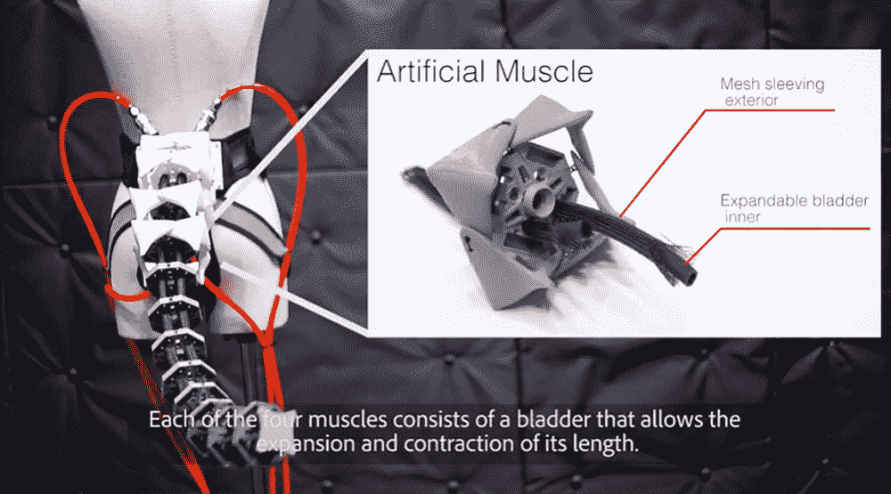
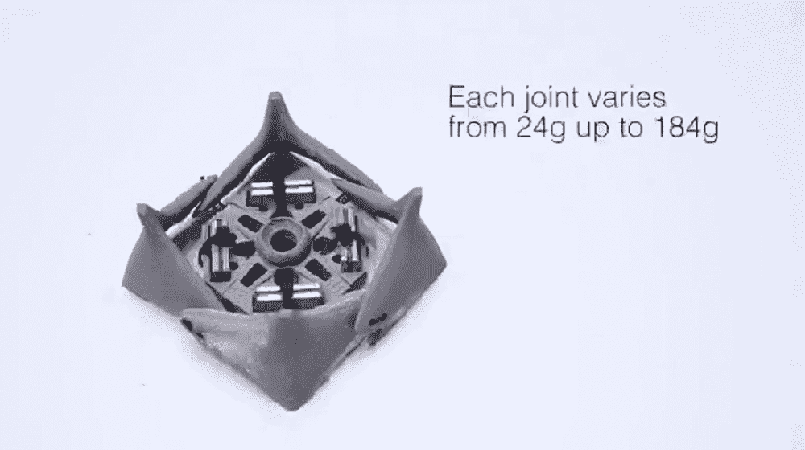
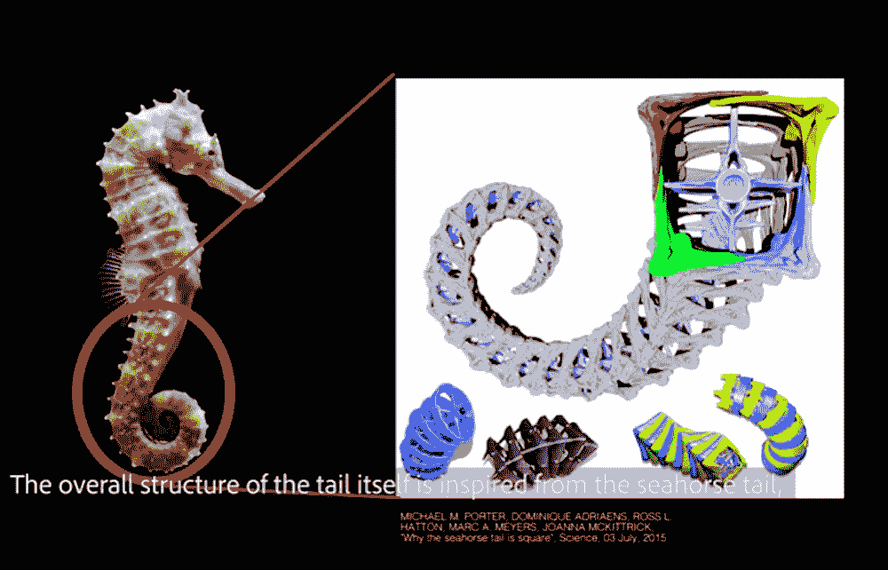
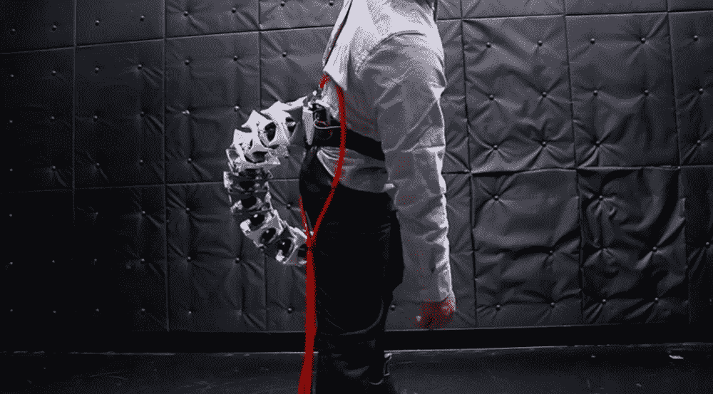
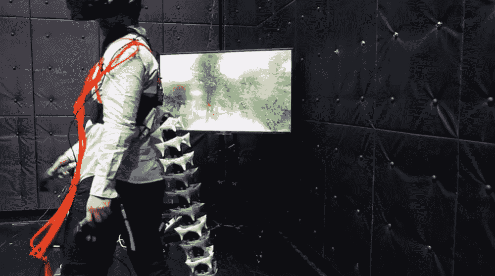

# Arque 是用来增强人类的人造尾巴

> 原文：<https://thenewstack.io/arque-is-an-artificial-tail-for-enhancing-humans/>

增强自我的概念已经存在了一段时间，无论是通过提高性能和改变思维的物质，还是通过一点附加技术。虽然有些人可能会选择一个[额外的可编程手指](/extra-programmable-finger/)或一个[虚拟现实控制的机械臂或两个](/gain-two-extra-vr-controlled-robotic-arms-with-this-backpack/)，但其他人可能会被一个神奇的机械尾巴钉在他们的后背上所诱惑。毕竟，正如我们的灵长类表亲可以证明的那样，拥有尾巴可以帮助增强一个人的平衡感，并赋予抓住附近物体的惊人能力。

如果你正在寻找这样一种尾部假肢，那么你很幸运:日本庆应义塾大学媒体设计研究生院的一组研究人员正在开发 Arque，这是一种用于人类的机械假肢尾巴，实际上是受海马的启发——而不是人们最初可能认为的灵长类动物。

正如他们在[的论文](https://dl.acm.org/citation.cfm?id=3338573)中详细描述的，该团队描述了 Arque 如何通过改变身体的动量和补偿身体重心的突然变化来帮助人类扩展他们的机动性。例如，它可以帮助穿着者在摔倒时快速恢复平衡，以便他们恢复并避免摔倒和受伤，类似于有尾巴的动物(如猫)可能使用它来控制自己的重心，以帮助他们优雅地落地。或者，创作者说它可以以一种破坏性的方式使用，比如在虚拟现实游戏环境中使用时让玩家失去平衡，以便为玩家提供触觉反馈。请观看下面的视频:

[https://www.youtube.com/embed/Tr1-IhEhXYQ?feature=oembed](https://www.youtube.com/embed/Tr1-IhEhXYQ?feature=oembed)

视频

不足为奇的是，该团队在创建原型时从大自然中寻找灵感。特别是，海马的尾巴是一个主要的影响，因为相对于它的大小，它的结构可以承受很大的力。海马的尾巴也是方形的——因为每个脊椎都被四个互锁的 L 形板包围着——这使它成为动物尾巴世界中的一个独特特征，使它们能够紧紧地和安全地缠绕在周围的物体上。

类似地，Arque 的支撑柱由联锁板组成。每个脊椎关节由一个中央板组成，由另外四个保护板包围，这些板用弹性绳连接在一起。中央板是重量可调的——这意味着可以根据佩戴者的体格增加金属重量，因为整个尾巴需要测量佩戴者体重的 5%才能提供必要的推力来改变用户的重心。类似弹簧的机制被用来将一切连接在一起，模仿野生海马非凡的骨骼结构的弹性和压缩力。

尾巴还具有四个长的人造“肌肉”，实际上是穿过中央柱的气动管，可以放气或填充空气压缩机的空气，提供沿八个不同方向移动尾巴所需的驱动力。此外，可以根据用户的需要，通过增加或减少链接来定制尾部并使其更长或更短。尾巴绑在用户的腰部，用户戴上一个可穿戴的身体追踪器，它可以确定用户的大致重心，然后促使尾巴移动并相应地调整自己，作为一种校正平衡。

正如该团队所指出的，这种设备可能有许多潜在用途。当与传感器结合时，它可以被视为某种自动化的人造肢体——身体的延伸，可以帮助老年人保持平衡，可能不再需要拐杖或助行器。这种人造肢体也可以与其他设备配对，允许它对大脑信号做出反应，因此它可以根据用户的情绪进行驱动。人们可以想象未来人类——在进化时间的迷雾中失去了灵长类动物的尾巴——将再次获得它们，成为半人半机器的控制论有机体。

<svg xmlns:xlink="http://www.w3.org/1999/xlink" viewBox="0 0 68 31" version="1.1"><title>Group</title> <desc>Created with Sketch.</desc></svg>