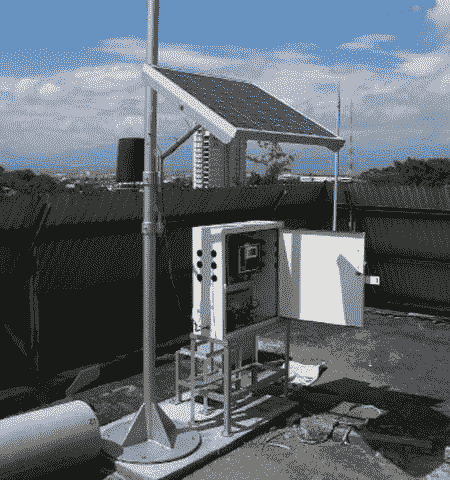
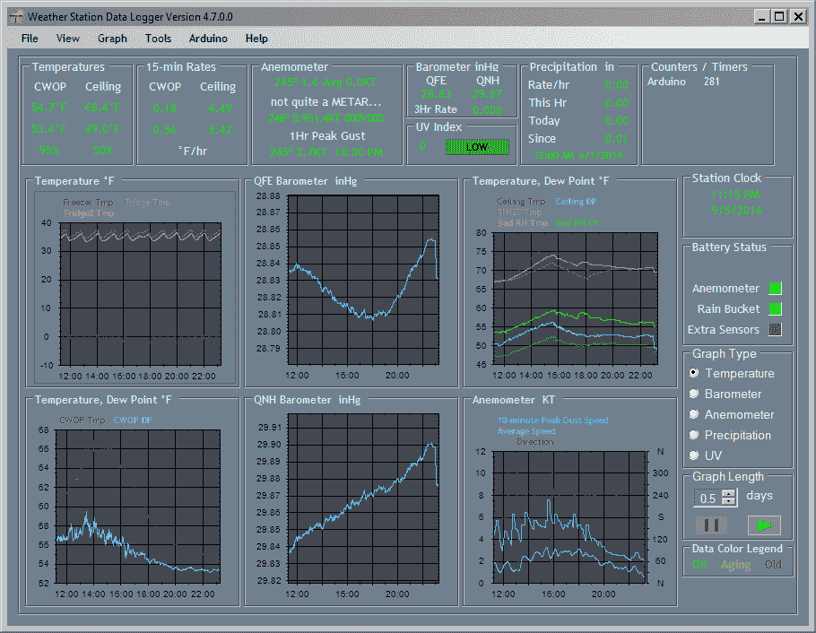
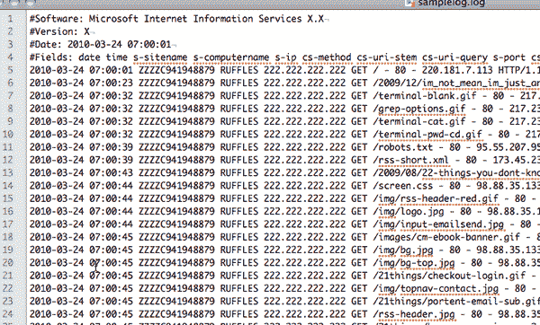
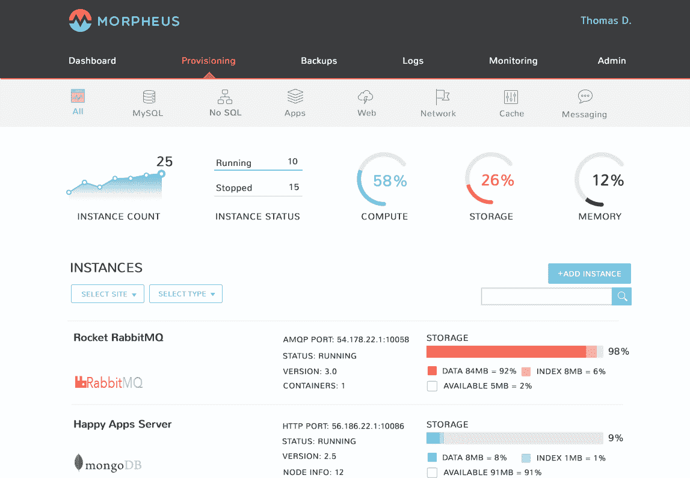

# 数据记录的艺术

> 原文：<https://thenewstack.io/art-data-logging/>

当分析你的应用程序的有效性和可用性时，收集你需要的数据以决定哪些可以改进是必要的。然而，为了生成有意义的报告，这些数据必须被检索并存储在某个地方。这种信息收集是通过一个称为数据记录的过程来完成的。

## 什么是数据记录？

 [布莱恩·惠勒

Brian Wheeler 负责 Morpheus Data 的技术团队。在 Morpheus 之前，Brian 创办了一家软件开发咨询公司，为各种行业设计和开发解决方案，包括电网管理、票务系统、在线交易、社交网络和游戏、SOX 合规性和电子商务。Brian 拥有波莫纳学院的化学学士学位。](https://www.morpheusdata.com/) 

数据记录是通过特定的独立设备或为捕获数据而设置的计算机系统来记录数据。记录的数据类型取决于数据记录器所处的环境类型。例如，独立的数据记录器通常收集诸如野生动物研究、天气状况、交通状况、汽车或飞机等交通工具的行为等信息。为日志记录而设置的计算机系统倾向于收集发生在计算机、网络、服务器甚至整个 IT 系统上的事件的数据。

一旦记录下来，就可以手动获取和分析数据，或者使用特定的软件来帮助数据分析。这种软件通常可以提供所收集的数据的高级概览以供快速查看，以及更详细的报告，这些报告允许更深入地理解记录数据的实体希望捕获的关键度量。

## 记录数据

要记录数据，您需要有一个设备或计算机系统，可以配置为捕获所需的数据类型。数据记录器的主要优势在于，它们允许一周 7 天、一天 24 小时记录信息，这使得研究人员或分析人员能够执行除记录数据之外的任务。人们可以从办公室或实验室分析以前记录的数据，而不需要在特定的位置收集数据。

例如，在进行野生动物研究时，当一个或多个人类在场时，野生动物可能会有不同的行为。当人类不在场时自动记录数据可以提供大量的洞察力，否则可能无法通过直接观察发现。这可能是有利的另一个例子是记录天气相关数据，因为大多数人不希望携带测量仪器进入特别恶劣的风暴中以便直接进行特定的天气测量。

出于应用程序监控的目的，数据记录记录了与应用程序运行所需的基础架构维护相关的信息。这可能是多种类型的数据，例如用户在计算机或软件系统上执行的操作、进出服务器的流量，或者在整个 IT 网络上采取的操作。记录的内容有多种可能性，所有这些信息都有助于系统管理员改进特定系统的运行。

例如，知道服务器访问者的 IP 地址有助于识别潜在的或正在进行的攻击。很多时候，在短时间内来自特定 IP 范围的流量过多可能表示存在某种攻击企图(例如，试图快速加载带有各种注入的页面以获取敏感信息)。如果可以有效地阻止该地址范围，就可以防止攻击成功，从而潜在地为公司节省大量处理此类攻击后果的时间和金钱。

## 日志数据

当数据被记录时，它通常存储在记录设备本身上，或者存储在它发送数据的另一个站点上。通常情况下，数据以某种文本格式存储，然后可以对其进行解析，将信息组织成有用的组，以便进行统计和分析。

例如，来自气象站数据记录器的报告可以生成关于一段时间内多种天气状况的有用报告。当然，这些可以帮助确定是否应该根据所获得的数据和报告发出雷暴、风或其他可能出现的情况的警报。

在记录应用程序和 it 系统的数据时，可以存储许多指标的日志文件。您的组织可以跟踪访问、登录、使用统计和其他有用的信息。例如，如果您在您的网站上记录数据，您可以跟踪一些指标，如页面加载时间、访问者数量、访问者查看最多的页面、用户来自哪里的一些指示、哪个站点将访问者推荐到您的站点(例如，Google 搜索、另一个站点上的链接、社交媒体)、访问者在您的站点上停留多长时间，以及哪个页面最常用于离开站点(通常称为退出页面)。这些类型的度量标准可以真正帮助您的组织调整网站的各个方面，以提高网站对访问者和客户的可用性。

请注意，有几行描述了日志文件，后面是许多行，每一行都包含相同顺序的特定信息。在其他数据中，每一行显示事件的时间、请求的类型(GET、POST 等)。)、被请求的文件等等。从这样的文件中，可以创建许多报告，这些报告对分析如何改进网站非常有帮助，可以通过为未来的访问者提供更快、更方便的体验来帮助他们。

当谈到在应用程序上记录数据时，这可以扩展到不仅记录网站上的信息，还可以记录其他部分的信息，如数据库、应用服务器、负载平衡器、网络以及与任何数量的应用程序相关的 it 系统的其他部分。

## 数据记录系统

您可以使用许多数据记录系统。选项范围从在您的每台服务器上设置您自己的日志记录到由应用程序监控服务提供的全功能日志记录，应用程序监控服务允许您配置您希望记录的事件类型，并允许您定制关于所有记录信息的报告。

为应用程序的所有部分设置日志记录可能是一项乏味的任务，因为需要从许多不同的机器记录信息。根据基础设施的设置方式，可能会有大量的日志记录需要设置和日志文件需要解析。您添加的应用程序越多，您需要做的工作就越多，以跟上所有必要的日志记录和有意义的报告的创建。

对于较小的基础设施，自己记录数据可能效果不错。但是，您需要获得或编写能够提供记录数据报告的软件。这可能意味着要有几个软件系统，需要从这些系统中获取关键指标。随着时间的推移，特别是随着显著增长，继续为每台机器设置日志记录并为每个新应用程序集成各种报告软件会变得很乏味。

最后，如果您在比服务器上使用更多的环境中运行一个或多个应用程序，最好使用为您提供数据记录的服务。这通常是网站/应用程序监控服务以及 PaaS 和其他类型的云服务的一个功能。

使用应用程序监控服务，您可以设置该服务指向您的服务器，并记录何时启动和运行、何时处于警告状态以及何时关闭。还会根据您选择的问题提醒时间设置提供提醒。根据服务的不同，可能还会记录其他信息。

借助 PaaS 和许多基于云的服务，您可以将整个应用基础设施添加到服务中，然后服务可以为您提供日志记录。在这种情况下，您通常可以相当容易地提供特定服务的副本，从而简化任何数据记录的设置，并确保捕获所有必要的数据。其中一些服务甚至允许您拥有现场服务器、云服务器或两者的混合(混合云)。此外，有些可能还提供监控服务，让您能够轻松掌握所有应用的关键指标，同时还能确保最大限度地减少停机时间。

## 使用 Morpheus 获取数据记录

寻找一个好的 PaaS 服务来为您提供简单的数据记录和监控？为什么不试试 [Morpheus](https://www.morpheusdata.com/) 呢，它让供应、扩展和维护变得轻而易举。您可以快速配置数据库和服务器，并立即启动和运行您的应用程序！使用可用的工具，您还可以监视系统的各个部分，以跟踪正常运行时间、响应时间，并在出现问题时得到提醒。

Morpheus 允许您只需点击一下鼠标即可提供应用程序，并通过 API 和 CLI 为开发人员提供易用性。此外，备份也是自动的，您可以根据需要拥有冗余，以避免可能需要长时间等待灾难恢复。那么，为什么不注册一个帐户或者今天就免费试用墨菲斯？

通过 Morpheus 数据的图像。

<svg xmlns:xlink="http://www.w3.org/1999/xlink" viewBox="0 0 68 31" version="1.1"><title>Group</title> <desc>Created with Sketch.</desc></svg>