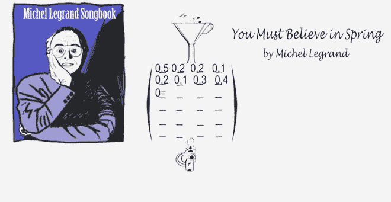
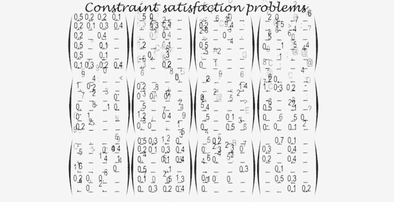

# 认识今天最新的热门人物:人工智能

> 原文：<https://thenewstack.io/artificial-intelligence-todays-newest-hitmaker/>

过去几年，人工智能出现了许多重大飞跃，进入了一度被视为纯粹人类的创造性领域。最近，我们已经看到人工智能机器编写[自我参考文献](https://thenewstack.io/day-computer-wrote-novel-almost-won-literary-competition/)，甚至在曾经被认为太复杂而计算机无法掌握的棋盘游戏中击败[人类冠军](https://thenewstack.io/google-ai-beats-human-champion-complex-game-ever-invented/)。

现在，人工智能正在采取另一种易变的人类艺术形式:前 40 名。索尼计算机科学实验室 (CSL)的研究人员最近展示了两首由人工智能驱动的音乐制作程序创作的流行风格歌曲。CSL Flow Machines 研究项目背后的人将 [FlowComposer](http://www.flow-machines.com/flowcomposer-composing-with-ai/) 软件称为“智能助手”，旨在成为下一代创造性创作工具的一部分，这些工具将帮助人们使用[机器学习](/category/machine-learning/)技术以任何风格交互式创作新歌和文本。

因此，尽管最初对人工智能在多大程度上参与了这些作品的制作有些困惑，但显然仍有人类参与其中:研究人员与法国作曲家 benot carré合作，后者使用 FlowComposer 软件首先选择了他想要处理的某种风格。

Carré选择创作了一首风格类似于甲壳虫乐队的歌曲，名为“[爸爸的车](https://youtu.be/LSHZ_b05W7o)”，另一首更受爵士乐影响的歌曲模仿了艾灵顿公爵和科尔·波特的声音，名为“[影子先生的歌谣](https://youtu.be/lcGYEXJqun8)”

该软件随后被用于分析不同音乐风格和作曲家的数据库，其中有超过 13，000 张[导语表](https://en.wikipedia.org/wiki/Lead_sheet)——一种描述歌曲组成部分的音乐符号形式，如旋律、歌词和和声。人工智能产生了一种新的音乐安排，Carré用这种新材料添加歌词，并通过混音和最终制作对其进行润色。

[https://www.youtube.com/embed/LSHZ_b05W7o?feature=oembed](https://www.youtube.com/embed/LSHZ_b05W7o?feature=oembed)

视频

## 将风格变成计算对象

这是一个相当令人印象深刻的结果，它呼应了历史风格，听起来不像是盲目的模仿，所有这些都是在算法的帮助下完成的。FlowComposer 利用机器学习技术，如[风格转移](https://blogs.scientificamerican.com/sa-visual/neural-networks-for-artists/)，优化和交互，来处理来自不同音乐风格的数据，以便合成一个全新的作品。

“Flow Machines 项目从计算机科学的角度看待风格:机器如何理解风格并将其转化为计算对象——用户可以操纵该对象以创建具有自己约束的新对象？”流量机器研究团队在网上指出。“从概念上来说，我们开始在音乐创作和文本写作中构建创作工具，使人们能够通过操纵现有作者(可能是他们自己)的风格来生成内容。”

为了做到这一点，“风格”被建模为一个“忠实和灵活”的计算对象，因此用户可以塑造它并将其应用到新的环境中。该团队使用了一种被称为马尔科夫约束的机器学习模型，这种模型[将马尔科夫链](https://youtu.be/OZY3noFh0sk)的模拟能力与[组合优化](https://ocw.mit.edu/courses/mathematics/18-433-combinatorial-optimization-fall-2003/)的强大和灵活性结合在一起。

人们可以在一个[马尔可夫矩阵](http://www.math.harvard.edu/~knill/teaching/math19b_2011/handouts/lecture33.pdf)(一个特殊的数字概率网格)中数学地表示一个艺术家的文集(作品主体)，并计算出模仿这个作品主体的新的数据序列。问题是这种技术不能用来控制输出的结构，所以风格上的变化会很大。

FlowMachines 团队通过使用更复杂的方法解决了这个问题，将这些马尔可夫过程重新定义为“约束满足问题”，即。马尔可夫约束，允许对生成的内容进行更多的控制。

使用这种方法，用户可以对任何用户定义的约束应用某种“样式”，并进一步修改结果内容。例如，你可以将甲壳虫乐队的音乐风格应用于让人想起鲍勃·迪伦、麦当娜甚至用户自己的歌词。

## 进入流程

这里的目标是使用机器学习工具来帮助用户产生一种创造性的“流动”感。流动机器的概念是基于这样一种想法，即当人们完全专注于他们正在做的事情时，会进入一种先验的、心理上的“T1”流动状态。只有当我们“进入状态”时，我们的想象力才会感到自由，一切似乎都有可能——而像 FlowComposer 这样的人工智能软件希望反射性地挖掘和扩展这种不受约束的人类创造力状态。

当然，所有这些都提出了一个问题，一旦归结为算法成分，什么是“创造力”。但是也许这些程序和使用图形编辑软件没有什么不同。

创造力是智力的标志，用机器术语建模可能会让我们对人类的创造过程有新的见解和新途径。目前，我们已经隐约看到了这些创造性助手可以帮助人类做什么:在更大的范围内探索想法的领域，并增加对未知世界的创造性飞跃。这是一个激动人心的时刻。

[https://www.youtube.com/embed/lcGYEXJqun8?feature=oembed](https://www.youtube.com/embed/lcGYEXJqun8?feature=oembed)

视频

图像:流量机器

<svg xmlns:xlink="http://www.w3.org/1999/xlink" viewBox="0 0 68 31" version="1.1"><title>Group</title> <desc>Created with Sketch.</desc></svg>