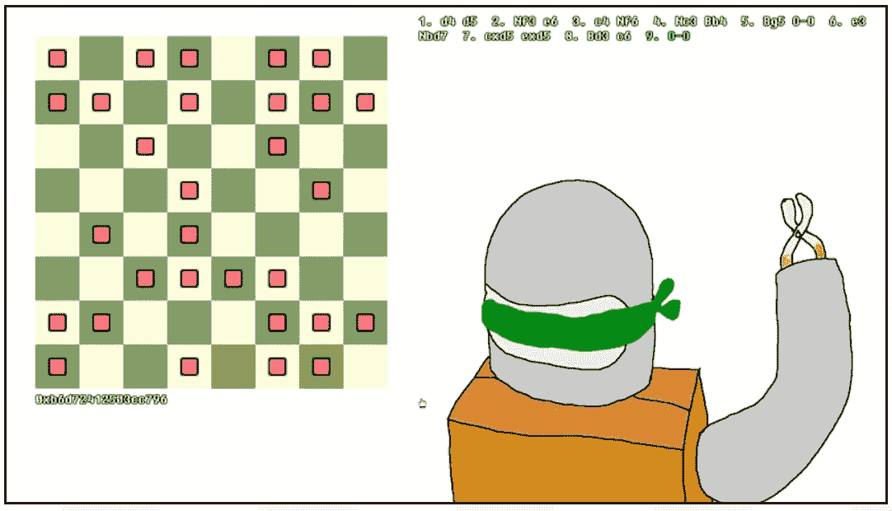
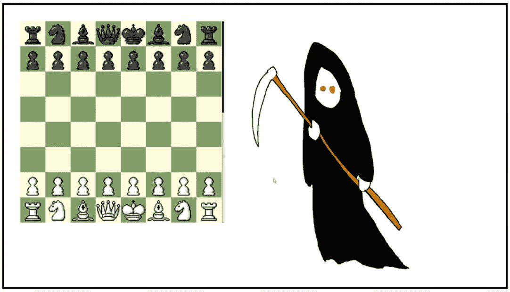
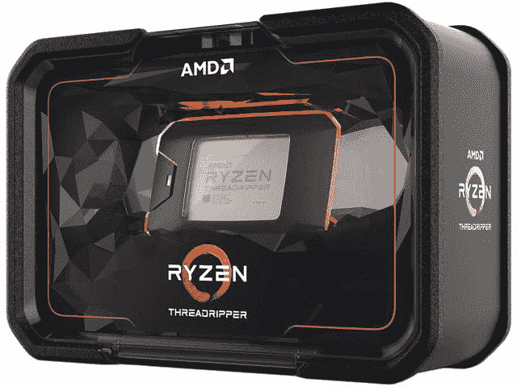
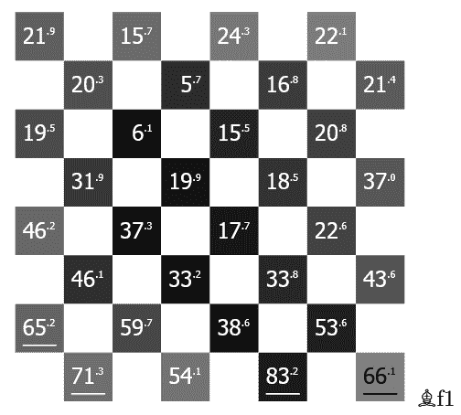
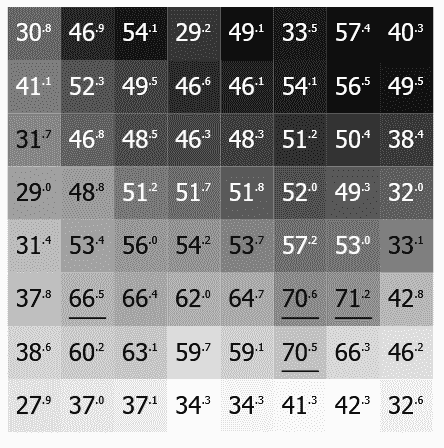
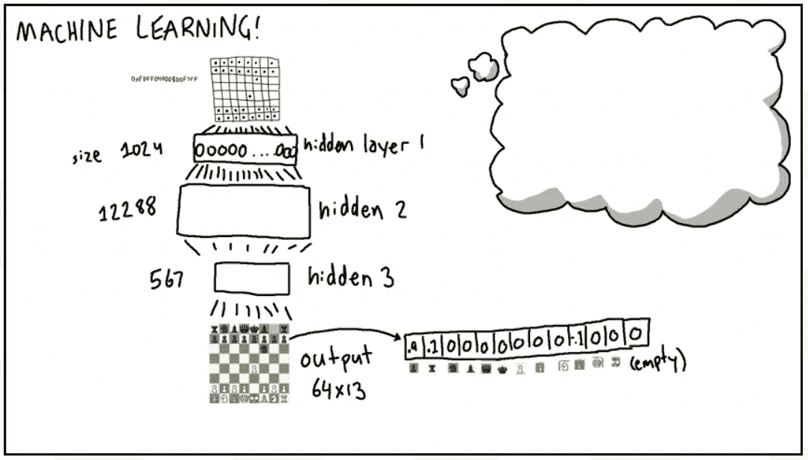
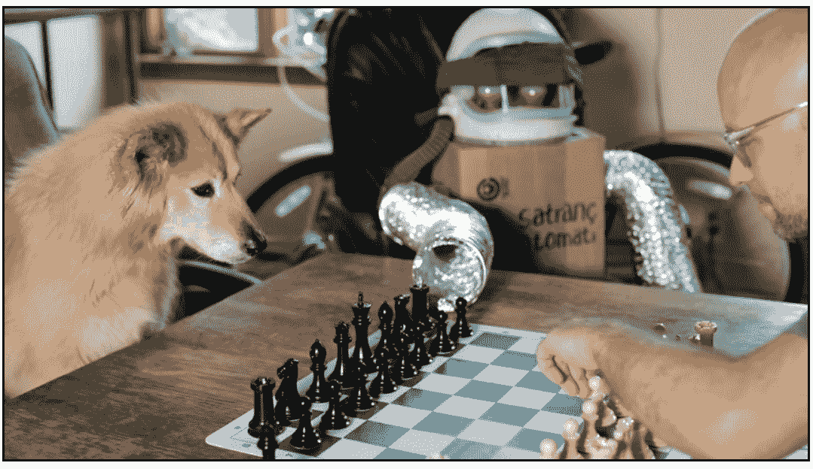

# 人工愚蠢:一位谷歌工程师的糟糕下棋算法

> 原文：<https://thenewstack.io/artificial-stupidity-one-google-engineers-algorithms-for-bad-chess-playing/>

当我们将尖端的现代技术应用于古老的国际象棋游戏时，会发生什么？当一个计算能力过剩的无聊极客在游戏上进行他自己的怪异家庭实验时会发生什么？

今年，一位自称汤姆·墨菲七世的宾夕法尼亚软件工程师决定创造一些[可笑的*糟糕的*国际象棋对弈算法](http://tom7.org/chess/)，使用了从机器学习和神经网络到大量免费 CPU 周期的一切——然后让糟糕的算法相互竞争，创造了一个“傻瓜锦标赛”

“这是我的有趣想法……”墨菲在一段描述实验的幽默视频中说道。

[https://www.youtube.com/embed/DpXy041BIlA?feature=oembed](https://www.youtube.com/embed/DpXy041BIlA?feature=oembed)

视频

## **第一招**

墨菲有能力完成它。他告诉我们，2007 年，他在卡内基梅隆大学为自己的计算机科学博士学位进行了答辩——同年，学生们开始在愚人节举行一年一度的 SIGBOVIK 会议。由“计算异端协会”赞助，这是一个讽刺性的特殊兴趣小组，致力于一个名为“哈利·奎兹马斯特·博维克”的虚构研究人员，包括征集关于“人工愚蠢”等主题的愚蠢论文。

在过去的 11 年里，墨菲一直是谷歌(位于匹兹堡的办公室)的高级软件工程师。但是今年他决定再次回来参加愚人节的会议——并且再次贡献了一些他自己的幽默研究。

墨菲自豪地吹嘘说，他过去在那里的一些演讲涉及荒谬的调查，这些调查“与‘真正的’研究难以区分”(例如[《超级马里奥兄弟》的第一级很容易按字典顺序排列，时间旅行](https://www.cs.cmu.edu/~tom7/mario/mario.pdf)在‘真正的’学术研究中有一些 [20 引用](https://scholar.google.com/scholar?cites=266602718816895530&as_sdt=5,39&sciodt=0,39&hl=en))。

但就在这一年，墨菲将注意力转向了国际象棋。

## 让游戏开始吧

在墨菲最初的游戏中，人类玩家被蒙上眼睛，强迫他们记住棋子在哪里。但是对于一台计算机来说相当于什么呢？告诉它*棋子的位置，而不是*它们是哪*棋子(甚至是什么颜色)…*

当然，计算机也不会提供导致一个位置的移动。它甚至不知道轮到谁了。是的，有一种可能性是计算机之王被控制了——在这一点上，几乎所有的移动都是非法的，除了把你的国王带到安全地带的移动。但是为了绕过这个问题，汤姆设计了一个程序，可以生成一个可能行动的*列表*，按照优先顺序排列——从中选择第一个合法的行动。

“我喜欢和它比赛，因为它不是很好，”墨菲在视频中说。"但自然的问题是*有多不太好？"对下棋程序进行测试证明，是的，它输得很有规律——就像“每一次都输”*

 *然后他开始构建其他糟糕的下棋算法，这样他就可以比较它们的*相对*性能…

当它玩白的时候，有一个偏好把它的棋子放在白方格上，当它玩黑的时候，放在黑方格上。(它的对手？一种优先将棋子放在与*颜色相反的*色方块上的算法。)最后两人都打得挺惨的。“他们有自己的偏好，但这与输赢没有太大关系。”事实上，它们都比随机选择走法的算法差一点点。

还有两种算法，他命名为“Huddle”和“Swarm”——其中一个自动玩家搜索使其棋子*靠近自己的国王*的移动，而另一个搜索使其棋子靠近对手的*国王*的移动。这有时会导致 Huddle 的国王被迫跟随自己的棋子，至少在一些情况下，它的棋子会意外地升级为更强大的棋子，无意中将死对方的国王。

但更多的时候，它以另一种方式工作。"如果你有攻击对手的偏好，你有时会不小心将死它."在视频中，墨菲揭示了在糟糕的国际象棋算法中，这个算法出人意料地没有那么糟糕。“‘蜂群’实际上比‘随机移动’好得多。”"

另一个更成功的策略是一种算法，该算法优先考虑四种特定的移动方式(按此顺序):将死、检验、捕捉棋子或推进对手的领地。

但是还有其他可怕的想法——比如一种算法试图镜像对手的棋子，或者将所有的棋子移动到棋盘的另一边。一种算法简单地选择按字母顺序排列的第一步。

还有另一种算法，每一步都是从可能的走法列表中选择的——选择由 pi 的数字任意决定…

## **切斯兰的生存**

但最终，他最复杂的算法从一个问题开始:哪个棋子最有可能“幸存”——在游戏结束时留在棋盘上，并与所有其他棋子一起获胜？出于对答案的认真调查，墨菲访问了免费/免费国际象棋网站[LiChess.org](https://lichess.org/)(现在每天有超过一百万场比赛)。它还提供游戏下载——所以墨菲下载了全部 506，000，416 个游戏。

他在一篇名为《[切斯兰](http://tom7.org/chess/survival.pdf)的生存》的论文中总结了这些结果，解释了他的方法。墨菲下载了他们截至 2018 年 11 月的所有完整游戏——尽管在那之后的八个月里又有 2 亿个游戏可供下载。甚至他 11 月份的收获也代表了 875GB 的巨大国际象棋游戏，“所以处理这些游戏需要考虑效率和并行性，”墨菲在视频中说。

“幸运的是，我有一台内核数量非常多、内存非常大的电脑，所以你必须用它来做点什么。”

呃，有多猥琐？在一封电子邮件中，他描述了他的“免费”家庭系统，一个 32 核 AMD ThreadRipper 2990WX。运行几个小时的多线程 C++程序足以处理整个数据集。“我认为人们低估了你用一台机器可以高效完成的工作！”

“所涉及的工作非常简单:我解析 PGN(它描述了游戏)，然后执行游戏中的移动，跟踪每个棋子的命运，然后对每个命运的计数求和……”

“我基本上从头开始写所有的代码，因为这比让别人的代码工作更有趣。:)"

墨菲的“生存能力”分析创建了一些真正美丽的数据可视化，显示了 64 个方格中每个方格上每个棋子的生存概率(用颜色表示它们在游戏结束时出现在该方格上的可能性)。)

然后这导致了更多糟糕的下棋算法。首先，有一个只是将棋子移动到统计上更有可能存活的方格中。或者简单地去他们最有可能在游戏结束时成为 T1 的方格。其他算法做的正好相反——将棋子移动到它们*最不可能存活(或结束)的方格。两种算法计算每个方格上的棋子存活率(相对于捕获率)最高的方格，其中一种算法寻求有利于存活的最高比率，而“宿命论”算法寻求最低的*比率。**

"奇怪的是，在这些策略中，它的胜算最大."

最后，他决定在几个层面上将它们与 Stockfish 国际象棋引擎进行比较(包括一种特殊的算法，在这种算法中，它被迫采取最不*的*-有希望的走法)。“看看结果，不出所料，这是总体上最糟糕的策略，它输给了几乎所有人。”

但是还记得 Tom 当初的“蒙眼”算法，不知道*哪*块占了一个正方形(甚至是它的颜色)？他决定用一个执行机器学习的神经网络来增强它——利用 LiChess.org 游戏中数十亿个可用的位置。现在，它能够以 100%的准确率正确预测每个位置的实际棋子……大约只有五分之一的时间。即使它是错误的，它也只是错误地猜测了平均每个位置 3.22 个棋子。

这成为更疯狂计算的起点。在某种程度上，他推断出他们数据库中的所有游戏最终都经过了 21，553，382，902 个唯一位置。有了 204GB，您可以将它们全部存储起来——连同下一次移动——但是还有另一个有趣的统计数据。多达 76%的位置恰好在*发生一次*。“所以这些占据了很大的空间，它们对玩来说不是很有用，因为我不太可能再看到它们了。”扔掉这些一次性的位置，每隔一个可能的游戏位置就可以存储 500MB 左右的内存。这可以很容易地转换成一种算法，对它遇到的任何位置进行最受欢迎的移动(如果它碰巧发现自己被困在一个独特的位置，则交换一个随机移动)。

但是有一个简单的方法可以打败它。“只要我做出一点奇怪的举动，它就会开始随机播放。然后就非常容易被打败了。”

最后一个实验包括对 Stockfish 引擎的各种“稀释”——在这个实验中，它的首选移动被一个随机选择的移动所取代。"

“我们实际上可以通过直接与特定稀释度的鱼群进行比较来评估一个玩家现在有多好……”

在墨菲所有精心设计的下棋算法都经过尽职尽责的测试后，他在一个巨大的表格中总结了结果，并宣布他终于准备好追求其他兴趣，从而成功地结束了他的视频。

"现在进入下一个项目，教这只狗如何下棋."

* * *

## WebReduce

<svg xmlns:xlink="http://www.w3.org/1999/xlink" viewBox="0 0 68 31" version="1.1"><title>Group</title> <desc>Created with Sketch.</desc></svg>*