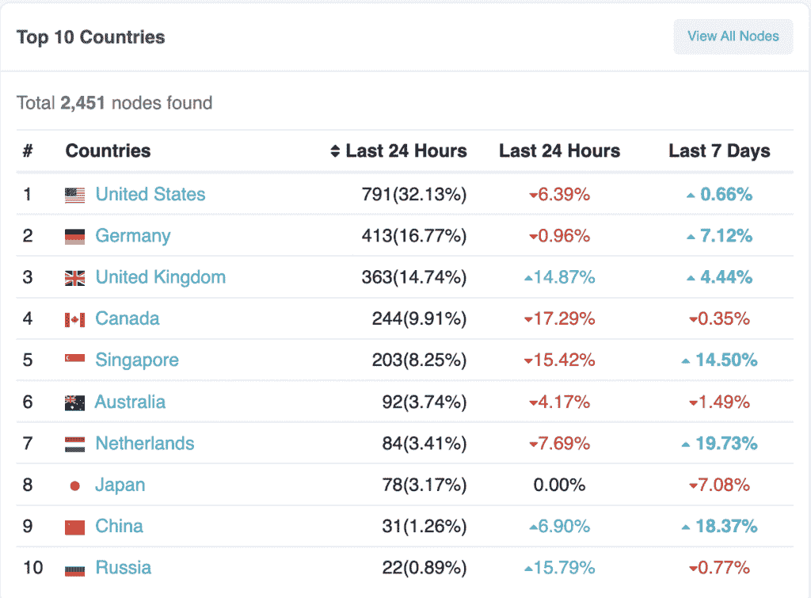

# 作为一个协议，Ankr 旨在分散以太坊节点

> 原文：<https://thenewstack.io/as-a-protocol-ankr-aims-to-decentralize-ethereum-nodes/>

二月初，Ankr [宣布与 maxi host](https://thenewstack.io/ankr-expands-its-blockchain-node-infrastructure-globally/)合作，将[以太坊](https://thenewstack.io/as-blockchain-hype-fades-developers-give-ethereum-a-serious-look/)节点扩展到更多国家，作为分散节点努力的一部分。这仍然很重要，因为 [Etherscan 节点跟踪器](https://etherscan.io/nodetracker)的数据表明，在撰写本文时，大约 32%的节点位于美国，如果包括加拿大，超过 40%的节点位于北美。

如果你正在为一个主要在美国以外的市场构建一个去中心化的应用程序(d app ),这意味着大多数节点基础设施都不在你的用户附近。

数据由以太坊节点追踪器提供。

周四， [Ankr](https://www.ankr.com/about/our-purpose/) 宣布脱离传统的公司结构，成立 Ankr DAO，这一举措将公司从平台重新定位为协议，也将决策权从 Ankr 的执行团队转移到令牌持有者。

这种转变增加了 Ankr 令牌的效用和治理机制，允许开发人员社区积极参与诸如节点托管的费用结构和节点运营商的奖励分配机制等决策。

在对新堆栈的后续采访中，Ankr 产品负责人 Josh Neuroth 讲述了为什么从平台到协议的转变与最初的 Maxihost 合作关系保持一致:“Ankr 仍将为协议贡献大量的服务器资源，作为令人难以置信的高性能节点的基础层。

“拥有 Maxihost 意味着该协议有更多的全局服务器资源，这意味着更低的延迟、更强的弹性和更好的用户体验，以及更快的事务处理。”

他说，在可能与 dApp 开发人员最相关的问题中，“当节点提供商因封锁或地理围栏而无法为特定国家/地区提供流量服务时，或者当服务受到互联网或云中断的影响时，增加总服务器资源也可能会降低对用户的影响风险。”

## 为什么要重组为道？

我还没有看到很好解释的一件事是，为什么一个公司作为 DAO(去中心化自治组织)比一个更传统的公司实体更有优势。

Neuroth 给出了一个明确的理由:“根据定义，集中的运营商将所有权、使用权和治理权分开，这在选民之间形成了不一致的激励。相比之下，符合 Web3 精神的令牌组学系统为用户参与协议的所有权、使用和治理创造了激励。

“通过这种方式，经济奖励被用于调整协议利益相关方之间的激励机制，使其能够以更分散的方式发挥作用。”

通过超越资源消耗(这是购买技术空间中的基础设施和服务的典型方法)，参与 Ankr 协议之类的东西会使所有各方都获得集体成功。

如果你在 Ankr 协议上操作一个节点，你会被激励去维护一个健康的节点。Ankr 还有一个提议，可能会奖励参与治理的用户，同时实施问责机制以鼓励积极的决策。

Neuroth 提供了更多的细节。“因为不同的利益攸关者群体更多地参与治理会产生更有效的激励。良好的激励有助于加强令牌经济学，给予 Ankr 社区更多的控制权来管理协议应该有助于确保推动 Ankr 经济的奖励结构保持平衡和有效。”

## Ankr 协议对 dApp 开发者有什么好处？

作为一家开发公司，为什么您可能想要参与 Ankr 协议？

Neuroth 说，Ankr 协议为 dApp 开发者提供了“比集中管理的竞争者更多的对他们经常使用的工具和服务的控制。”他说，这也激励他们积极参与 Ankr DAO 的管理。

对开发者来说，另一个好处是 Ankr 正在采用的演进令牌桩的方法。传统上，几乎所有协议都采用三种主要形式。您可以运行自己的验证器，委托给现有的验证器，或者将令牌存放在委托给现有验证器的服务中。

Neuroth 说，Ankr 正在增加一种新的赌注选择，“我们很高兴很快宣布一种新的液体赌注即服务模式，将 Ankr 的液体赌注技术与委托系统相结合，这将鼓励越来越多的赌注者和验证者积极参与 Ankr 经济。”关于这种新的赌注方法的更多细节将很快公布。

## Ankr 重组为 DAO 的风险

鉴于以太坊节点高度集中地由 [Infura](https://twitter.com/infura_io) 和 [Alchemy](https://twitter.com/AlchemyPlatform) 控制，什么会阻止风险投资(VC)公司或竞争对手购买 Ankr 令牌的大量股份并最终对协议产生重大影响？

“这是每个 DAO 都面临的弱点，”Neuroth 说。“我们知道，实施分散控制系统是一个过程，必须涉及令牌持有者的教育和责任的分阶段转移，以促进负责任和受过教育的治理。

“认识到这一现实，我们将很快向 Ankr 机构群体提出一个涉及令牌持有者的正式治理模型，该模型将包括对如何提出治理建议的限制，治理权力的交错释放，以便用户的投票权随着时间的推移而变得更强，以及对 DAO 财政部将被授权执行的活动类型的合理限制。”

Ankr 的举措似乎是直接以社区为重点，以正确的激励方式鼓励广泛参与。面对像 Infura 和 Alchemy 这样资金雄厚、有风投支持的竞争对手，挑战是巨大的。很容易看到社区方法的一些优势，它将所有权、使用和治理结合起来，使所有利益相关者受益。观察 Ankr 如何发展将会很有趣。

<svg xmlns:xlink="http://www.w3.org/1999/xlink" viewBox="0 0 68 31" version="1.1"><title>Group</title> <desc>Created with Sketch.</desc></svg>