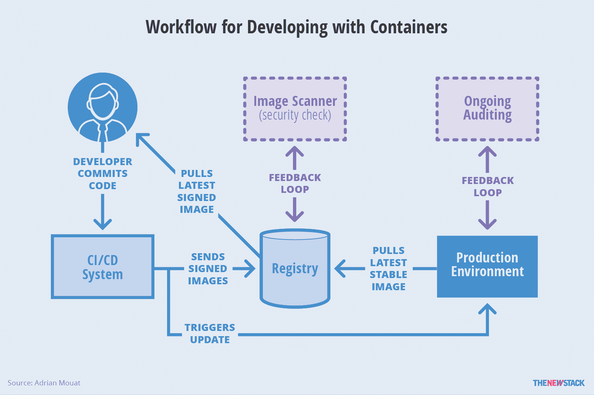

# 评估集装箱安全的现状

> 原文：<https://thenewstack.io/assessing-the-state-current-container-security/>

 [阿德里安·穆亚特

阿德里安从 Docker 的早期就开始接触容器，并撰写了《使用 Docker:使用容器开发和部署软件》一书*。他目前是 Container Solutions 的首席科学家，这是一家泛欧洲公司，专注于微服务和容器的咨询和产品开发。他是码头船长项目的成员。*](http://container-solutions.com/) 

任何希望在容器上运行关键任务服务的理性组织都会在某个时候问这样一个问题:“但是它安全吗？我们真的可以信任包含我们的数据和应用的容器吗？”

在技术人员中，这通常会导致容器与虚拟机(VMs)的争论，以及对虚拟机中的虚拟机管理程序层所提供的保护的讨论。虽然这可能是一个有趣和有意义的讨论，但容器与虚拟机是一个错误的二分法；相关方应该简单地在虚拟机中运行他们的容器，就像目前大多数云提供商所做的那样。一个值得注意的例外是 Joyent 的 Triton，它使用 SmartOS Zones 来确保租户的隔离。也有越来越多的社区相信 Linux 上的容器安全性和隔离已经改进到可以使用裸机容器服务而不使用虚拟机进行隔离的程度；例如，IBM 在公共 Bluemix 云服务上构建了一个托管容器服务，该服务在租户之间没有 VM 隔离的情况下运行。

为了保持容器的灵活性优势，每个 VM 中运行多个容器。有安全意识的组织可以使用虚拟机来分离在不同安全级别上运行的容器；例如，处理计费信息的容器可以被安排在与那些为面向用户的网站保留的节点分开的节点上。有趣的是，几家公司——包括 Hyper、Intel 和 VMware——正在致力于构建基于虚拟机的闪电般快速的框架，这些框架实现了 Docker API，试图将容器工作流的速度和虚拟机管理程序的安全性结合起来。

一旦我们接受了迁移到容器并不意味着放弃由虚拟机管理程序提供的已建立和验证的安全性，下一步就是研究通过使用容器和基于容器的工作流可以获得的安全性收益。

## 安全工作流程

在一个典型的工作流程中，一旦开发人员完成了一个特性，他们将推进到持续集成(CI)系统，该系统将构建并测试图像。然后，该图像将被推送到注册表。现在可以部署到生产环境中了，这通常涉及到一个编排系统，比如 Docker 的内置编排、Kubernetes、Mesos 等。相反，一些组织可能会在生产前推出一个试运行环境。

图 1:在容器工作流中，开发人员将使用测试组件将变更推送到 CI 系统。已签名的映像将移动到注册表中，在那里可以部署到生产环境中。

在遵循安全最佳实践的系统中，将存在以下功能和属性:

*   **图片来源:**一个安全的标签系统已经到位，可以准确无误地识别生产环境中运行的容器来自哪里。
*   **安全扫描:**图像扫描仪会自动检查所有图像中的已知漏洞。
*   **审计:**生产环境被定期审计，以确保所有容器都基于最新的容器，并且主机和容器都被安全地配置。
*   **隔离和最小特权:**容器以有效运行所需的最小资源和特权运行。它们不会不适当地干扰主机或其他容器。
*   **运行时威胁检测和响应:**一种在运行时检测针对容器化应用的主动威胁并自动做出响应的能力。
*   **访问控制:** Linux 安全模块，如 AppArmor 或 SELinux，用于实施访问控制。

## 图像出处

组织需要小心他们正在运行的软件，尤其是在生产环境中。避免运行过时的、易受攻击的软件，或者以某种方式遭到破坏或篡改的软件是非常重要的。出于这个原因，能够识别和验证任何容器的源代码是很重要的，包括谁构建了它，以及它运行的是哪个版本的代码。

图片出处的黄金标准是 [Docker 内容信任](https://docs.docker.com/engine/security/trust/content_trust/)。启用 Docker 内容信任后，在将图像推送到注册表之前，会在图像中添加数字签名。提取图像时，Docker Content Trust 将验证签名，从而确保图像来自正确的组织，并且图像的内容与推送的图像完全匹配。这确保了攻击者不会篡改图像，无论是在传输过程中还是存储在注册表中。Docker Content Trust 还通过实施[更新框架](https://theupdateframework.github.io/) (TUF)来防止其他更高级的攻击，如回滚攻击和冻结攻击。

[cyclone slider id = " ebook-4-赞助商"]

在撰写本文时，Docker 内容信任由 Docker Hub、Artifactory 和 Docker Trusted Registry(目前处于试验阶段)提供支持。可以用 Docker Content Trust 设置开源私有注册中心，但这也需要建立一个[公证](https://github.com/docker/notary)服务器(更多细节见[这些说明](https://github.com/docker/notary/blob/master/docs/running_a_service.md))。

在缺乏 Docker 内容信任的情况下，仍然可以使用摘要来验证图像出处，摘要是图像内容的加密散列。推送图片时，Docker 客户端会返回一个表示图片摘要的字符串(如 sha 256:45 b 23 dee 08 af 5 e 43 a 7 FEA 6 C4 cf 9 c 25 CCF 269 ee 113168 c 19722 f 87876677 C5 CB 2)。然后，可以使用该摘要来提取图像。每当以这种方式提取图像时，Docker 将验证摘要是否与图像匹配。与标签不同，摘要总是指向同一个图像；对图像的任何更新都将导致新摘要的生成。使用摘要的问题是组织需要建立一个专有系统来自动提取和分发它们。

还需要确定来自第三方的图像的出处，无论它们是直接使用还是作为基础图像使用。使用 Docker Hub 时，所有“官方”图像都经过 Docker 审查，附有内容信任信息，应被视为最安全的 Hub 图像。使用其他映像时应该谨慎，但是请注意“自动构建”与构建它们的源代码相关联，应该被认为比常规用户映像更值得信赖。组织应该考虑从源本身构建映像，而不是从不受信任的存储库中获取。随着 Docker Store 的出现，这种情况正在发生一些变化，Docker Store 将为出版商提供一个值得信赖的商店，就像苹果的应用商店一样。

## 安全扫描

Docker 图像的安全扫描是由几家公司提供的一项新服务。基本思想很简单:获取一个 Docker 映像，将它包含的软件与已知漏洞列表进行交叉引用，从而为该映像生成一份“健康清单”。根据这些信息，组织可以采取措施来减少漏洞。

目前的产品包括 Red Hat 的[原子扫描](https://developerblog.redhat.com/2016/05/02/introducing-atomic-scan-container-vulnerability-detection/)，IBM 的 Bluemix 漏洞顾问，CoreOS 的 [Clair](https://github.com/coreos/clair) ，Docker Inc .的 [Docker 安全扫描](https://blog.docker.com/2016/05/docker-security-scanning/)，Aqua Security 的 Peekr，以及 Twistlock Trust 的[。它们在工作方式、访问方式和价格上千差万别。一个至关重要的区别是扫描仪识别图像中安装的软件的方式。](https://www.twistlock.com/trust/)

包括 Clair 在内的一些扫描器只会询问包管理器(例如 Debian 和 Ubuntu 上的 Apt)来找到已安装的软件，但这对于通过 tarballs 安装的软件或扫描器不识别的包管理器不起作用。相比之下，Docker 安全扫描对图像执行二进制级别的分析，不管包管理器如何，它都可以工作，并且还可以识别静态链接库的版本。Twistlock 的另一个有趣之处在于，它对通过 tarball 安装的软件执行扫描，在其漏洞扫描中提供零日馈送，并在空气间隙环境中工作。

必须考虑如何将安全扫描集成到您的系统中。Docker 安全扫描作为 Docker 云和 Docker 数据中心的集成部分提供，但不是独立的服务。其他提供商提供应用程序接口(API)，允许集成到现有 CI 系统和定制工作流中。有些扫描仪可以安装在内部，这对于要求将所有软件都保持在其边界内的组织来说非常重要。

一旦您集成了安全扫描服务，您的第一个想法可能是全面禁止在生产中运行任何有漏洞的映像。不幸的是，您可能会发现您的大多数图像都有一些漏洞，这不是一个现实的选择。例如，Ubuntu 拥有快速更新映像的最佳记录之一，但是在撰写本文时，16.04 基础映像由于使用的 Perl 版本而存在一个主要漏洞(大多数其他映像存在更多问题)。因此，您可能会发现需要单独调查发现的漏洞，以确定它们是否对您的系统构成真正的风险。

通过使用去掉了不必要软件的轻量级容器，这种情况可以得到显著缓解。最简单的方法是使用非常小的基本图像，例如 Alpine，它只有 5MB。另一种有点极端的可能性是构建一个静态链接的二进制文件，并将其复制到空的“临时”映像之上。这样就完全没有操作系统级的漏洞了。这种方法的主要缺点是构建和调试变得非常复杂——甚至没有可用的 shell。

自动扫描是我们行业安全方面的一大进步。它很快暴露了潜在的风险，并给供应商施加压力，要求他们迅速修补易受攻击的基础映像。通过关注扫描结果并快速做出反应，组织可以领先于许多潜在攻击者一步。

## 审计

审计直接跟随安全扫描和图像来源。在任何时间点，我们都希望能够看到哪些映像正在生产中运行，以及它们运行的是哪个版本的代码。特别是，识别运行过时的、潜在易受攻击的图像的容器非常重要。

当使用容器时，强烈建议遵循有时被称为“黄金映像”的方法:不要修补正在运行的容器，而是用运行更新代码的新容器替换它们— [蓝绿色部署](http://martinfowler.com/bliki/BlueGreenDeployment.html)和滚动升级可以用来避免停机。使用这种方法，可以通过查看构建容器的映像来审计大量正在运行的容器。诸如 Docker diff 之类的工具可以用来验证容器文件系统没有偏离底层映像。

请注意，在部署之前扫描图像是不够的。随着新漏洞的报告，以前健康状况良好的映像将变得已知易受攻击。因此，持续扫描生产中运行的所有映像非常重要。根据所使用的扫描解决方案，这不一定涉及深入的重新扫描；扫描仪可以存储扫描图像中的软件列表，并快速参考这些列表来防范新的漏洞。

在基于容器的系统中审计主机仍然很重要，但这可以通过运行最少的发行版来简化，如 CoreOS、Red Hat Atomic 或 Ubuntu Snappy，它们设计为运行容器，只包含较少的审计软件。此外，像 [Docker Bench for Security](https://github.com/docker/docker-bench-security) 这样的工具可以用来检查配置，Aqua Security 和 Twistlock 都提供了审计主机和配置的解决方案。

## 孤立和最低特权

容器的一个主要安全好处是围绕隔离的额外工具。容器通过创建一个系统来工作，这个系统有一个关于文件系统、网络和进程的独立的世界视图——独立的名称空间。此外，cgroups 用于控制对 CPU 和 RAM 等资源的访问级别。此外，容器可以进行的 Linux 内核调用可以通过 [Linux 功能](https://docs.docker.com/engine/security/security/#/linux-kernel-capabilities)和 [seccomp](https://docs.docker.com/engine/security/seccomp/) 来控制。

信息安全中的一个基本概念是最低特权的[原则](https://en.wikipedia.org/wiki/Principle_of_least_privilege)，最初表述为:

“系统的每个程序和每个特权用户都应该使用完成作业所需的最少特权进行操作。”——[杰罗姆·萨尔茨](https://en.wikipedia.org/wiki/Jerry_Saltzer)

就容器而言，这意味着每个容器都应该以最少的特权集运行，以保证其有效运行。应用这一原则会使攻击者的生活更加艰难；即使在容器中发现了漏洞，攻击者也很难有效地利用该漏洞。如果容器不能访问易受攻击的功能，它就不能被利用。

在安全性方面，一个大而容易的胜利是运行具有只读文件系统的容器。在 Docker 中，这是通过将–read-only 标志传递给 docker run 来实现的。有了这一点，任何利用漏洞的攻击者都会发现操纵系统变得更加困难；他们将无法向文件系统写入恶意脚本或修改文件内容。许多应用程序都希望写入文件，但这可以通过使用针对特定文件或目录的 [tmpfs](https://docs.docker.com/engine/reference/run/#tmpfs-mount-tmpfs-filesystems) 或卷来实现。

限制对其他资源的访问也是有效的。限制容器可用的内存量将防止攻击者消耗主机上的所有内存并耗尽其他正在运行的服务。限制 CPU 和网络带宽可以防止攻击者运行比特币挖矿或 torrent peers 等资源密集型进程。

在生产中运行容器时，最常见的错误可能是让容器作为根用户运行。构建映像时，通常需要 root 权限来安装软件和配置映像。但是，容器启动时执行的主进程不应该以 root 用户身份运行。如果是这样，任何破坏该过程的攻击者都将拥有容器内的根级别权限。更糟糕的是，由于默认情况下用户没有命名空间，如果攻击者设法突破容器进入主机，他们就有可能获得主机上完全的根级别权限。

为了防止这种情况，请始终确保 Dockerfiles 声明一个非特权用户，并在执行主进程之前切换到该用户。从 Docker 1.10 开始，就有了对启用用户名空间的可选支持，它会自动将容器中的用户映射到主机上编号较高的用户。这是可行的，但是目前有几个缺点，包括使用只读文件系统和卷的问题。许多这些问题在发布时已经在 Linux 社区中得到解决，所以预计在不久的将来，用户名称空间支持将变得对更大比例的用例更加可行。

[cyclone slider id = " ebook-4-赞助商"]

限制容器的内核调用还可以通过限制攻击者的行为和减少内核代码中的漏洞来显著减少攻击面。限制特权的主要机制是使用 Linux 功能。Linux 定义了大约 40 种功能，它们映射到内核调用集上。容器运行时，包括 rkt 和 Docker，允许用户选择容器应该运行的特权。这些功能映射到大约 330 个系统调用，这意味着一些功能，尤其是 SYS_ADMIN，映射到大量的调用。为了更好地控制哪些内核调用被允许，Docker 现在有了 [seccomp](https://docs.docker.com/engine/security/seccomp/) 支持来精确指定哪些调用可以被使用，并且附带了一个默认的 seccomp 策略，该策略已经被证明在减轻 Linux 内核中的问题方面是[有效的](https://docs.docker.com/engine/security/non-events/)。这两种方法的主要问题是计算出应用程序需要进行的内核调用的最小集合。简单地运行不同级别的功能并检查故障是有效的，但是很耗时，并且可能会遗漏代码中未测试部分的问题。

潜在地，现有的工具可能有助于确定您的应用程序对系统调用的使用，而不必求助于试错法。如果你能充分利用跟踪功能来测试你的应用程序的代码路径，比如 [strace2elastic](https://github.com/jfrazelle/strace2elastic) ，这将提供一份在容器运行时你的应用程序中使用的系统调用的报告。

虽然操作系统级别的隔离和最低特权的实施非常关键，但隔离也需要与应用程序逻辑联系起来。如果不了解主机上运行的应用程序，操作系统级隔离本身可能不会有效。

## 运行时威胁检测和响应

无论您在漏洞扫描和容器加固方面做得多好，总会有未知的错误和漏洞在运行时出现，并导致入侵或损害。这就是为什么为您的系统配备实时威胁检测和事件响应功能非常重要。

容器化的应用程序，与它们的单片对应物相比，明显更小和不可变。这使得为您的应用程序导出一个比传统的、单一的应用程序具有更高保真度的基线成为可能。使用此基准，您应该能够检测实时威胁、异常和主动危害，并且比传统异常检测的误报率更低。

行为基线是 Blackhat 2016 上最热门的[趋势之一，安全机制专注于理解应用或系统的典型行为以识别异常。行为基线的关键是尽可能自动化基线的推导、持续监控、检测和响应。今天，大多数组织通过人工劳动和数据科学的结合来完成行为基线。然而，由于容器的瞬时性质，整个过程自动化尤其重要。](https://techcrunch.com/2016/08/04/the-four-cybersecurity-terms-everyone-is-talking-about-at-black-hat/)

积极响应与基线密切相关。主动响应是如何在检测到攻击、危害或异常时立即做出响应。响应可以以多种不同的形式出现，例如向负责人员发出警报、与企业票证系统通信，或者对系统和应用程序应用一些预先确定的纠正措施。

在容器环境中，主动响应可能意味着执行额外的日志记录、应用额外的隔离规则、动态禁用用户，甚至主动删除容器。同样，自动化在这里是关键——执行的所有操作不得以负面方式干扰应用程序逻辑，例如使系统处于不一致状态或干扰非幂等操作。

目前提供这种级别的运行时威胁检测和响应的产品包括 [Aqua Security](https://www.aquasec.com/) 、 [Joyent Triton SmartOS](https://www.joyent.com/smartos) 、 [Twistlock](https://www.twistlock.com/) 和 [Red Hat OpenShift](https://www.openshift.com/) 。随着越来越多的任务关键型应用程序迁移到容器，自动化运行时威胁检测和响应对于容器安全性将变得越来越重要。以自动化的方式关联信息、分析危害迹象、管理取证和响应操作的能力，将是提升容器化世界的运行时安全性的唯一途径。

## 访问控制

Linux 内核支持安全模块，这些模块可以在内核调用执行之前应用策略。两个最常见的安全模块是 AppArmor 和 SELinux，它们都实现了所谓的强制访问控制(MAC)。MAC 将检查用户或进程是否有权在文件、套接字或进程等对象上执行各种操作，如读取和写入。访问策略是集中定义的，用户不能更改。这与文件和权限的标准 Unix 模型形成对比，后者可以由具有足够权限的用户随时更改，有时称为自主访问控制或 DAC。

SELinux 最初是由美国国家安全局(NSA)开发的，但现在主要由 Red Hat 开发，并出现在他们的发行版中。虽然使用 SELinux 确实增加了一层重要的额外安全性，但是使用起来可能有些困难。启用 SELinux 后，您会注意到的第一件事是卷不能像预期的那样工作，需要额外的标志来控制它们的[标签](https://docs.docker.com/engine/tutorials/dockervolumes/#volume-labels)。AppArmor 类似，但不如 SELinux 全面，并且没有相同的音量控制。它在 Debian 和 Ubuntu 发行版上默认是启用的。

在这两种情况下，都可以为运行特定的容器创建特殊的策略；例如用于运行 Apache 或 NGINX 的 web 服务器策略，其允许某些网络操作但不允许各种其他调用。理想情况下，所有映像都有自己特制的策略，但创建这样的策略往往是一项令人沮丧的工作，通过第三方工具如[贝恩](https://github.com/jfrazelle/bane)可以稍微缓解一下。将来，我们可以期待看到一个集成的安全概要文件，它与容器一起运行，为内核调用、SELinux/AppArmor 概要文件和资源需求指定设置。

关于访问控制的话题，需要注意的是，任何有权有效运行 Docker 容器的人都拥有该主机上的 root 权限——他们可以挂载和编辑任何文件，或者创建 setuid(在执行时设置用户 id)二进制文件，这些二进制文件可以复制回主机。在大多数情况下，这只是需要注意的事情，但是一些组织希望对用户权限进行更细粒度的控制。为此，组织可能希望使用更高级别的平台(如 Docker Datacenter 和 OpenShift)或工具(如 Aqua Security 和 Twistlock)来添加此类控制。

## 结论

当在生产中实现基于容器的工作流或运行容器时，组织必须考虑安全性。安全性影响整个工作流，需要从一开始就考虑到。映像起源始于开发人员在他们的笔记本电脑上构建、提取和推送映像，接着是 CI 和测试阶段，最后是在生产中运行的容器。

容器和黄金映像方法支持新的工作方式和工具，尤其是在映像扫描和审计方面。组织能够更好地跟踪在生产中运行的软件，并且能够更容易、更快速地对漏洞做出反应。可以在几分钟内测试、集成和部署更新的基础映像。图像签名验证容器的真实性，并确保攻击者没有篡改其内容。

随着经过验证和签名的图像变得普遍，以及诸如集成安全配置文件等功能的增加，未来将会带来更多重要的功能。在接下来的几个月里，单单安全方面的好处就将成为组织转向容器的一个强有力的理由。

<svg xmlns:xlink="http://www.w3.org/1999/xlink" viewBox="0 0 68 31" version="1.1"><title>Group</title> <desc>Created with Sketch.</desc></svg>