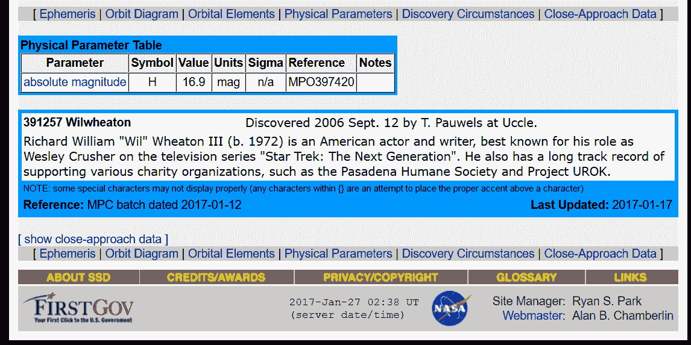

# 星际:威尔·惠顿是名人小行星俱乐部的最新成员

> 原文：<https://thenewstack.io/asteroid-named-star-trek-tng-actor-wil-wheaton/>

现在有一颗小行星以在《[星际旅行:下一代](http://www.startrek.com/database_article/star-trek-the-next-generation-synopsis)》中扮演年轻[卫斯理·克拉舍](http://memory-alpha.wikia.com/wiki/Wesley_Crusher)的演员[威尔·惠顿](http://wilwheaton.net/)的名字命名从 1987 年到 1991 年的前四季中，惠顿的角色一直伴随着星舰“企业号”执行持续的任务——从惠顿 15 岁开始。但是二十年后，他现在在科幻圈里已经小有名气了。

尽管这看起来很奇怪，CNET 指出，惠顿[甚至不是第一个用小行星来纪念《星际迷航》的演员*。还有以竹井乔治*](https://www.cnet.com/news/asteroid-star-trek-wil-wheaton-wesley-crusher/)*[命名的小行星](https://twitter.com/GeorgeTakei)和以 20 世纪 60 年代原版电视连续剧*命名的[尼切尔·尼克斯](https://twitter.com/nichelleisuhura)，以及以创作该连续剧的吉恩·罗登伯里命名的[。](https://en.wikipedia.org/wiki/4659_Roddenberry)

以名人命名小行星并不罕见:已经有 60 颗小行星以流行音乐家的名字命名，包括以弗兰克·辛纳特拉、毕吉乐队甚至英国重金属乐队 motrhead 命名的小行星。

有以 [命名的](https://en.wikipedia.org/wiki/4148_McCartney)[小行星，所有的](https://en.wikipedia.org/wiki/4147_Lennon) [四个](https://en.wikipedia.org/wiki/4149_Harrison) [甲壳虫](https://en.wikipedia.org/wiki/4150_Starr)，宇宙甚至在纪念摇滚的早期，有一颗小行星以《夜以继日的摇滚》主唱的名字命名——比尔·哈利和彗星。佛莱迪·摩克瑞在他 70 岁生日时被授予小行星称号，两年前，一颗小行星被授予大卫·鲍依。

甚至还有六颗小行星[以巨蟒剧团](https://en.wikipedia.org/wiki/9617_Grahamchapman)的每个成员命名。

但是这个月轮到惠顿接受与《明星》同名的罕见荣誉——他似乎和其他人一样惊讶。这个[消息首先在](https://twitter.com/RonBaalke/status/821869370624217090)[罗恩·巴尔克](https://twitter.com/RonBaalke)的个人推特上传播(他自称是[美国宇航局喷气推进实验室](http://www.jpl.nasa.gov/)的太空探险家)。具有讽刺意味的是，已经有一颗小行星以他的名字命名了——小行星 6524 Baal ke——所以很高兴是他分享了关于惠顿进入天堂的消息:

https://twitter.com/RonBaalke/status/821869370624217090

“美国国家航空航天局的人也对惠顿情有独钟，”[辣妹 Hardware.com](http://hothardware.com/news/nasa-names-newly-discovered-star-after-star-treks-wil-wheaton)开玩笑说——能够在美国国家航空航天局喷气推进实验室的在线天体数据库中查找自己的名字一定是一种令人敬畏的荣誉。

惠顿在他的博客上写了一篇非常亲切的回应，回忆他第一次爱上外太空的那一天。他记得 1975 年秋天的一天，当时他还是一个三岁的男孩，站在南加州的农田里，凝视着月亮，他的父母手牵着手。

在同一个后院，他后来在一个用毯子和扫帚柄搭建的帐篷里玩耍，他们一起凝视着一个巨大的月亮，他的父亲向他保证月亮在遥远的太空中。惠顿写道，从那天起，他就不再把月亮当成一件东西，而是一个你可以去的地方。

“从那一刻起，我想尽我所能了解太空的一切。只要奶奶允许，我就会经常和她一起读《让我们去月球吧》。我会用我能得到的任何东西制造火箭，想象着乘着它们进入太空。”当他在《星际迷航:下一代》(Star Trek: The Next Generation)的片场工作时，“看着剧中的假星空感觉很奇妙，只是因为“我必须假装我也生活在太空中。"

他从未失去这种感觉。“我长大了。我的生活发生了很多变化，但我从未停止对太空的热爱。我从未停止仰望黑暗的天空，想象着有一天，也许我会去那里，然后回来。”

当他们用他的名字给一颗小行星命名时，这似乎成真了。

“今天，我发现我可以进入太空，生活在地球上……这里一天黑，我就要走到我的后院，仰望天空，就在天狼星上方一点，并且知道，尽管我无法用肉眼看到它，它就在那里，并且以我的名字命名。”

* * *

# WebReduce

<svg xmlns:xlink="http://www.w3.org/1999/xlink" viewBox="0 0 68 31" version="1.1"><title>Group</title> <desc>Created with Sketch.</desc></svg>