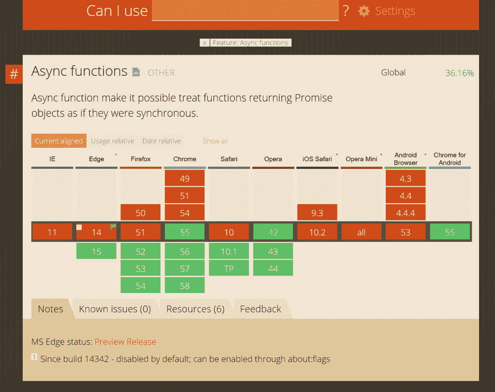

# JavaScript 将最终得到合适的异步编程

> 原文：<https://thenewstack.io/async-officially-coming-javascript-year/>

在 ECMAScript 中包含**异步**功能的提议已经到了第四阶段；这意味着它有望在 2017 年发布该标准。但是这对 JavaScript 开发者来说意味着什么呢？

人们对[异步](https://github.com/tc39/proposal-async-iteration)很感兴趣，JavaScript 需要这种能力来轻松地并行执行多个函数。

“因为 JavaScript 是单线程的，这意味着如果你有任何长时间运行的工作，它必须异步发生，让你的应用程序保持响应，否则它只会阻塞，你的浏览器会冻结，”C#的首席架构师[安德斯·海尔斯伯格](https://github.com/ahejlsberg)说，他现在也是微软 JavaScript 的 TypeScript [transpiler](https://thenewstack.io/javascript-transpilers-need-know/) 的核心开发人员。所以 JavaScript 运行时库和所有的框架都被设计成只有异步的做事方式。如果你想做一个昂贵的操作，比如一个 XML HTTP 请求，你不需要阻塞并等待结果；您可以提供一个回调函数，它稍后会将结果返回给您。"

“那里有大量令人兴奋的东西；来自微软 Edge 团队的 Brian Terlson 说:“人们期待着在没有编译的情况下使用异步函数。”他是 ECMAScript 标准的编辑，也是标准化 ECMAScript 的 [TC39 委员会](https://github.com/tc39)中异步提议的“拥护者”。当他在推特上说 async 提案已经到了第四阶段时，它获得了比他在推特上发布的任何其他东西都多的转发。

“异步编程模型允许开发人员一次提出所有问题。开发人员随后对提供的答案做出反应。应用程序不断地根据信息进行调整。Mozilla 平台工程团队的 Naveed Ihsanullah 说:“用户体验到一个动态的应用程序，它可以自我更新，而不是被迫无限期地等待一个完美的完整视图，”部分原因是它将使代码更容易理解。

“异步编程对于开发最佳用户体验非常重要。信息分布在许多地方，现代应用程序试图将所有这些不同的来源无缝集成到一个统一的视图中。然而，即时加载和完成的网页都是假象。在幕后，许多信息请求是代表用户发出的。有些问题可以很快回答，有些可能需要更长时间。有些问题可能完全没有答案，”他说。

泰尔森指出，整个网络平台都在朝着这个方向发展。进入 ECMAScript 2017 是“平台上越来越多的东西是异步的这一事实的反映，所以你的代码最终不得不处理更多的异步。与网络工作者交谈是一种异步的事情，任何类型的网络都是如此。存储 API 是异步的。服务人员正在做大量的网络工作，所以他们是异步的。新的 [Streams API](https://www.w3.org/TR/2013/WD-streams-api-20130214/) 中有许多异步部分。随着新 API 的加入，随着平台能力的增长，我们会发现越来越多的异步来源，因此它会渗透到您的代码中。”

增加异步的 API 的增长意味着 JavaScript 需要比回调更好的方式来处理代码中的异步。“如果您只有一个异步源，回调是可以的，但是如果您有很多异步源，这就糟糕了，而且由于性能原因，创建和丢弃大量函数也很痛苦。”本质上，泰尔森指出，一次又一次地重复 HTML [文档对象模型](https://www.w3.org/DOM/) (DOM)，是没有效率的。

## 让异步变得可承受

他认为 **async** 是对回调的“巨大改进”,因为“没有末日金字塔嵌套回调”, Ihsanullah 也同意这一点。

“尽管异步编程有很多好处，但以这种方式编写应用程序通常是复杂而乏味的。多年来，JavaScript 语言已经有了低级的异步工具，比如 XMLHttpRequest。这些低级的基于回调的构造很难使用，很难维护，也很难调试。他们可以将源代码退化为[回调地狱](http://callbackhell.com/)，因为产生了多个嵌套请求。Asynct 有可能大大降低编写高质量可维护异步代码的障碍。由于使用了更多的异步，这些开发人员的优势直接转化为对用户响应更快的应用程序。”

Hejlsberg 说，在许多方面，这是 JavaScript 赶上了其他语言，如开创异步编程的 C#，JavaScript 中异步的工作方式与 C#中的处理方式非常相似。这使得代码更容易阅读和思考。

“JavaScript 是一个单线程执行环境。如果你希望异步的结果是什么，你必须通过回调或者有人调用你，因为只有一个执行线程。如果别人有它，他们必须放弃它，让你跑。所以从第一天开始，JavaScript 总是有类似于 **setTimeout** 或者类似于 DOM 事件的回调；所有这一切都是因为有人给你回电话。

Hejlsberg 说，问题是大量回调使得代码结构变得多么复杂，以及这使得它的工作变得多么困难。“逻辑往往变得更加复杂；如果你必须有条件分支，或者你必须有 for 循环的等价物，但是在循环中间有异步调用，那该怎么办？您可以尝试自己进行映射，您必须将状态提升到共享对象或共享变量中并维护它们，但是您基本上必须自己编写一个状态机。状态机是计算机非常擅长推理而人类却不擅长推理的东西！”

Async 会处理这些，他解释道。“事实证明，你可以使用 CPS 将常规顺序风格的代码机械地转换成异步代码，[延续处理风格](http://wiki.c2.com/?ContinuationPassingStyle)代码重写。你可以重写任何使用同步函数调用和返回的程序，并将它们转换成接受回调的函数——这就是异步的优势。你可以像编写同步代码一样编写代码，然后编译器会为你将其重写为基于回调的异步代码，并将你的代码转换为状态机。”

他建议说，这是考虑新的异步/等待特性的最佳方式。在使用 await 操作符等待异步工作的地方，编译器会自动对其余代码进行回调

“最大的好处是你可以像往常一样编写代码。如果你需要一个 If 语句，你就写一个 if 语句，如果你需要一个 for 循环，你就写一个 for 循环，在里面你可以说 await，然后让控制返回，然后每当异步工作完成时返回。人们对此感到非常兴奋，因为这让你的代码看起来更干净，也更容易对你的代码进行推理。”

正如 Terlson 指出的，“在大多数情况下，您不必担心您调用的是异步 API 你只需要等待它，然后开始你的一天。如果承诺被拒绝，async 会抛出一个异常，因此您可以编写看起来像同步代码的异步代码，并用普通的同步命令式代码处理错误。”

您仍然需要进行重构。当您使一个函数成为异步函数时，调用它的代码会得到一个承诺而不是一个值，因此您确实需要将调用代码也更改为异步，然后等待结果但是用 async 更容易做到这一点，因为代码本身不太复杂。“你甚至可以等待无承诺。有一些 API 会返回承诺，但有时如果它们同步知道一个值，它们就会返回它，所以如果你等待 API 结果，正确的事情就会发生。”

Ihsanullah 说，能够使用这些熟悉的同步模式编写代码，同时获得异步的所有好处，“极大地简化了为动态和响应性 web 应用程序编写代码”。他建议将其视为“JavaScript 承诺和生成器的语法包装器”，并指出“理解这些特性将极大地促进开发人员对 async 的理解”以及“承诺方面的经验可能是强制性的。”

他说，理解异步及其相关函数 await 是基于生成器和承诺的，将有助于你处理更复杂的异步代码。“Await 目前只允许一次等待一件事情。然而，开发人员认识到这些异步函数是承诺，就可以使用 await Promise.all(…)来等待几个动作。

## 浏览器为异步做好准备

在某种程度上，async 似乎是一个有点争议的提议。“有些人担心祝福承诺是否是异步模式的正确选择，或者更像是可以在幕后交换其他东西的任务，”特尔森解释说。但在那个阶段，除了[微软的 Edge 浏览器](https://www.microsoft.com/en-us/windows/microsoft-edge)(从 2015 年 9 月 Edge 13.10547 中的一个实验性功能开始，到 Windows Insider 预览版 14986 中的一个未修正版本)之外，还没有多少实现。

“然后[谷歌 V8](https://developers.google.com/v8/) 开始实施它，随着我们获得更多的实施经验，人们确信不存在性能等问题，这很有帮助。”

另外，Ihsanullah 解释说，JavaScript 需要异步的那些构件:承诺和生成器。虽然 promises 由于可以用 JavaScript 实现，已经在浏览器中使用了几年，但生成器是这种语言的新成员让语法反映开发人员使用函数的方式非常重要。“这是从箭开始的。然后是发电机。现在是异步函数。对标准委员会和社区来说，语言的人体工程学至关重要。”

现在，在 Chrome 55(谷歌的[杰克·阿奇博尔德](https://jakearchibald.com/)称之为[“非常坦率地说，非常棒”](https://developers.google.com/web/fundamentals/getting-started/primers/async-functions))以来，异步功能在 [Chrome](https://www.google.com/chrome/) 中是默认启用的，并且自 2016 年 11 月以来，它们一直在 [Firefox](https://www.mozilla.org/en-US/firefox/products/) 每夜发布中出现(计划是在 Firefox 52 中支持它们)。Opera[42 和更高版本支持异步，它正在 Safari 中开发。](http://www.opera.com/)

## 运输工人

有了像 [Babel](https://babeljs.io/) 和 [TypeScript](https://thenewstack.io/typescript-2-new-version-javascript-scales/) 这样的 transpilers，你甚至可以编写异步代码，并让它在旧的浏览器中运行，同时确信它将在最新的浏览器中工作，因为它们增加了支持。

在没有生成器的情况下支持异步需要更多的工作，这就是为什么过去只能在 TypeScript 中将异步代码转换为 ECMAScript 2015，并且 [Babel 有不同的技术](http://stackoverflow.com/questions/28708975/transpile-async-await-proposal-with-babel-js)取决于您想要的 ECMAScript 版本。Hejlsberg 说，但是现在 TypeScript 2.1 让你回到 ECMAScript 3。

“一旦您将代码重写为状态机，如果您有生成器，那么转换就相对简单——将包含等待的异步函数重写为生成器几乎是微不足道的。但是如果你没有生成器，事情就复杂多了——因为现在你必须在你的代码周围包裹一个状态机，实际上你看到的每一个等待的地方，函数都必须返回，然后当控制返回时，它必须跳回那里继续执行。由于 JavaScript 中没有 gotos，这就很复杂了。因此，您必须用 switch 语句编写一个 while 循环，其中包含一堆机器发明的状态，然后您可以维护这些状态。对代码的重写是复杂的，而正确重写代码并不简单。

“在 TypeScript 2.1 中，我们改用了新的发射器；这是编译器的后端。它是一个树编写器，重写你的语法树，以创建这些新的状态机和你必须做的其他有趣的东西，所以我们现在本机支持将 async await 重写到 ECMAScript 3。这不仅仅是在简单的情况下，你只能在顶级使用 await，而不是在初始化过程中或对对象文字的属性使用 await 不，它是一个像任何其他操作符一样的操作符，所以就像你可以说 plus 一样，你也可以说 wait。”

当然，浏览器和 transpilers 并不是 async 成为主流需要支持的唯一地方；框架和库也需要支持它。“如果你想写异步风格的代码，但是你有一堆不是用那种风格写的框架，那些框架仍然会做回调，”他指出。“如果你有一个基于 promise 的库，而你是针对这个库进行编码的，那么 Async 的效果会非常好。然而，库通常不是基于承诺的，然后你必须承诺它们或者找到相同功能的承诺版本。这将是一个挑战，因为这是将你从回调连接到异步世界的粘合剂。”

预计这需要时间来实现。“与任何事情一样，这不会在一夜之间发生，但将会有一个越来越渐进的转变，现在编写的现代框架将对所有异步代码使用承诺——这意味着用异步代码消费它们将容易得多。这将是一波慢慢冲刷过来的浪潮，而不是一夜之间发生的事情。”

宣布 async 将出现在 ECMAScript 2017 中将有助于这一点。“库作者将不得不在一段时间内实现 transpile async，”Terlson 预测，“但他们现在可以相信这是 JavaScript 的未来方向，所以他们可以使用它，而不用担心它会被未来的语言变化所破坏。”

当然，编写异步 JavaScript 对许多开发人员来说是新的。“如果你今天不使用 transpiler，你就没有使用过异步函数，”Terlson 指出。任何已经在使用 async 的人都是早期采用者，但随着 ECMAScript 2017 走向批准，现在是时候开始考虑它如何改进您的代码了。

<svg xmlns:xlink="http://www.w3.org/1999/xlink" viewBox="0 0 68 31" version="1.1"><title>Group</title> <desc>Created with Sketch.</desc></svg>